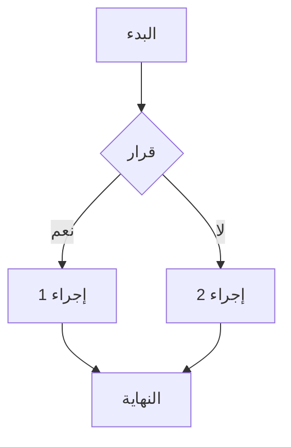

# موقع دليل المستخدم -  المؤشرات KPI

موقع ويب تفاعلي لعرض دليل مستخدم منصة  المؤشرات KPI، يدعم اللغة العربية (RTL)، ومتوافق مع الطباعة، ويدعم رسوم Mermaid البيانية.

## المميزات

- 📱 **تصميم متجاوب** - يعمل على جميع الأجهزة (جوال، تابلت، سطح مكتب)
- 🖨️ **جاهز للطباعة** - CSS مخصص لتحسين عرض المستندات عند الطباعة
- 🎨 **Tailwind CSS** - تصميم عصري ونظيف
- 📊 **دعم Mermaid** - رسوم بيانية وتخطيطات تفاعلية
- 🔍 **تنقل سهل** - قائمة جانبية مع البحث
- 🌙 **دعم RTL** - كامل الدعم للغة العربية من اليمين لليسار

## البنية

```
docs/site/
├── src/
│   ├── app/
│   │   ├── globals.css       # الأنماط العامة مع دعم الطباعة
│   │   ├── layout.tsx        # تخطيط الصفحة الرئيسي
│   │   └── page.tsx          # الصفحة الرئيسية
│   ├── components/
│   │   ├── Sidebar.tsx       # القائمة الجانبية للتنقل
│   │   ├── DocPage.tsx       # مكون عرض صفحات التوثيق
│   │   └── Mermaid.tsx       # مكون عرض الرسوم البيانية
│   └── lib/
│       └── utils.ts          # أدوات مساعدة
├── package.json              # تبعيات المشروع
├── tailwind.config.js        # إعدادات Tailwind
├── next.config.ts            # إعدادات Next.js
└── tsconfig.json             # إعدادات TypeScript
```

## التثبيت والتشغيل

### 1. تثبيت التبعيات

```bash
cd docs/site
npm install
```

### 2. تشغيل في وضع التطوير

```bash
npm run dev
```

افتح المتصفح على: [http://localhost:3000](http://localhost:3000)

### 3. بناء الموقع للنشر

```bash
npm run build
```

يتم إنشاء الملفات الثابتة في مجلد `dist/`.

## كيفية الإستخدام

### إضافة صفحة توثيق جديدة

1. أنشئ ملف Markdown جديد في `docs/user-docs/ar/`:
   ```bash
   touch "docs/user-docs/ar/17-العنوان-الجديد.md"
   ```

2. أضف الصفحة إلى القائمة في `src/components/Sidebar.tsx`:
   ```typescript
   { title: "العنوان الجديد", href: "/17-العنوان-الجديد", file: "17-العنوان-الجديد.md" },
   ```

3. أضفها إلى الصفحة الرئيسية في `src/app/page.tsx`:
   ```typescript
   { title: "العنوان الجديد", href: "/17-العنوان-الجديد", desc: "وصف مختصر" },
   ```

### استخدام رسوم Mermaid

أضف الرسم في ملف Markdown:

```markdown

```

## دعم الطباعة

الموقع يتضمن CSS مخصص لتحسين الطباعة:

- إخفاء القائمة الجانبية وأزرار التحكم
- تحسين حجم الخط والهوامش
- منع قطع الجداول والصور عبر الصفحات
- إظهار روابط URL بجانب النصوص

للطباعة: اضغط `Ctrl+P` (أو `Cmd+P` على Mac) في أي صفحة.

## التخصيص

### تغيير الألوان

عدل ملف `tailwind.config.js`:

```javascript
colors: {
  primary: {
    50: '#eff6ff',
    500: '#3b82f6',  // اللون الرئيسي
    600: '#2563eb',
    // ...
  },
}
```

### تغيير الخط

في `tailwind.config.js`:

```javascript
fontFamily: {
  sans: ['Inter', 'system-ui', 'sans-serif'],
}
```

## التقنيات المستخدمة

- [Next.js 15](https://nextjs.org/) - إطار عمل React
- [Tailwind CSS](https://tailwindcss.com/) - إطار CSS
- [MDX](https://mdxjs.com/) - Markdown مع JSX
- [Mermaid](https://mermaid-js.github.io/) - رسوم بيانية من النص
- [Lucide Icons](https://lucide.dev/) - أيقونات

## المساهمة

1. قم بإنشاء fork للمستودع
2. أنشئ فرعًا جديدًا: `git checkout -b feature/الخاصية-الجديدة`
3. قم بإجراء التغييرات
4. قم بإنشاء Pull Request

## الترخيص

جميع الحقوق محفوظة © 2025  المؤشرات KPI
