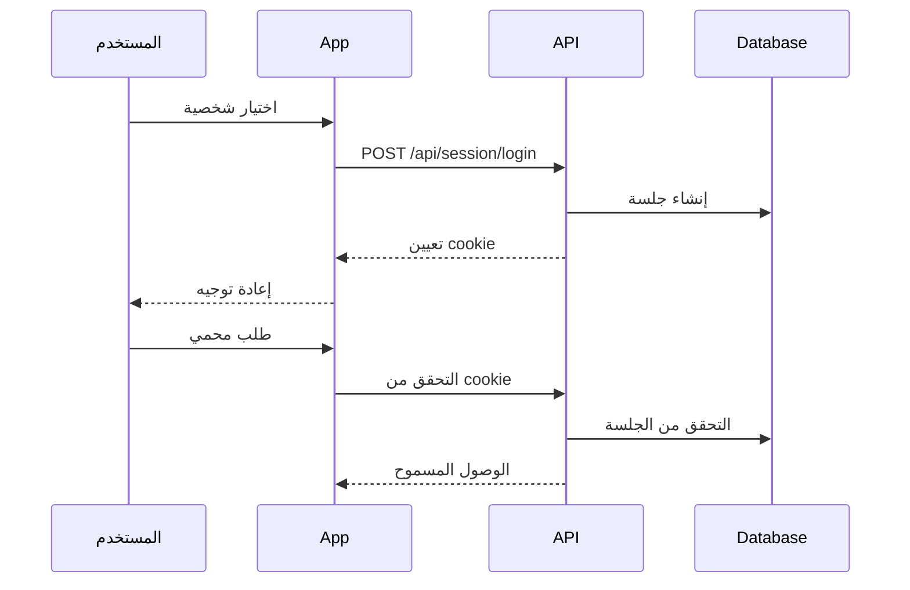
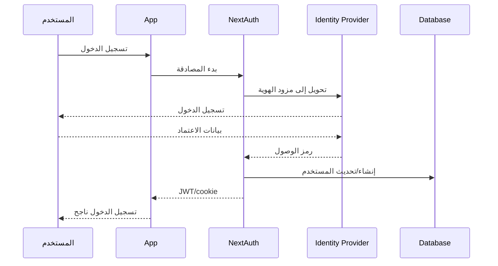
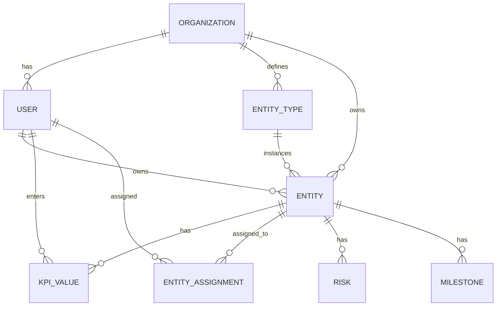

# معمارية النظام

<div dir="rtl">

وصف المعمارية العالية المستوى لمنصة مرتكز KPI.

---

## نظرة عامة

```
┌─────────────────────────────────────────────────────────────┐
│                        العميل (Client)                        │
│  ┌──────────────┐  ┌──────────────┐  ┌──────────────┐        │
│  │   المتصفح    │  │   الجوال     │  │   التطبيق    │        │
│  │   (Browser)  │  │   (Mobile)   │  │   (App)      │        │
│  └──────────────┘  └──────────────┘  └──────────────┘        │
└─────────────────────────────────────────────────────────────┘
                              │
                              ▼ HTTPS
┌─────────────────────────────────────────────────────────────┐
│                    بوابة API (API Gateway)                    │
│  ┌──────────────┐  ┌──────────────┐  ┌──────────────┐        │
│  │   Next.js    │  │   Middleware │  │   Rate Limit │        │
│  │    Edge      │  │   (Auth/RBAC)│  │   (Redis)    │        │
│  └──────────────┘  └──────────────┘  └──────────────┘        │
└─────────────────────────────────────────────────────────────┘
                              │
                              ▼
┌─────────────────────────────────────────────────────────────┐
│                   خدمات التطبيق (App Services)                 │
│  ┌──────────────┐  ┌──────────────┐  ┌──────────────┐        │
│  │  Server      │  │   Business   │  │   Data       │        │
│  │  Components  │  │   Logic      │  │   Access     │        │
│  └──────────────┘  └──────────────┘  └──────────────┘        │
└─────────────────────────────────────────────────────────────┘
                              │
                              ▼
┌─────────────────────────────────────────────────────────────┐
│                   طبقة البيانات (Data Layer)                 │
│  ┌──────────────┐  ┌──────────────┐  ┌──────────────┐        │
│  │  PostgreSQL  │  │   Prisma     │  │   Cache      │        │
│  │  (Primary)   │  │   ORM        │  │   (Redis)    │        │
│  └──────────────┘  └──────────────┘  └──────────────┘        │
└─────────────────────────────────────────────────────────────┘
```

---

## التوجيه والتنقل (Frontend & Routing)

### بنية المسارات

```
web/src/app/[locale]/
├── page.tsx                    # الصفحة الرئيسية
├── layout.tsx                  # التخطيط الرئيسي
├── auth/
│   └── login/page.tsx          # تسجيل الدخول
├── overview/page.tsx           # النظرة العامة
├── entities/
│   ├── [type]/page.tsx         # قائمة الكيانات
│   └── [type]/[id]/page.tsx    # تفاصيل الكيان
├── dashboards/
│   └── [type]/page.tsx         # لوحات المتابعة
├── reports/page.tsx            # التقارير
├── admin/page.tsx              # الإدارة
└── api/                        # API routes
    ├── session/
    └── ...
```

### التدويل (Localization)

- **Locale segment**: `/ar` للعربية، `/en` للإنجليزية
- **RTL/LTR**: معالجة الاتجاه تلقائياً
- **Translation files**: في `web/messages/`

---

## تدفق المصادقة (Auth Flow)

### النموذج الحالي (Demo)



### النموذج المستهدف (Production)



---

## تدفق البيانات (Data Flow)

### القراءة

```
الواجهة الأمامية
    ↓
Server Component
    ↓
Prisma Client
    ↓
PostgreSQL
    ↓
JSON Response
```

### الكتابة

```
الواجهة الأمامية
    ↓
Server Action
    ↓
Zod Validation
    ↓
RBAC Check
    ↓
Prisma Client
    ↓
PostgreSQL
    ↓
Revalidate Cache
```

---

## نموذج البيانات المستهدف

### العلاقات الأساسية



### الكيانات الرئيسية

| الكيان | الوصف |
|--------|-------|
| **Organization** | المؤسسة/المستأجر |
| **User** | المستخدم مع دور وإدارة |
| **EntityType** | نوع الكيان (قابل للتهيئة) |
| **Entity** | كيان استراتيجي (KPI، مشروع، إلخ) |
| **KpiValue** | قيمة مؤشر أداء لفترة |
| **EntityAssignment** | تكليف مستخدم بكيان |
| **Risk** | مخاطرة مرتبطة بكيان |
| **Milestone** | معلم لمشروع |

---

## طبقات الأمان

### 1. Middleware (البوابة)

```typescript
// middleware.ts
export function middleware(request: NextRequest) {
  // التحقق من المصادقة
  // التحقق من RBAC
  // التوجيه حسب اللغة
}
```

### 2. Server Actions (منطق الأعمال)

```typescript
// actions.ts
"use server"

export async function createEntity(data: EntityInput) {
  // 1. التحقق من الجلسة
  // 2. التحقق من RBAC
  // 3. التحقق من صحة البيانات (Zod)
  // 4. تنفيذ العملية
  // 5. تسجيل التدقيق
}
```

### 3. Database (الطبقة الأخيرة)

- قيود العلاقات (Foreign keys)
- قيود الصلاحيات (RLS)
- تدقيق التغييرات (Audit triggers)

---

## إدارة الحالة (State Management)

### Server Components (المفضل)

```typescript
// البيانات تُجلب على الخادم
async function Dashboard() {
  const data = await prisma.entity.findMany()
  return <DashboardView data={data} />
}
```

### Client Components (للتفاعل فقط)

```typescript
"use client"

// React Query / SWR للبيانات
// useState للحالة المحلية
// useContext للحالة المشتركة
```

---

## التخزين المؤقت (Caching)

### مستويات التخزين المؤقت

| المستوى | التقنية | الاستخدام |
|---------|---------|----------|
| Browser | Service Worker | تخزين الأصول |
| CDN | Edge | صفحات ثابتة |
| Application | React Cache | نتائج API |
| Database | Query Cache | استعلامات متكررة |

### إعادة التحقق (Revalidation)

```typescript
// ISR للصفحات
export const revalidate = 3600 // 1 ساعة

// إعادة التحقق عند الطلب
revalidatePath('/dashboards/executive')
revalidateTag('kpis')
```

---

## المراقبة والتتبع

### السجلات (Logging)

```typescript
// Structured logging
logger.info({
  event: 'kpi_value_submitted',
  userId: session.user.id,
  entityId: entity.id,
  value: data.value,
  timestamp: new Date()
})
```

### المقاييس (Metrics)

| المقياس | الوصف |
|---------|-------|
| Request duration | مدة الطلب |
| Error rate | معدل الأخطاء |
| Active users | المستخدمين النشطين |
| DB query time | وقت استعلام قاعدة البيانات |

---

## تدفق النشر (Deployment Flow)

```
المطور
   ↓ git push
GitHub
   ↓ webhook
CI/CD Pipeline
   ├─ اختبارات الوحدة
   ├─ اختبارات التكامل
   ├─ فحص الأمان
   ├─ بناء الصورة
   ↓
Production Server
   ├─ ترحيل قاعدة البيانات
   ├─ نشر التطبيق
   └─ فحص الصحة
```

---

## التوسع المستقبلي

### المرحلة 2

- [ ] تكامل Redis للتخزين المؤقت
- [ ] WebSockets للإشعارات الفورية
- [ ] OpenTelemetry للمراقبة
- [ ] ميزات الذكاء الاصطناعي المتقدمة

### المرحلة 3

- [ ] تطبيق الجوال
- [ ] تكاملات خارجية (ERP، CRM)
- [ ] تحليلات تنبؤية
- [ ] تعدد المستأجرين الكامل

</div>
