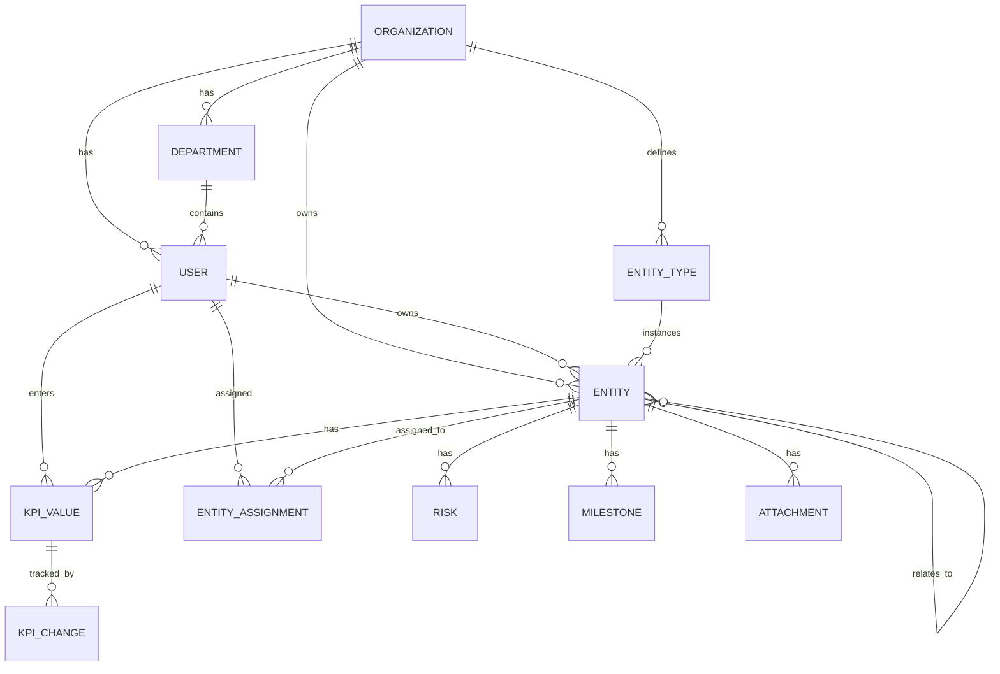

# نموذج البيانات

<div dir="rtl">

وصف نموذج البيانات وعلاقاته في منصة  المؤشرات KPI.

---

## نظرة عامة على الكيانات



---

## الكيانات الرئيسية

### 1. Organization (المؤسسة)

المستأجر الأعلى - كل بيانات تخص مؤسسة واحدة.

| الحقل | النوع | الوصف |
|-------|-------|-------|
| `id` | UUID | المعرّف الفريد |
| `name` | String | اسم المؤسسة |
| `nameAr` | String | الاسم بالعربية |
| `slug` | String | المعرف الفريد في URLs |
| `logo` | String | رابط الشعار (اختياري) |
| `settings` | JSON | إعدادات المؤسسة |
| `createdAt` | DateTime | تاريخ الإنشاء |
| `updatedAt` | DateTime | تاريخ التحديث |

**الإعدادات (Settings):**

```json
{
  "locale": "ar",
  "timezone": "Asia/Riyadh",
  "ragGreenMin": 75,
  "ragAmberMin": 50,
  "kpiApprovalLevel": "MANAGER",
  "features": {
    "ai": true,
    "approvals": true,
    "dashboards": true
  }
}
```

---

### 2. User (المستخدم)

| الحقل | النوع | الوصف |
|-------|-------|-------|
| `id` | UUID | المعرّف الفريد |
| `organizationId` | UUID | المؤسسة |
| `email` | String | البريد الإلكتروني (فريد) |
| `name` | String | الاسم الكامل |
| `nameAr` | String | الاسم بالعربية |
| `role` | Enum | ADMIN, EXECUTIVE, MANAGER |
| `departmentId` | UUID | الإدارة (اختياري) |
| `managerId` | UUID | المدير المباشر (اختياري) |
| `avatar` | String | صورة الملف الشخصي |
| `status` | Enum | ACTIVE, INACTIVE, SUSPENDED |
| `lastLoginAt` | DateTime | آخر تسجيل دخول |
| `createdAt` | DateTime | تاريخ الإنشاء |

**الأدوار (Roles):**

| الدور | الصلاحيات |
|-------|----------|
| `ADMIN` | كامل الصلاحيات |
| `EXECUTIVE` | قراءة شاملة + اعتماد |
| `MANAGER` | إدخال البيانات + قراءة محدودة |

---

### 3. Department (الإدارة)

| الحقل | النوع | الوصف |
|-------|-------|-------|
| `id` | UUID | المعرّف الفريد |
| `organizationId` | UUID | المؤسسة |
| `name` | String | اسم الإدارة |
| `nameAr` | String | الاسم بالعربية |
| `code` | String | الرمز الفريد |
| `managerId` | UUID | مدير الإدارة (اختياري) |
| `parentId` | UUID | الإدارة الأم (للتسلسل) |
| `createdAt` | DateTime | تاريخ الإنشاء |

---

### 4. EntityType (نوع الكيان)

أنواع الكيانات القابلة للتهيئة لكل مؤسسة.

| الحقل | النوع | الوصف |
|-------|-------|-------|
| `id` | UUID | المعرّف الفريد |
| `organizationId` | UUID | المؤسسة |
| `code` | String | الرمز (مثل: kpi, project) |
| `name` | String | الاسم |
| `nameAr` | String | الاسم بالعربية |
| `description` | String | الوصف |
| `icon` | String | الأيقونة |
| `sortOrder` | Int | ترتيب العرض |
| `config` | JSON | التكوين الإضافي |

**أنواع الكيانات المدمجة:**

| الكود | الاسم | الوصف |
|-------|-------|-------|
| `pillar` | ركيزة استراتيجية | مستوى استراتيجي عالٍ |
| `objective` | هدف | هدف استراتيجي |
| `initiative` | مبادرة | برنامج تنفيذي |
| `project` | مشروع | وحدة تسليم |
| `kpi` | مؤشر أداء | KPI |
| `task` | مهمة | مهمة فردية |

---

### 5. Entity (الكيان)

الكيان الأساسي - يمثل KPI، مشروع، مبادرة، إلخ.

| الحقل | النوع | الوصف |
|-------|-------|-------|
| `id` | UUID | المعرّف الفريد |
| `organizationId` | UUID | المؤسسة |
| `entityTypeId` | UUID | نوع الكيان |
| `parentId` | UUID | الكيان الأب (للتسلسل) |
| `code` | String | الرمز الفريد |
| `title` | String | العنوان |
| `titleAr` | String | العنوان بالعربية |
| `description` | String | الوصف |
| `descriptionAr` | String | الوصف بالعربية |
| `ownerId` | UUID | المالك |
| `status` | Enum | PLANNED, ACTIVE, AT_RISK, COMPLETED |
| `sourceType` | Enum | MANUAL, CALCULATED, DERIVED, SCORE |
| **القياس** ||
| `period` | Enum | MONTHLY, QUARTERLY, YEARLY |
| `unit` | String | وحدة القياس |
| `unitAr` | String | الوحدة بالعربية |
| `direction` | Enum | INCREASE_IS_GOOD, DECREASE_IS_GOOD |
| `indicatorType` | Enum | LEADING, LAGGING |
| `target` | Decimal | الهدف |
| `baseline` | Decimal | الخط الأساسي |
| `minValue` | Decimal | الحد الأدنى |
| `maxValue` | Decimal | الحد الأقصى |
| `weight` | Decimal | الوزن |
| **الصيغة** ||
| `formula` | String | الصيغة الحسابية |
| `aggregation` | Enum | LAST_VALUE, SUM, AVERAGE, MIN, MAX |
| **الحوكمة** ||
| `approvalLevel` | Enum | MANAGER, EXECUTIVE, ADMIN |
| `requiresApproval` | Boolean | يتطلب اعتماد |
| **التواريخ** ||
| `startDate` | Date | تاريخ البدء |
| `endDate` | Date | تاريخ الانتهاء |
| `createdAt` | DateTime | تاريخ الإنشاء |
| `updatedAt` | DateTime | تاريخ التحديث |
| `deletedAt` | DateTime | تاريخ الحذف (soft delete) |

---

### 6. EntityVariable (متغير الكيان)

متغيرات للكيانات المحسوبة (CALCULATED).

| الحقل | النوع | الوصف |
|-------|-------|-------|
| `id` | UUID | المعرّف الفريد |
| `entityId` | UUID | الكيان |
| `code` | String | رمز المتغير |
| `name` | String | اسم العرض |
| `nameAr` | String | الاسم بالعربية |
| `dataType` | Enum | NUMBER, PERCENTAGE |
| `isRequired` | Boolean | مطلوب |
| `isStatic` | Boolean | قيمة ثابتة |
| `staticValue` | Decimal | القيمة الثابتة |

---

### 7. KpiValue (قيمة مؤشر الأداء)

قيمة مؤشر أداء لفترة زمنية محددة.

| الحقل | النوع | الوصف |
|-------|-------|-------|
| `id` | UUID | المعرّف الفريد |
| `entityId` | UUID | الكيان |
| `period` | String | الفترة (YYYY-MM) |
| `periodStart` | Date | بداية الفترة |
| `periodEnd` | Date | نهاية الفترة |
| `actualValue` | Decimal | القيمة الفعلية |
| `calculatedValue` | Decimal | القيمة المحسوبة |
| `finalValue` | Decimal | القيمة النهائية |
| **الحالة** ||
| `status` | Enum | DRAFT, SUBMITTED, APPROVED, LOCKED |
| **المستخدمون** ||
| `enteredById` | UUID | المُدخل |
| `enteredAt` | DateTime | وقت الإدخال |
| `submittedById` | UUID | المُرسل |
| `submittedAt` | DateTime | وقت الإرسال |
| `approvedById` | UUID | المعتمد |
| `approvedAt` | DateTime | وقت الاعتماد |
| **الاعتماد** ||
| `approvalComment` | String | تعليق الاعتماد |
| **المتغيرات** ||
| `variables` | JSON | قيم المتغيرات |
| **البيانات الوصفية** ||
| `notes` | String | ملاحظات |
| `attachmentUrl` | String | رابط المرفق |
| `createdAt` | DateTime | تاريخ الإنشاء |
| `updatedAt` | DateTime | تاريخ التحديث |

**حالات القيمة:**

```
┌─────────┐    submit    ┌──────────┐    approve   ┌──────────┐
│  DRAFT  │ ───────────► │ SUBMITTED│ ───────────► │ APPROVED │
│  مسودة  │              │  مرسلة   │              │  معتمدة  │
└─────────┘              └──────────┘              └──────────┘
     │                                              │
     │                                              │
     └──────────────► (auto after period ends) ─────► LOCKED
                                                   │  مقفلة
```

---

### 8. EntityAssignment (تكليف الكيان)

ربط المستخدمين بالكيانات.

| الحقل | النوع | الوصف |
|-------|-------|-------|
| `id` | UUID | المعرّف الفريد |
| `entityId` | UUID | الكيان |
| `userId` | UUID | المستخدم |
| `role` | Enum | OWNER, CONTRIBUTOR, REVIEWER |
| `assignedById` | UUID | المُكلِّف |
| `assignedAt` | DateTime | وقت التكليف |
| `expiresAt` | DateTime | انتهاء الصلاحية (اختياري) |

**أدوار التكليف:**

| الدور | الصلاحيات |
|-------|----------|
| `OWNER` | كامل الصلاحيات |
| `CONTRIBUTOR` | إدخال البيانات |
| `REVIEWER` | مراجعة فقط |

---

### 9. Risk (المخاطرة)

| الحقل | النوع | الوصف |
|-------|-------|-------|
| `id` | UUID | المعرّف الفريد |
| `entityId` | UUID | الكيان المرتبط |
| `title` | String | عنوان المخاطرة |
| `description` | String | الوصف |
| `probability` | Enum | LOW, MEDIUM, HIGH |
| `impact` | Enum | LOW, MEDIUM, HIGH |
| `severity` | Enum | LOW, MEDIUM, HIGH, CRITICAL |
| `status` | Enum | OPEN, MITIGATED, CLOSED |
| `mitigation` | String | خطة المواجهة |
| `ownerId` | UUID | مسؤول المخاطرة |
| `dueDate` | Date | تاريخ الاستحقاق |
| `createdAt` | DateTime | تاريخ الإنشاء |

---

### 10. Milestone (المعلم)

| الحقل | النوع | الوصف |
|-------|-------|-------|
| `id` | UUID | المعرّف الفريد |
| `entityId` | UUID | الكيان (المشروع) |
| `title` | String | العنوان |
| `description` | String | الوصف |
| `dueDate` | Date | تاريخ الاستحقاق |
| `status` | Enum | PLANNED, IN_PROGRESS, COMPLETED, BLOCKED |
| `completionPercent` | Decimal | نسبة الإنجاز |
| `createdAt` | DateTime | تاريخ الإنشاء |

---

## العلاقات (Relationships)

### هرمية الكيانات

```
Organization
  └── Departments
        └── Users
              └── Own Entities
                    ├── KPI Values
                    ├── Risks
                    ├── Milestones
                    └── Assignments
```

### التسلسل الهرمي للكيانات

```
Pillar (ركيزة)
  └── Objective (هدف)
        ├── KPIs
        └── Initiative (مبادرة)
              ├── Projects
              │     ├── Tasks
              │     └── Milestones
              └── KPIs
```

### العلاقات متعددة الجوانب

| من | إلى | النوع | الوصف |
|----|-----|-------|-------|
| Entity | Entity | self-ref | تسلسل هرمي |
| Entity | User | many-to-one | المالك |
| Entity | User | many-to-many | التكليفات |
| Entity | KpiValue | one-to-many | القيم الزمنية |
| Entity | Risk | one-to-many | المخاطر |
| Entity | Milestone | one-to-many | المعالم |
| User | Department | many-to-one | الإدارة |
| User | User | self-ref | المدير/المرؤوس |

---

## الفهارس (Indexes)

### فهارس الأداء

```sql
-- البحث السريع في الكيانات
CREATE INDEX idx_entity_org_type ON Entity(organizationId, entityTypeId);
CREATE INDEX idx_entity_code ON Entity(code);
CREATE INDEX idx_entity_status ON Entity(status);

-- البحث في قيم KPI
CREATE INDEX idx_kpivalue_entity_period ON KpiValue(entityId, period);
CREATE INDEX idx_kpivalue_status ON KpiValue(status);

-- البحث في المستخدمين
CREATE INDEX idx_user_org ON User(organizationId);
CREATE INDEX idx_user_email ON User(email);

-- البحث في التكليفات
CREATE INDEX idx_assignment_user ON EntityAssignment(userId);
CREATE INDEX idx_assignment_entity ON EntityAssignment(entityId);
```

---

## القيود (Constraints)

### قيود التكامل

```sql
-- رمز فريد لكل مؤسسة
UNIQUE(organizationId, code)

-- بريد إلكتروني فريد
UNIQUE(email)

-- قيمة واحدة معتمدة لكل فترة
UNIQUE(entityId, period, status) WHERE status = 'APPROVED'
```

### قيود التحقق

```sql
-- الهدف أكبر من الصفر
CHECK (target >= 0)

-- الحد الأدنى أقل من الحد الأقصى
CHECK (minValue < maxValue)

-- نسبة الإنجاز بين 0 و 100
CHECK (achievementPercent BETWEEN 0 AND 100)
```

</div>
