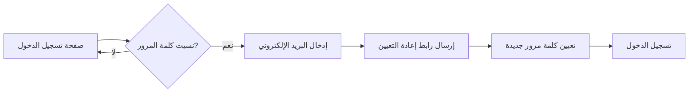
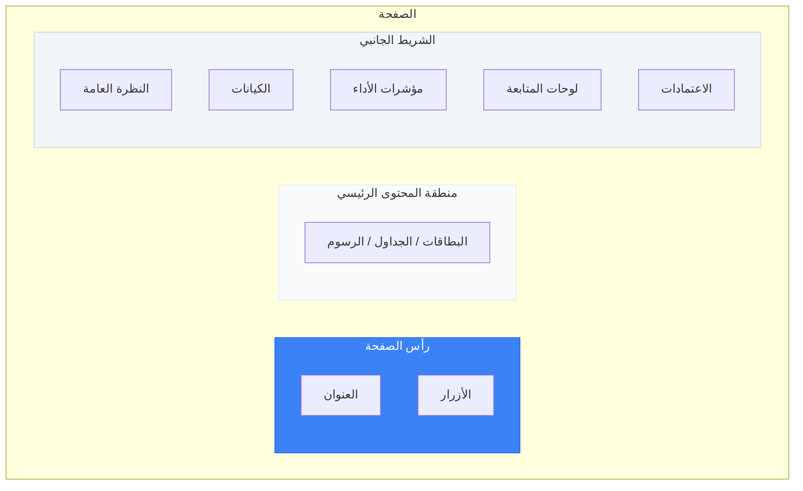

# البدء والدخول

يرشدك هذا الدليل خطوةً بخطوة عبر تسجيل الدخول إلى المنصة، والتنقل بين أقسامها، وفهم التخطيط العام للواجهة.

---

## 1. الوصول إلى المنصة

افتح متصفح الإنترنت وانتقل إلى رابط المنصة الذي زوّدتك به مؤسستك. يتضمن مسار الرابط بادئة اللغة:

- **العربية**: `/ar/...`
- **الإنجليزية**: `/en/...`

عند زيارة الرابط الجذر `/` يتم التوجيه تلقائياً إلى `/en`، وبإمكانك تغيير اللغة يدوياً بعد الدخول.

---

## 2. تسجيل الدخول

1. انتقل إلى `/<locale>/auth/login` (مثال: `/ar/auth/login`).
2. أدخل **بريدك الإلكتروني** و**كلمة المرور**.
3. انقر على زر **تسجيل الدخول**.

بعد المصادقة الناجحة، سيتم توجيهك تلقائياً إلى صفحة **النظرة العامة** (`/<locale>/overview`).

> **ملاحظة:** إن لم تكن لديك بيانات اعتماد، تواصل مع مسؤول النظام في مؤسستك. تُدار بيانات الاعتماد على مستوى المؤسسة ولا تتوفر خدمة التسجيل الذاتي.

### نسيت كلمة المرور؟

استخدم رابط **نسيت كلمة المرور** في صفحة تسجيل الدخول لبدء عملية إعادة تعيين كلمة المرور عبر البريد الإلكتروني.

---

## 3. تغيير اللغة

تدعم المنصة دعماً كاملاً **اللغة العربية** (من اليمين إلى اليسار) و**اللغة الإنجليزية** (من اليسار إلى اليمين).

- غيّر اللغة بتعديل بادئة اللغة في الرابط: استبدل `/en/` بـ `/ar/` أو العكس.
- أو استخدم زر تبديل اللغة في شريط التنقل العلوي.

تتكيف جميع التسميات والتواريخ والأرقام تلقائياً مع اللغة المحددة، بما في ذلك اتجاه الصفحة بالكامل.

---

## 4. التنقل الرئيسي (الشريط الجانبي)

بعد تسجيل الدخول، يكون الشريط الجانبي وسيلة التنقل الرئيسية. تختلف العناصر الظاهرة بحسب دورك في النظام:

| عنصر التنقل | الوصف |
|------------|-------|
| **النظرة العامة** | ملخص تنفيذي مخصص ولوحة الصحة المؤسسية |
| **الكيانات** | تصفح مؤشرات الأداء وعناصر الاستراتيجية حسب النوع (يتغير بحسب إعدادات مؤسستك) |
| **المشاريع** | محفظة المشاريع الاستراتيجية |
| **المخاطر** | سجل المخاطر المؤسسية |
| **الركائز الاستراتيجية** | محاور الاستراتيجية ومجالات التركيز |
| **الأهداف** | الأهداف التنظيمية |
| **المسؤوليات** | تكليفات الفريق والملكية |
| **الإدارات** | الهيكل التنظيمي والأقسام |
| **لوحات المتابعة** | لوحات تحليلية مبنية على الأدوار |
| **التقارير** | تقارير تحليلية مع التصدير |
| **الاعتمادات** | طابور اعتماد قيم مؤشرات الأداء |
| **المؤسسة** | إعدادات ومعلومات المؤسسة |
| **الإدارة** | إدارة المستخدمين (للمسؤولين فقط) |

---

## 5. تخطيط الصفحة

تتبع جميع الصفحات تخطيطاً موحداً:

- **رأس الصفحة**: يعرض عنوان الصفحة والعنوان الفرعي وأزرار الإجراءات الرئيسية (مثل: "كيان جديد"، "عرض لوحات المتابعة").
- **البطاقات**: تُعرض البيانات في بطاقات تحتوي على مقاييس وأشرطة تقدم وشارات الحالة.
- **الجداول**: قوائم السجلات بأعمدة قابلة للترتيب مع روابط للوصول إلى صفحات التفاصيل.

---

## 6. تسجيل الخروج

- انقر على صورتك الشخصية أو اسمك في شريط التنقل العلوي.
- اختر **تسجيل الخروج**.

تُمسح جلستك وتعود تلقائياً إلى صفحة تسجيل الدخول.

---

## 7. المساعد الذكي (AI Assistant)

عند تمكينه، يكون المساعد الذكي متاحاً في شريط العلوي للمساعدة في المهام:

### تفعيل/إخفاء لوحة المساعد

- انقر على زر **المساعد الذكي** في الشريط العلوي لتفعيل لوحة المحادثة.
- انقر مرة أخرى لإخفاء اللوحة.

### ميزات المساعد الذكي

- **مساعدة سياقية**: يقدم إرشادات بناءً على الصفحة الحالية.
- **الإجابة على الأسئلة**: يمكن طرح الأسئلة حول استخدام المنصة.
- **الدعم متعدد اللغات**: يدعم اللغتين العربية والإنجليزية.

> **ملاحظة:** يتحكم مسؤول المنصة في توفر هذه الميزة عبر **مؤشرات الميزات** في إعدادات النظام.

---

## 8. صفحة الملف الشخصي

انتقل إلى `/<locale>/profile` للاطلاع على:
- دورك الحالي ومؤسستك
- نطاق وصولك (ما يمكنك رؤيته وتنفيذه)
- إعدادات التفضيلات (اللغة، المظهر)

