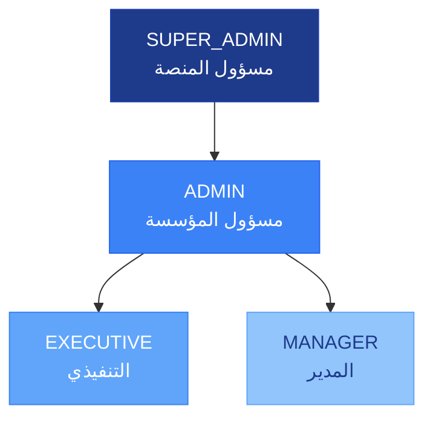

# الأدوار والصلاحيات

تعتمد منصة **رافد KPI** على نظام **التحكم في الوصول المبني على الأدوار (RBAC)**. يُخصَّص لكل مستخدم دور واحد داخل مؤسسته، ويُحدِّد هذا الدور الصفحات التي يمكنه زيارتها، والبيانات التي يمكنه الاطلاع عليها، والإجراءات التي يمكنه تنفيذها.

---

## نظرة عامة على الأدوار

| الدور | الفئة المستهدفة | مستوى الوصول |
|-------|----------------|--------------|
| **SUPER_ADMIN** (مسؤول المنصة) | مسؤولو المنصة على مستوى النظام | وصول كامل لجميع المؤسسات |
| **ADMIN** (مسؤول المؤسسة) | مسؤولو المؤسسة | وصول كامل داخل المؤسسة |
| **EXECUTIVE** (التنفيذي) | المدير التنفيذي والقيادة العليا | عرض للقراءة فقط على مستوى المؤسسة؛ لوحات المتابعة؛ بدون إدخال بيانات |
| **MANAGER** (المدير) | رؤساء الأقسام والمشرفون | يمكنه إدخال وإرسال قيم مؤشرات الأداء؛ يرى الكيانات المكلَّف بها |

> **ملاحظة:** لا يوجد دور مستقل "للموظف" في النظام الحالي. يُدار الموظفون عبر دور **MANAGER** أو من خلال تكليفات الكيانات.

### هرمية الأدوار

---

## مصفوفة الصلاحيات

| الصلاحية | مسؤول المنصة | مسؤول المؤسسة | التنفيذي | المدير |
|---------|:------------:|:-------------:|:--------:|:------:|
| عرض جميع الكيانات (على مستوى المؤسسة) | ✅ | ✅ | ✅ | المكلَّف به فقط |
| إنشاء الكيانات وتعديلها | ✅ | ✅ | ❌ | ❌ |
| حذف الكيانات | ✅ | ✅ | ❌ | ❌ |
| إدخال قيم مؤشرات الأداء (مسودة) | ✅ | ✅ | ❌ | ✅ |
| إرسال قيم مؤشرات الأداء للاعتماد | ✅ | ✅ | ❌ | ✅ |
| اعتماد أو رفض قيم مؤشرات الأداء | ✅ | ✅ | ✅ (إذا كان مستوى الاعتماد = EXECUTIVE) | ✅ (إذا كان مستوى الاعتماد = MANAGER) |
| عرض لوحات المتابعة | ✅ | ✅ | ✅ | ✅ |
| إدارة المستخدمين | ✅ | ✅ | ❌ | ❌ |
| الوصول إلى لوحة الإدارة | ✅ | ✅ | ❌ | ❌ |
| إدارة إعدادات المؤسسة | ✅ | ✅ | ❌ | ❌ |
| الوصول إلى لوحة مسؤول المنصة | ✅ | ❌ | ❌ | ❌ |

---

## مستويات اعتماد مؤشرات الأداء

يُحدِّد إعداد **مستوى الاعتماد** على مستوى المؤسسة الجهة المخوَّلة باعتماد قيم مؤشرات الأداء المُرسَلة:

| الإعداد | جهة الاعتماد |
|---------|-------------|
| `MANAGER` | يعتمد مستخدم بدور المدير |
| `EXECUTIVE` | يعتمد مستخدم بدور التنفيذي |
| `ADMIN` | يعتمد مستخدم بدور مسؤول المؤسسة |

يُهيَّأ هذا الإعداد من قِبَل المسؤول على مستوى المؤسسة من صفحة (`/ar/admin`).

---

## مدى رؤية الكيانات

- **مسؤول المؤسسة / التنفيذي**: يمكنهما رؤية **جميع الكيانات** على مستوى المؤسسة بالكامل.
- **المدير**: يرى الكيانات التي هو **مكلَّف بها** عبر `UserEntityAssignment`، إضافةً إلى الكيانات التي هو **مالكها** (`ownerUserId`).
- المستخدمون غير المكلَّفين بكيان لا يمكنهم رؤيته أو التفاعل معه.

---

## التنقل حسب الدور

### مسؤول المؤسسة (ADMIN)
شريط جانبي كامل يشمل جميع الأقسام، بما فيها:
- لوحة الإدارة (`/admin`)
- إدارة المستخدمين (`/admin/users`)
- جميع الكيانات ومؤشرات الأداء ولوحات المتابعة والاعتمادات

### التنفيذي (EXECUTIVE)
- النظرة العامة، لوحات المتابعة، الكيانات (للقراءة فقط)، الاعتمادات (بصفته مُعتمِداً)
- لا يمكنه إنشاء أو تعديل أو حذف الكيانات أو إدخال قيم مؤشرات الأداء

### المدير (MANAGER)
- النظرة العامة، الكيانات (المكلَّف بها)، مؤشرات الأداء (المكلَّف بها)، الاعتمادات (بصفته مُرسِلاً)
- لوحات المتابعة على مستوى المدير
- يمكنه إدخال وإرسال بيانات مؤشرات الأداء للكيانات المكلَّف بها

---

## تغيير دور مستخدم

يقتصر تغيير الأدوار على **مسؤول المؤسسة** أو **مسؤول المنصة**:

1. انتقل إلى **الإدارة** ← **المستخدمون** (`/admin/users`).
2. اختر المستخدم المعني.
3. عدّل الدور باستخدام قائمة اختيار الدور.
4. احفظ التغييرات.

يسري الدور الجديد فور تحديث المستخدم للصفحة دون الحاجة إلى إعادة تسجيل الدخول في معظم الحالات.

