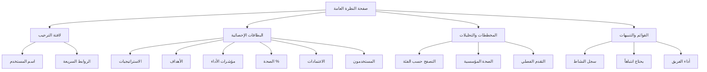
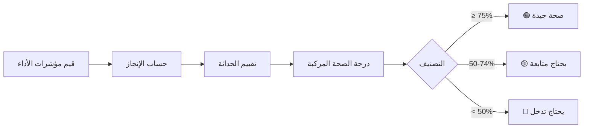
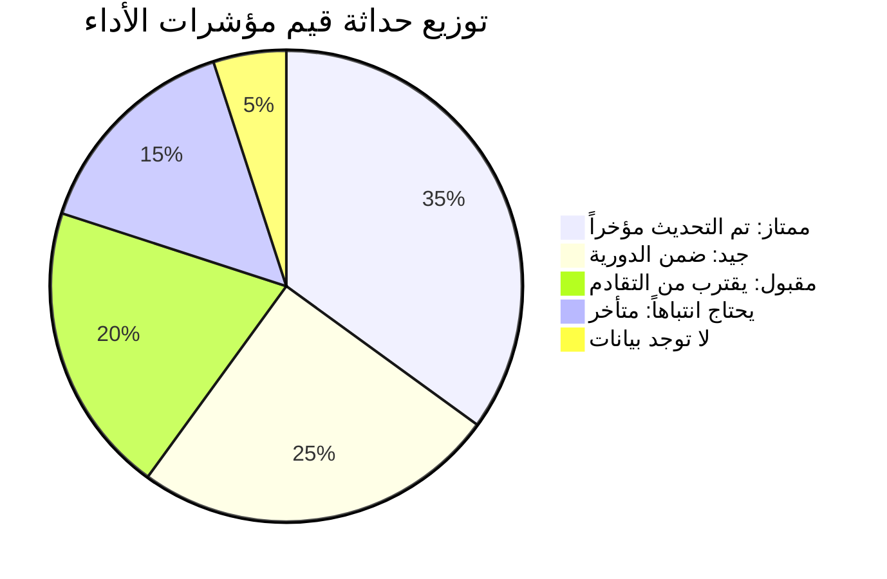
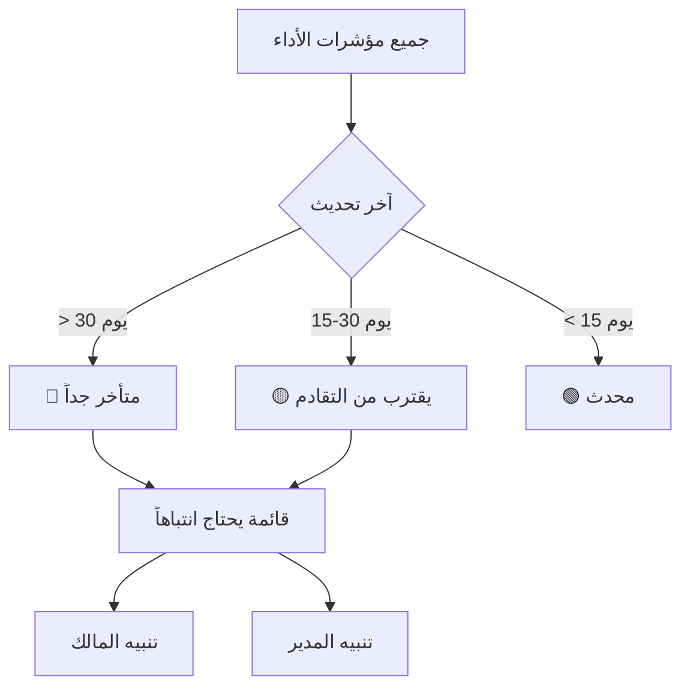

# صفحة النظرة العامة

تُعدّ صفحة **النظرة العامة** (`/<locale>/overview`) صفحة الهبوط المخصصة لك بعد تسجيل الدخول. توفر لقطة شاملة على مستوى القيادة تعكس صحة مؤشرات الأداء والاعتمادات والتقدم الاستراتيجي في مؤسستك.

---

## أقسام الصفحة

### مخطط هيكل صفحة النظرة العامة

### 1. لافتة الترحيب

تعرض اسمك واسم مؤسستك، وتحتوي على روابط الإجراءات السريعة:

| الرابط السريع | الوجهة |
|--------------|--------|
| **إدارة مؤشرات الأداء** | كتالوج النوع الأول من الكيانات (مثل: فئة مؤشرات الأداء الرئيسية) |
| **الاعتمادات** | طابور اعتماد قيم مؤشرات الأداء |
| **المسؤوليات** | قائمة تكليفاتك بالكيانات |

---

### 2. لقطة التغطية (البطاقة العلوية اليسرى)

#### تدفق بيانات الصحة

ملخص موجز للوضع الراهن للمؤسسة:

| المقياس | المعنى |
|---------|--------|
| **مؤشرات الأداء** | إجمالي عدد كيانات مؤشرات الأداء في النظام |
| **الاعتمادات المعلّقة** | قيم مؤشرات الأداء التي تنتظر الاعتماد |
| **الصحة العامة** | نسبة الصحة المؤسسية الإجمالية (شريط تقدم) |

يمثل **مؤشر الصحة** متوسطاً مرجّحاً يعكس مدى حداثة قيم مؤشرات الأداء وجودة أدائها عبر جميع الكيانات.

---

### 3. بطاقات ملخص الإحصاءات

ست بطاقات إحصائية في الجزء العلوي من منطقة المحتوى الرئيسية:

| البطاقة | لون الأيقونة | المعنى |
|---------|------------|--------|
| **الاستراتيجيات** | بنفسجي | إجمالي الكيانات الاستراتيجية النشطة |
| **الأهداف** | أزرق | إجمالي الأهداف التنظيمية |
| **مؤشرات الأداء** | أخضر زمردي | إجمالي كيانات مؤشرات الأداء |
| **الصحة %** | سماوي | درجة الصحة الإجمالية مع شريط التقدم |
| **الاعتمادات** | عنبري | عدد الاعتمادات المعلّقة |
| **المستخدمون** | وردي | إجمالي المستخدمين في المؤسسة |

---

### 4. التصفح حسب الفئة (مخطط أعمدة)

مخطط أعمدة أفقي يُظهر عدد الكيانات لكل **نوع كيان** (مثل: الاستراتيجية، الأهداف، مؤشرات الأداء). استخدمه لفهم توزيع بيانات مؤسستك.

---

### 5. الصحة المؤسسية (مخطط دائري)

#### تقسيم حداثة البيانات

مخطط دائري يُظهر مدى **حداثة** قيم مؤشرات الأداء، مقسَّماً إلى شرائح:

| الشريحة | اللون | المعنى |
|---------|-------|--------|
| **ممتاز** | أخضر | تم التحديث مؤخراً جداً |
| **جيد** | أزرق | تم التحديث ضمن الدورية المعتادة |
| **مقبول** | عنبري | يقترب من التقادم |
| **يحتاج انتباهاً** | أحمر | متأخر / قديم |
| **لا توجد بيانات** | رمادي | لم يُسجَّل أي قيمة من قبل |

---

### 6. سجل النشاط الأخير

قائمة زمنية بأحدث إدخالات قيم مؤشرات الأداء عبر المؤسسة، تُظهر:
- اسم الكيان (رابط لصفحة التفاصيل)
- الحالة: مسودة، مُرسَل، معتمد، أو مقفل
- الطابع الزمني

انقر على أي إدخال للانتقال مباشرةً إلى صفحة تفاصيل ذلك الكيان.

---

### 7. التقدم الفصلي (مخطط مساحي)

مخطط خطي/مساحي يرسم أداء مؤشرات الأداء المُجمَّع عبر أرباع السنة الحالية. استخدمه لرصد اتجاهات الأداء — تحسُّن، ثبات، أو تراجع.

انقر على **عرض التفاصيل** للانتقال إلى صفحة لوحات المتابعة الكاملة.

---

### 8. يحتاج انتباهاً

#### تدفق تحديد الأولويات

يسرد مؤشرات الأداء التي **لم يتم تحديثها مؤخراً**، مرتَّبةً حسب عدد الأيام منذ آخر إدخال قيمة. يُظهر كل عنصر:
- اسم الكيان (رابط)
- عدد الأيام منذ آخر تحديث
- شريط تقدم يعكس درجة التأخر

استخدم هذه القائمة لتحديد أولويات إشعار أصحاب مؤشرات الأداء الذين يحتاجون إلى إدخال البيانات.

---

### 9. أداء الفريق

يعرض أبرز **مالكي الكيانات** مرتَّبين حسب عدد الكيانات التي يمتلكونها، مما يساعد على تحديد تركّز أعباء العمل أو الكيانات غير المُسنَدة لأحد.

---

### 10. التنقل الاستراتيجي

أزرار وصول سريع لأقسام المنصة الرئيسية:

- **إدارة مؤشرات الأداء** — كتالوج الكيانات
- **الركائز الاستراتيجية** — قائمة الركائز
- **الأهداف** — قائمة الأهداف
- **المشاريع** — محفظة المشاريع
- **إدارة المخاطر** — سجل المخاطر
- **المؤسسة** — الهيكل التنظيمي

---

## نصائح مفيدة

- تُحدَّث بيانات صفحة النظرة العامة عند كل تحميل للصفحة.
- إذا ظهرت `—` في البطاقات، فالبيانات لا تزال تُحمَّل أو لا توجد سجلات بعد.
- قسم **يحتاج انتباهاً** هو الطريقة الأسرع لتحديد مؤشرات الأداء المتأخرة التي تحتاج إلى إدخال.

