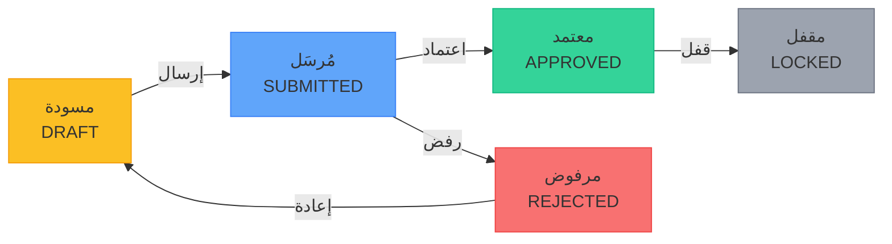

# إدخال قيم مؤشرات الأداء

تمر قيم مؤشرات الأداء بدورة عمل منظَّمة: **مسودة ← مُرسَل ← معتمد ← مقفل**. يضمن هذا النهج جودة البيانات والمساءلة قبل أن تصبح أي قيمة جزءاً من السجل الرسمي.

---

## من يمكنه إدخال القيم؟

| الدور | إدخال القيمة (مسودة) | الإرسال للاعتماد | الاعتماد |
|-------|:-------------------:|:----------------:|:--------:|
| مسؤول المؤسسة (ADMIN) | ✅ | ✅ | ✅ |
| التنفيذي (EXECUTIVE) | ❌ | ❌ | ✅ (إذا كان مستوى الاعتماد = EXECUTIVE) |
| المدير (MANAGER) | ✅ | ✅ | ✅ (إذا كان مستوى الاعتماد = MANAGER) |

> لا يمكن للمدير إدخال القيم إلا للكيانات التي هو مكلَّف بها أو مالكها.

---

## دورة حياة القيمة

| الحالة | الوصف |
|--------|-------|
| **مسودة (DRAFT)** | تم إدخال القيمة لكنها لم تُرسَل بعد. غير مرئية للمعتمِدين. |
| **مُرسَل (SUBMITTED)** | أُرسلت القيمة للمراجعة. تظهر في طابور الاعتمادات. |
| **معتمد (APPROVED)** | قبِلها معتمِد مخوَّل. تُستخدم في لوحات المتابعة وحسابات الصحة. |
| **مقفل (LOCKED)** | القيمة مقفلة نهائياً — لا يمكن إجراء أي تعديلات. تُضبط بعد الاعتماد. |

---

## الخطوة الأولى — الانتقال إلى الكيان

1. افتح **الكيانات ← [اسم النوع]** من الشريط الجانبي.
2. ابحث عن كيانك باستخدام البحث أو بالتمرير في القائمة.
3. انقر على اسم الكيان لفتح صفحة تفاصيله.

---

## الخطوة الثانية — فتح تبويب القيم

في صفحة تفاصيل الكيان، انقر على تبويب **القيم**. يعرض هذا التبويب جميع إدخالات القيم التاريخية لهذا الكيان مع حالتها.

---

## الخطوة الثالثة — إضافة قيمة جديدة

انقر على **+ إضافة قيمة** (أو الزر المعادل في تبويب القيم).

تفتح نموذجاً يحتوي على الحقول التالية:

### للكيانات اليدوية (MANUAL):

| الحقل | مطلوب | الوصف |
|-------|:-----:|-------|
| **القيمة الفعلية** | ✅ | القياس الرقمي لهذه الدورة |
| **ملاحظة** | ❌ | تفسير أو سياق اختياري |

### للكيانات المحسوبة (CALCULATED):

بدلاً من قيمة واحدة، تملأ كل **متغير** مُعرَّف للكيان:

| الحقل | مطلوب | الوصف |
|-------|:-----:|-------|
| **قيم المتغيرات** | يعتمد على إعداد `isRequired` | كل متغير مُعرَّف على الكيان |
| **ملاحظة** | ❌ | تفسير اختياري |

يحسب النظام الصيغة تلقائياً ويعرض **القيمة المحسوبة** كمعاينة.

> **تلميح:** للمتغيرات ذات `isStatic = true`، تُملأ قيمها مسبقاً ولا يمكن تغييرها لكل إدخال.

### التحقق من نطاق القيمة

إذا كان الكيان يحتوي على **حد أدنى** أو **حد أقصى** للقيمة، سيرفض النظام الإدخالات التي تقع خارج النطاق المسموح به. ستظهر رسالة خطأ داخلية:

| الخطأ | المعنى |
|-------|--------|
| `valueBelowMinimum` | القيمة المُدخَلة أقل من الحد الأدنى المُضبَط |
| `valueAboveMaximum` | القيمة المُدخَلة تتجاوز الحد الأقصى المُضبَط |

صحِّح القيمة وأعد الحفظ. إذا بدا النطاق غير صحيح، تواصل مع المسؤول لتعديل إعدادات الحد الأدنى/الأقصى للكيان.

---

## الخطوة الرابعة — الحفظ كمسودة

انقر على **حفظ** لحفظ القيمة بوصفها **مسودة**.

- المسودات خاصة بك (وبالمسؤولين).
- يمكنك تعديل المسودة قبل الإرسال.
- لا يُشغَّل أي إجراء اعتماد في هذه المرحلة.

---

## الخطوة الخامسة — الإرسال للاعتماد

عندما تكون القيمة جاهزة للمراجعة:

1. ابحث عن إدخال المسودة في تبويب **القيم**.
2. انقر على **إرسال**.
3. أكّد الإرسال.

تتغير حالة القيمة إلى **مُرسَل** وتظهر الآن في طابور **الاعتمادات** للمعتمِد المحدَّد.

> **ملاحظة:** بعد الإرسال لا يمكنك تعديل القيمة. إذا اكتُشف خطأ قبل الاعتماد، اطلب من المسؤول أو المعتمِد رفضها حتى تتمكن من إعادة الإدخال.

بعد الإرسال، **يتلقى المعتمِدون المخوَّلون تلقائياً إشعاراً بالجرس** في شريط الرأس. يُظهر أيقونة الجرس عدد الإشعارات غير المقروءة، وعند النقر عليها تُمسح الإشعارات وينتقل المستخدم إلى صفحة الاعتمادات.

---

## الخطوة السادسة — انتظار الاعتماد

سيراجع المعتمِد المحدَّد (بناءً على إعداد `kpiApprovalLevel` للمؤسسة) القيمة المُرسَلة في صفحة **الاعتمادات**.

- في حالة **الاعتماد**: تصبح الحالة `APPROVED` ← ثم `LOCKED`. تصبح القيمة جزءاً من السجل الرسمي.
- في حالة **الرفض**: تعود الحالة إلى `DRAFT` (أو تُحذف). ستحتاج إلى إعادة إدخال القيمة المصحَّحة.

---

## تعديل مسودة

1. افتح تبويب **القيم** للكيان.
2. ابحث عن إدخال المسودة.
3. انقر على إجراء التعديل في الصف.
4. حدّث القيمة أو الملاحظة.
5. انقر على **حفظ**.

لا يمكن تعديل سوى قيم **المسودة**. قيم SUBMITTED وAPPROVED وLOCKED غير قابلة للتعديل.

---

## قيمة الإنجاز

يحسب النظام **قيمة الإنجاز** تلقائياً ويخزّنها عند كل حفظ للقيمة. تعتمد الصيغة على **اتجاه** الكيان:

| الاتجاه | الصيغة |
|---------|--------|
| `INCREASE_IS_GOOD` | `(القيمة الفعلية ÷ القيمة المستهدفة) × 100` |
| `DECREASE_IS_GOOD` | `(القيمة المستهدفة ÷ القيمة الفعلية) × 100` |

تُحدَّد النسبة بين **0%** و**100%**، وتُعرض كمقياس دائري في قائمة الكيانات وصفحة التفاصيل. وهي أيضاً الأساس لتلوين الصحة بنظام RAG (أحمر/أصفر/أخضر).

> **ملاحظة:** إذا لم تُضبَط قيمة مستهدفة للكيان، لا يمكن حساب الإنجاز ولن يُعرض المقياس.

---

## نوع الدورية وجدول البيانات

لكل كيان **نوع دورية** يحدد عدد مرات إدخال القيم:

| نوع الدورية | الجدول الزمني المتوقع |
|------------|----------------------|
| **MONTHLY (شهري)** | قيمة واحدة شهرياً |
| **QUARTERLY (ربع سنوي)** | قيمة واحدة كل ربع سنة (ر1–ر4) |
| **YEARLY (سنوي)** | قيمة واحدة سنوياً |

لا يُطبِّق النظام الجدول تلقائياً، لكن الكيانات المتأخرة تظهر في قسم **يحتاج انتباهاً** في صفحة النظرة العامة.

---

## استكشاف الأخطاء وإصلاحها

| المشكلة | الحل |
|---------|------|
| لا يظهر زر "إضافة قيمة" | تحقق من أنك مكلَّف بالكيان، أو تواصل مع المسؤول |
| نتيجة القيمة المحسوبة خاطئة | تحقق من صحة جميع قيم المتغيرات؛ راجع الصيغة مع المسؤول |
| ظهور خطأ "valueBelowMinimum" أو "valueAboveMaximum" | القيمة خارج نطاق الحد الأدنى/الأقصى المُضبَط. صحِّح القيمة أو اطلب من المسؤول تعديل النطاق. |
| القيمة المُرسَلة تحتوي على خطأ | اطلب من المسؤول أو المعتمِد رفضها؛ أعد الإدخال بعد الرفض |
| القيمة متوقفة في حالة "مُرسَل" | تحقق من طابور الاعتمادات — يجب أن يرى المعتمِد أيضاً إشعار الجرس في شريط الرأس |

