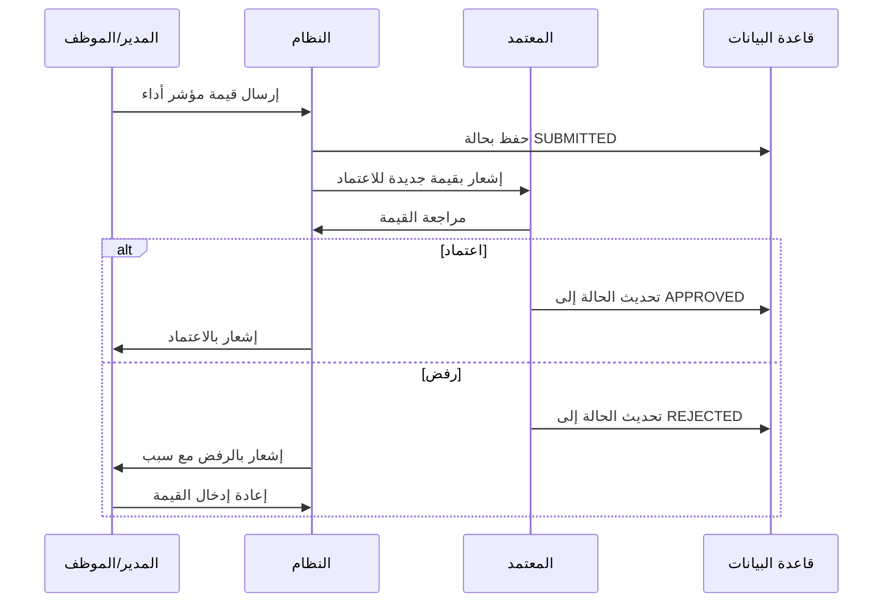

# الاعتمادات

صفحة **الاعتمادات** (`/<locale>/approvals`) هي المكان الذي يراجع فيه المستخدمون المخوَّلون قيم مؤشرات الأداء المُرسَلة ويتخذون قراراتهم بشأنها. تُعدّ هذه المرحلة خطوة حوكمة جوهرية تضمن دقة البيانات قبل أن تصبح جزءاً من السجل الرسمي.

---

## من يستخدم صفحة الاعتمادات؟

| الدور | الإجراء |
|-------|--------|
| **مسؤول المؤسسة (ADMIN)** | يمكنه اعتماد أو رفض أي قيمة مُرسَلة |
| **التنفيذي (EXECUTIVE)** | يمكنه الاعتماد/الرفض إذا كان إعداد `kpiApprovalLevel = EXECUTIVE` |
| **المدير (MANAGER)** | يمكنه الاعتماد/الرفض إذا كان إعداد `kpiApprovalLevel = MANAGER` |

> لا يعتمد المُرسِلون (الذين أدخلوا البيانات) إرسالاتهم بأنفسهم. يجب أن يصدر الاعتماد من مستخدم مخوَّل آخر.

### سير عمل الاعتماد

---

## الوصول إلى طابور الاعتمادات

1. انقر على **الاعتمادات** في الشريط الجانبي.
2. تفتح الصفحة على فلتر **المعلَّق** افتراضياً، وتعرض جميع القيم التي تنتظر قراراً.

---

## تصفية الطابور

ثلاثة أزرار تصفية في أعلى القائمة:

| الفلتر | يعرض |
|--------|-------|
| **معلَّق** | القيم بحالة `SUBMITTED` — تنتظر قراراً |
| **معتمَد** | القيم التي اعتُمدت بالفعل |
| **الكل** | جميع القيم بصرف النظر عن حالتها |

---

## قراءة جدول الاعتمادات

يعرض كل صف في الجدول:

| العمود | الوصف |
|--------|-------|
| **الكيان** | اسم مؤشر الأداء/الكيان الذي تنتمي إليه القيمة. يُظهر نوع الكيان ورمزه تحت الاسم. انقر على الاسم للانتقال إلى صفحة تفاصيل الكيان. |
| **الفترة** | تاريخ/وقت إنشاء إدخال القيمة |
| **القيمة** | القيمة النهائية المحسوبة (`finalValue` ← `calculatedValue` ← `actualValue`، أيها متاح) |
| **أرسلها** | المستخدم الذي أرسل القيمة |
| **وقت الإرسال** | تاريخ ووقت الإرسال |
| **الحالة** | شارة الحالة الحالية (`SUBMITTED`، `APPROVED`، إلخ) |

---

## اعتماد قيمة

1. من صفحة الاعتمادات، انقر على **اسم الكيان** في الصف الذي تريد مراجعته.
2. يفتح هذا الإجراء صفحة تفاصيل الكيان على تبويب **القيم**.
3. حدّد إدخال القيمة المُرسَلة (الحالة = `SUBMITTED`).
4. انقر على **اعتماد**.
5. أكّد الإجراء.

تتغير حالة القيمة من `SUBMITTED` ← `APPROVED` ← `LOCKED`.

> بمجرد القفل، تصبح القيمة جزءاً من السجل الدائم ولا يمكن تغييرها.

---

## رفض قيمة

1. انتقل إلى إدخال القيمة المُرسَلة (كما في الخطوات أعلاه).
2. انقر على **رفض**.
3. أضف **تعليقاً** اختيارياً يوضح سبب الرفض.
4. أكّد الإجراء.

تُعاد حالة القيمة (إلى `DRAFT` أو تُحذف)، ويمكن للمُرسِل تصحيحها وإعادة إرسالها.

---

## سجل تدقيق الاعتمادات

يُسجَّل كل اعتماد أو رفض مع:
- هوية المعتمِد
- الطابع الزمني للقرار
- أي تعليق مُقدَّم

يُحفظ سجل التدقيق هذا بشكل دائم ويمكن مراجعته من تاريخ تبويب القيم للكيان.

---

## تهيئة مستوى الاعتماد

يُحدِّد **مستوى اعتماد مؤشرات الأداء** للمؤسسة الجهة المعتمِدة المحدَّدة. يضبطه المسؤول:

| المستوى | دور المعتمِد |
|---------|------------|
| `MANAGER` | يجب أن يعتمد مستخدم بدور المدير |
| `EXECUTIVE` | يجب أن يعتمد مستخدم بدور التنفيذي |
| `ADMIN` | يجب أن يعتمد مستخدم بدور مسؤول المؤسسة |

لتغيير هذا الإعداد، انتقل إلى **الإدارة** ← **إعدادات المؤسسة**.

---

## الإشعارات

يرسل النظام **إشعارات داخل التطبيق تلقائياً** — دون الحاجة إلى أي إعداد.

### أيقونة الجرس (شريط الرأس)

تظهر أيقونة الجرس (🔔) في شريط الرأس العلوي لجميع المستخدمين (باستثناء SUPER_ADMIN). عند وجود إشعارات غير مقروءة، تظهر شارة حمراء تُظهِر العدد (حتى "9+").

| الحدث | من يتلقى الإشعار |
|------|-------------------|
| **إرسال قيمة** | جميع المستخدمين ذوي الدور المخوَّل بالاعتماد (بحسب `kpiApprovalLevel`) |
| **اعتماد قيمة** | المستخدم الذي أرسل القيمة أصلاً |
| **رفض قيمة** | المستخدم الذي أرسل القيمة أصلاً |

### مسح الإشعارات

عند النقر على أيقونة الجرس:
1. تُمسح جميع الإشعارات غير المقروءة كمقروءة.
2. ينتقل المستخدم تلقائياً إلى صفحة **الاعتمادات**.

يتجدد عدد الإشعارات تلقائياً كل **60 ثانية** طالما كان التطبيق مفتوحاً.

---

## استكشاف الأخطاء وإصلاحها

| المشكلة | الحل |
|---------|------|
| صفحة الاعتمادات فارغة رغم وجود قيم مُرسَلة | تحقق من دورك — قد لا تكون أنت مستوى الاعتماد المحدَّد |
| لا تظهر أزرار الاعتماد/الرفض | انتقل إلى صفحة تفاصيل الكيان ← تبويب القيم، وليس قائمة الاعتمادات |
| اعتُمدت قيمة بالخطأ | تواصل مع المسؤول للمراجعة — القيم المقفلة تستلزم تدخل المسؤول |
| ينمو الطابور دون معالجة | حدّد المعتمِد المحدَّد وتأكد من أن لديه وصولاً ومعرفة بذلك |

