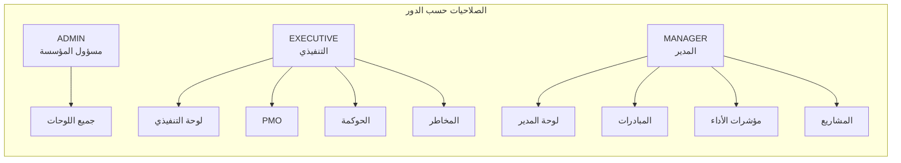
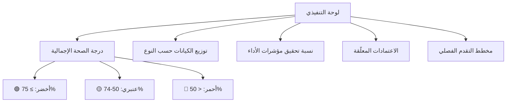
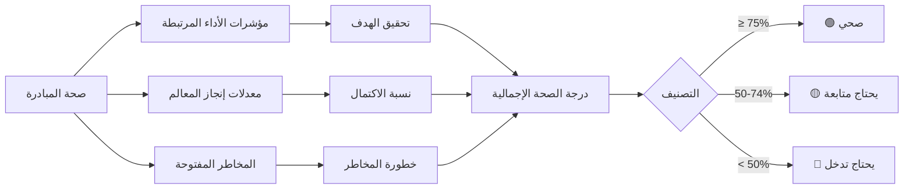
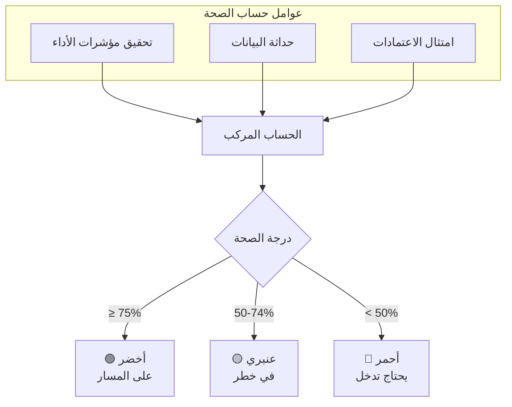

# لوحات المتابعة

يوفر قسم **لوحات المتابعة** (`/<locale>/dashboards`) عروضاً تحليلية مبنية على الأدوار تعكس الأداء الاستراتيجي لمؤسستك. تُجيب كل لوحة على سؤال قيادي محدد وتدعم التعمق في البيانات الأساسية.

---

## الوصول إلى لوحات المتابعة

1. انقر على **لوحات المتابعة** في الشريط الجانبي.
2. تعرض صفحة كتالوج لوحات المتابعة جميع اللوحات المتاحة على شكل بطاقات.
3. انقر على أي بطاقة لفتح اللوحة المقابلة.

أو انتقل مباشرةً باستخدام الروابط الواردة أدناه.

---

## لوحات المتابعة المتاحة

### مخطط علاقة اللوحات بالأدوار

### 1. لوحة التنفيذي / القيادة العليا
**الرابط:** `/<locale>/dashboards/executive`

**تُجيب على:** *"هل نسير وفق المسار الصحيح لتحقيق استراتيجيتنا؟"*

مُصمَّمة للمدير التنفيذي والقيادة العليا. تعرض ملخصاً صحياً رفيع المستوى بنظام (أحمر/عنبري/أخضر) لجميع الكيانات الاستراتيجية.

#### هيكل لوحة التنفيذي

**المحتوى الرئيسي:**
- درجة الصحة الإجمالية واتجاهها
- عدد الكيانات حسب النوع مع تفصيل الحالة
- نسبة تحقيق مؤشرات الأداء (% بلغت الهدف)
- عدد الاعتمادات المعلّقة
- مؤشرات الأداء الرئيسية على أعلى مستوى
- مخطط التقدم الفصلي المساحي

**يستخدمها:** التنفيذي (EXECUTIVE)، مسؤول المؤسسة (ADMIN)

---

### 2. لوحة مكتب الاستراتيجية / إدارة المشاريع (PMO)
**الرابط:** (يُتاح عبر كتالوج لوحات المتابعة)

**تُجيب على:** *"أين ينحرف التنفيذ عن الاستراتيجية؟"*

لفريق مكتب الاستراتيجية أو إدارة المشاريع لمتابعة التوافق والحوكمة.

**المحتوى الرئيسي:**
- تغطية الكيانات حسب النوع
- مؤشرات الأداء التي لا تحتوي على بيانات حديثة (متقادمة)
- تقادم طابور الاعتمادات المعلّق
- حالة طلبات التغيير
- الكيانات غير المسنَدة (بدون مالك)

**يستخدمها:** مسؤول المؤسسة (ADMIN)، التنفيذي (EXECUTIVE)

---

### 3. لوحة صحة المبادرات
**الرابط:** `/<locale>/dashboards/initiative-health`

**تُجيب على:** *"هل يمكن إنجاز هذه المبادرة دون تدخل؟"*

تركز على صحة المبادرات وتتبع مساهمة مؤشرات الأداء والتقدم والمخاطر.

#### نموذج حساب صحة المبادرة

**المحتوى الرئيسي:**
- درجة الصحة لكل مبادرة
- اتجاه مؤشرات الأداء
- معدلات اكتمال المعالم
- المخاطر والعوائق المفتوحة

**يستخدمها:** مسؤول المؤسسة (ADMIN)، التنفيذي (EXECUTIVE)، المدير (MANAGER)

---

### 4. لوحة أداء مؤشرات الأداء
**الرابط:** `/<locale>/dashboards/kpi-performance`

**تُجيب على:** *"أي المؤشرات تدفع الاستراتيجية إلى الأمام وأيها يُعيقها؟"*

تعمّق في بيانات مؤشرات الأداء: المستهدفات مقابل الفعلي، الاتجاهات، حداثة البيانات، وحالة الحوكمة.

**المحتوى الرئيسي:**
- قائمة مؤشرات الأداء مع القيم المستهدفة والفعلية
- مقاييس نسبة الإنجاز
- مؤشرات الحداثة (أيام منذ آخر قيمة)
- حالة الإرسال والاعتماد لكل مؤشر
- تصنيف حسب نوع الدورية (شهري / ربع سنوي / سنوي)

**يستخدمها:** مسؤول المؤسسة (ADMIN)، التنفيذي (EXECUTIVE)، المدير (MANAGER)

---

### 5. لوحة المدير
**الرابط:** `/<locale>/dashboards/manager`

**تُجيب على:** *"ما الذي أملكه وما الذي يستحق اهتمامي؟"*

عرض مخصص للمديرين يُظهر الكيانات المكلَّفين بها والأعمال المعلّقة.

**المحتوى الرئيسي:**
- الكيانات المكلَّف بها
- مؤشرات الأداء التي تحتاج إدخال بيانات (لا مسودة حديثة)
- الاعتمادات المعلّقة في طابورك
- ملخص تكليفات الفريق

**يستخدمها:** المدير (MANAGER)، مسؤول المؤسسة (ADMIN)

---

### 6. لوحة تنفيذ المشاريع
**الرابط:** `/<locale>/dashboards/project-execution`

**تُجيب على:** *"هل يسير التنفيذ وفق الخطة المحددة؟"*

تتبع تنفيذ المشاريع: المعالم، المساهمات، التبعيات، والعوائق.

**المحتوى الرئيسي:**
- نظرة عامة على حالة المشاريع
- اكتمال المعالم لكل مشروع
- مؤشرات أيام الإيقاف / الخطر
- تكرار المساهمات

**يستخدمها:** المدير (MANAGER)، مسؤول المؤسسة (ADMIN)

---

### 7. لوحة مساهمة الموظفين
**الرابط:** `/<locale>/dashboards/employee-contribution`

**تُجيب على:** *"كيف يُسهم عملي في تحقيق الاستراتيجية؟"*

تعرض سجل المساهمات الفردية والتوافق مع الأهداف الاستراتيجية.

**المحتوى الرئيسي:**
- المشاريع والكيانات المكلَّف بها
- المساهمات المسجَّلة لكل فترة
- مؤشرات التوافق الاستراتيجي

**يستخدمها:** المدير (MANAGER) لأعضاء الفريق، مسؤول المؤسسة (ADMIN)

---

### 8. لوحة المخاطر والتصعيد
**الرابط:** `/<locale>/dashboards/risk-escalation`

**تُجيب على:** *"أين نحتاج تدخل القيادة الآن؟"*

تكشف عن المخاطر الحرجة والمُصعَّدة عبر المؤسسة.

**المحتوى الرئيسي:**
- المخاطر الحرجة المفتوحة مصنَّفة حسب الخطورة
- العناصر المُصعَّدة
- متوسط أيام عدم الحل
- ملكية الإجراءات التخفيفية

**يستخدمها:** مسؤول المؤسسة (ADMIN)، التنفيذي (EXECUTIVE)

---

### 9. لوحة الحوكمة
**الرابط:** `/<locale>/dashboards/governance`

**تُجيب على:** *"هل تُدار الاستراتيجية بالطريقة الصحيحة؟"*

تتابع عملية الاعتماد وحوكمة التغيير.

**المحتوى الرئيسي:**
- حجم طابور الاعتمادات وتقادمه
- متوسط وقت دورة الاعتماد
- القيم المعتمَدة مقابل المرفوضة لكل فترة
- الكيانات التي لا تمتلك نشاطاً في الاعتمادات

**يستخدمها:** مسؤول المؤسسة (ADMIN)، التنفيذي (EXECUTIVE)

---

## أدوات التحكم في لوحات المتابعة

تتضمن معظم اللوحات:

| أداة التحكم | الوصف |
|------------|-------|
| **فلتر النطاق الزمني** | تحديد نطاق البيانات لفترة زمنية محددة (مثل: الربع الحالي، آخر 90 يوماً) |
| **فلتر نوع الكيان** | التركيز على نوع كيان محدد |
| **فلتر الحالة** | التصفية حسب حالة الكيان (ACTIVE، AT_RISK، إلخ) |
| **روابط التعمق** | انقر على أي بطاقة أو عمود مخطط أو صف جدول للانتقال إلى صفحة الكيان المرتبطة |

---

## فهم درجات الصحة

### مخطط حساب درجة الصحة

الصحة **محسوبة من قِبَل النظام** — لا يضبطها المستخدمون يدوياً. تستخدم درجة الصحة:

- **تحقيق مؤشرات الأداء**: مدى قرب القيم الفعلية من الأهداف
- **حداثة البيانات**: مدى حداثة إرسال القيم واعتمادها
- **الامتثال للاعتمادات**: هل مرت القيم بدورة الاعتماد الصحيحة؟

حدود الصحة (تقريبية):

| اللون | الدرجة | المعنى |
|-------|--------|--------|
| 🟢 **أخضر** | ≥ 75% | على المسار الصحيح |
| 🟡 **عنبري** | 50–74% | في خطر، يحتاج متابعة |
| 🔴 **أحمر** | < 50% | خارج المسار، يستلزم تدخلاً |

---

## تصدير بيانات لوحات المتابعة

حيثما كان متاحاً، استخدم زر **تصدير** (CSV أو PDF) في صفحة اللوحة لتنزيل العرض الحالي. تراعي عمليات التصدير الفلاتر النشطة.

---

## نصائح مفيدة

- ابدأ بـ**لوحة التنفيذي** للحصول على نظرة شاملة، ثم تعمّق في **لوحة أداء مؤشرات الأداء** للتفاصيل.
- **لوحة الحوكمة** هي المكان الأمثل لرصد الاعتمادات المتوقفة.
- استخدم قسم **يحتاج انتباهاً** في صفحة النظرة العامة كبديل أسرع لتصفح لوحات المتابعة في المتابعة اليومية.

