# 📚 المسرد الشامل

<div dir="rtl">

مرجعك الكامل لجميع المصطلحات والمفاهيم المستخدمة في منصة **مرتكز KPI**. هنا ستجد تعريفات مفصلة مع أمثلة عملية وتوضيحات بصرية.

---

## 🗺️ خريطة المفاهيم الرئيسية

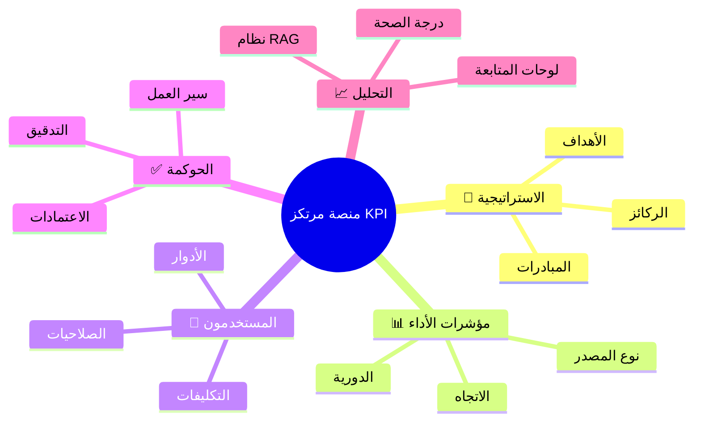

---

## أ

### اعتماد (Approval)

**التعريف:** قرار رسمي يُصدره مستخدم مخوَّل بقبول قيمة مؤشر أداء مُرسَلة أو رفضها.

**🔑 أهمية:**
- يُمثّل ركيزة حوكمة البيانات في النظام
- يضمن دقة البيانات المُستخدمة في التقارير
- يوفر سجل تدقيق لكل قيمة معتمدة

**🔄 مراحل الاعتماد:**
```
مُرسَل ← مراجعة ← معتمَد/مرفوض ← مقفل
```

---

### الاتجاه (Direction)

**التعريف:** سمة في مؤشر الأداء تُحدد ما إذا كانت الزيادة أو الانخفاض يُعدّ نتيجة إيجابية.

**📊 الأنواع:**

| الاتجاه | الوصف | مثال |
|---------|-------|------|
| **📈 INCREASE_IS_GOOD** | الزيادة مؤشر إيجابي | الإيرادات، رضا العملاء، الإنتاجية |
| **📉 DECREASE_IS_GOOD** | الانخفاض مؤشر إيجابي | معدل الأخطاء، معدل الاستقالات، التكاليف |

**💡 نصيحة:** اختر الاتجاه الصحيح عند إنشاء KPI لضمان حساب درجة الصحة بشكل صحيح.

---

### إدارة المشاريع (PMO)

**التعريف:** مكتب إدارة المشاريع أو مكتب الاستراتيجية المسؤول عن متابعة تنفيذ الخطط الاستراتيجية.

**🎯 المهام الرئيسية:**
- مراقبة تقدم المشاريع
- ضمان توافق المشاريع مع الأهداف الاستراتيجية
- إعداد التقارير الدورية للإدارة
- إدارة الموارد عبر المشاريع

---

## ب

### البيانات الأولية (Seed Data)

**التعريف:** مجموعة بيانات أولية تُحمَّل في المؤسسة عند الإعداد الأول أو لأغراض التجربة.

**📦 ما تتضمنه:**
- أنواع كيانات افتراضية
- كيانات تجريبية
- مستخدمين تجريبيين
- بيانات KPIs نموذجية

**⚠️ هام:** لا تُستخدم البيانات الأولية في البيئة الإنتاجية.

---

## ت

### التكليف (Assignment)

**التعريف:** ربط مستخدم بكيان معين لإدخال قيمته ومتابعته.

**🎯 الغرض:**
- تحديد المسؤول عن كل KPI
- توزيع المهام على الفريق
- تتبع الأداء الفردي

**🔗 العلاقة:** انظر: *تكليف المستخدم بكيان*، *المالك*.

---

### التجميع (Aggregation Method)

**التعريف:** طريقة دمج عدة قيم مُدخَلة عند إعداد التقارير.

**📊 الخيارات المتاحة:**

| الطريقة | الاستخدام | مثال |
|---------|-----------|------|
| **LAST_VALUE** | آخر قيمة مُدخَلة | نسبة رضا العملاء الحالية |
| **SUM** | مجموع القيم | إجمالي المبيعات الشهرية |
| **AVERAGE** | متوسط القيم | متوسط وقت الاستجابة |
| **MIN** | أدنى قيمة | أقل معدل تواجد |
| **MAX** | أعلى قيمة | أعلى إنتاجية يومية |

**💡 نصيحة:** اختر `LAST_VALUE` للمؤشرات النسبية، و`SUM` للمؤشرات التراكمية.

---

### التدقيق (Audit)

**التعريف:** سجل دائم وغير قابل للتعديل يوثّق جميع الإجراءات المهمة.

**📝 ما يُسجّل:**
- إدخال القيم
- الاعتمادات والرفض
- التغييرات على الكيانات
- إضافة/حذف المستخدمين

**👤 المعلومات المسجلة:**
- هوية المنفِّذ
- التوقيت الزمني
- الإجراء المُتخذ
- القيمة قبل وبعد

---

## ح

### الحذف الناعم (Soft Delete)

**التعريف:** عند "حذف" كيان أو مستخدم، يُعلَّم بطابع زمني `deletedAt` بدلاً من حذفه فعلياً.

**🎯 الفوائد:**
- حفظ السجل التاريخي
- إمكانية الاستعادة لاحقاً
- الحفاظ على سلامة البيانات المرتبطة

**🔒 مقابل الحذف الفعلي:**
| الحذف الناعم | الحذف الفعلي |
|--------------|--------------|
| يبقى في قاعدة البيانات | يُحذف نهائياً |
| يُخفى من الواجهة | غير قابل للاسترداد |
| قابل للاستعادة | فقدان دائم للبيانات |

---

### الحالة (Status)

**التعريف:** الوضع الحالي للكيان في دورة حياته.

**🔄 الدورات:**

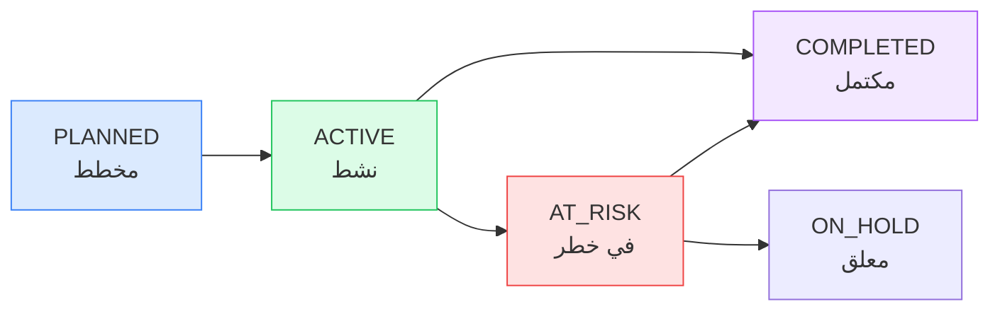

**📋 الحالات:**
- **🟡 PLANNED** — مخطط: تم التخطيط له ولكن لم يبدأ بعد
- **🟢 ACTIVE** — نشط: قيد التنفيذ حالياً
- **🔴 AT_RISK** — في خطر: يواجه مشاكل قد تؤخره
- **🟣 COMPLETED** — مكتمل: تم إنجازه بنجاح
- **⚪ ON_HOLD** — معلق: متوقف مؤقتاً

---

## د

### درجة الصحة (Health Score)

**التعريف:** نسبة مئوية محسوبة من قِبَل النظام تعكس مدى أداء الكيان مقارنةً بالأهداف وحداثة البيانات.

**🎨 نظام الألوان:**

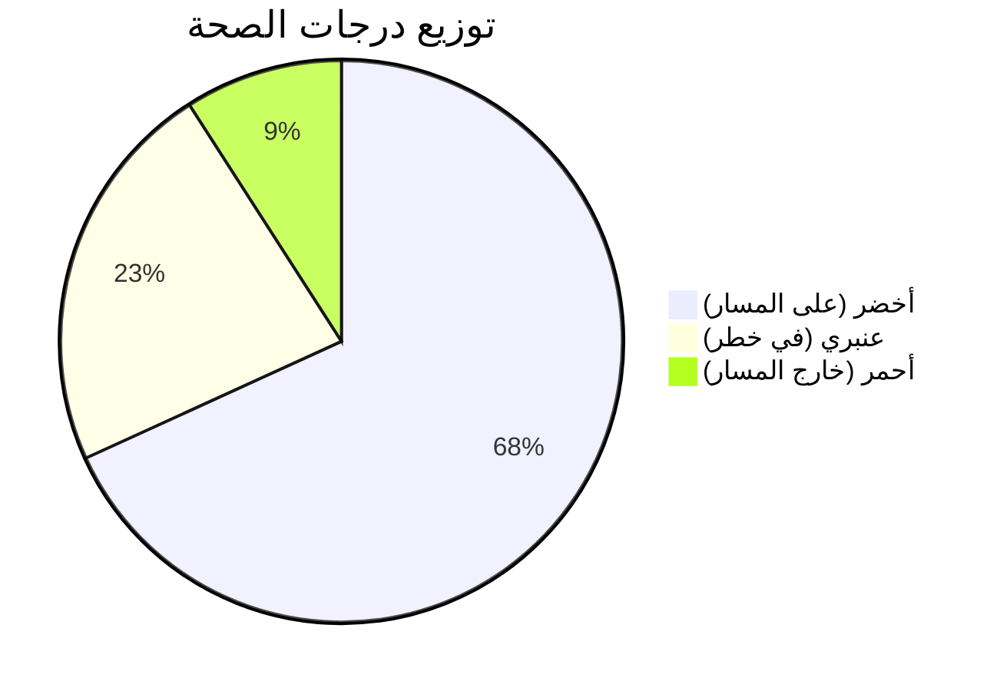

| اللون | النطاق | المعنى | الإجراء |
|-------|--------|--------|---------|
| 🟢 **أخضر** | ≥ 75% | على المسار | استمر في الأداء |
| 🟡 **عنبري** | 50–74% | في خطر | يحتاج مراجعة |
| 🔴 **أحمر** | < 50% | خارج المسار | تدخل فوري مطلوب |

**🧮 كيفية الحساب:**
```
درجة الصحة = (نسبة الإنجاز × 0.7) + (حداثة البيانات × 0.3)
```

---

## ر

### الركيزة الاستراتيجية (Strategic Pillar)

**التعريف:** أحد محاور الاستراتيجية الكبرى التي تُنظَّم تحتها الأهداف والمبادرات.

**🏗️ الهيكل:**

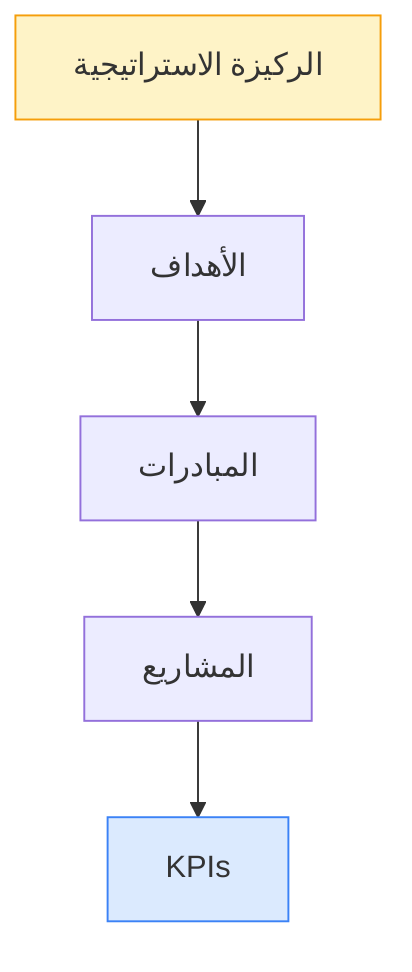

**📝 مثال:**
- **الركيزة:** "التميز التشغيلي"
- **الهدف:** "تقليل وقت الاستجابة 30%"
- **المبادرة:** "تحسين عملية خدمة العملاء"
- **KPI:** "متوسط وقت الاستجابة (ساعة)"

---

### الرؤية (Vision)

**التعريف:** توصيف المستقبل المنشود للمؤسسة على المدى البعيد.

**📍 أين تُعرض:**
- صفحة المؤسسة
- صفحة النظرة العامة
- التقارير التنفيذية

**💡 نصيحة:** اجعل الرؤية قصيرة وملهمة وسهلة التذكر.

---

## ز

### الزخم / الاتجاه (Trend)

**التعريف:** تغيُّر قيم مؤشر الأداء عبر الزمن.

**📈 أنواع الاتجاهات:**

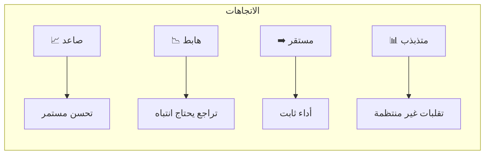

**🎯 الاستخدام:** يُستخدم في لوحات المتابعة للكشف عن أنماط التحسن أو التراجع قبل أن تصبح مشاكل كبيرة.

---

## س

**سجل التدقيق (Audit Log)**
انظر: *التدقيق*.

---

## ص

### الصيغة الحسابية (Formula)

**التعريف:** تعبير رياضي يُستخدم في الكيانات من نوع `CALCULATED` لحساب القيمة الناتجة من متغيرات الإدخال.

**🔧 البنية:**

```javascript
// مثال: حساب نسبة الربح
(profit / revenue) * 100

// مثال: حساب متوسط الأداء
(get("REV_001") + get("REV_002")) / 2

// مثال: مع عقوبة
actual * (actual >= target ? 1 : 0.8)
```

**📋 المكونات:**
- `get("CODE")` — جلب قيمة KPI آخر
- `vars.CODE` — قيمة متغير مُدخل
- العمليات الحسابية (+, -, *, /)
- الدوال المنطقية (if/then)

انظر: *دليل الصيغ الحسابية* للتفاصيل الكاملة.

---

## ط

### طابور الاعتمادات (Approvals Queue)

**التعريف:** قائمة القيم التي أُرسلت وتنتظر قرار الاعتماد أو الرفض.

**👥 للمعتمِد:**
- عرض جميع الطلبات المعلقة
- مراجعة التفاصيل والتاريخ
- الموافقة أو الرفض مع تعليق

**📊 عرض تلخيصي:**
- عدد الطلبات المعلقة
- أقدم طلب في الانتظار
- توزيع الطلبات حسب النوع

---

### طريقة التجميع

انظر: *التجميع*.

---

## ع

### العنصر / الكيان (Entity)

**التعريف:** الوحدة البيانية الأساسية في النظام.

**📦 أنواع الكيانات:**

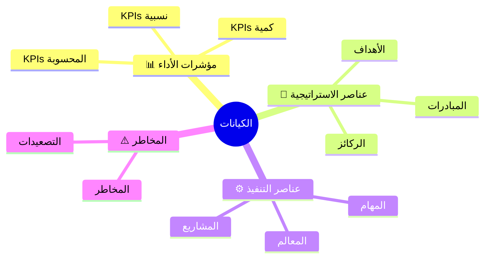

**💡 خصائص الكيان:**
- رمز فريد (Code)
- اسم ووصف
- مالك (Owner)
- حالة (Status)
- KPIs مرتبطة

---

## ف

### الفترة (Period)

**التعريف:** الدورة الزمنية التي يُقاس فيها مؤشر الأداء.

**📅 الأنواع:**

| النوع | الوصف | مثال الاستخدام |
|-------|-------|----------------|
| **MONTHLY** | شهري | المبيعات الشهرية |
| **QUARTERLY** | ربع سنوي | الأرباح الربع سنوية |
| **YEARLY** | سنوي | الأهداف السنوية |
| **WEEKLY** | أسبوعي | الإنتاجية الأسبوعية |
| **DAILY** | يومي | عدد المعاملات اليومية |

**🔄 دورة الإدخال:**
```
بداية الفترة ← تذكير ← إدخال القيمة ← مراجعة ← اعتماد ← نهاية الفترة
```

---

## ق

### القيمة الأساسية / خط الأساس (Baseline Value)

**التعريف:** قيمة المرجع الابتدائية لمؤشر الأداء، تُستخدم لقياس التقدم المحقَّق.

**📊 كيفية الاستخدام:**
```
نسبة التحسن = ((القيمة الحالية - الأساس) ÷ الأساس) × 100
```

**💡 نصيحة:** اجعل قيمة الأساس واقعية ومبنية على بيانات تاريخية.

---

### القيمة المستهدفة (Target Value)

**التعريف:** الهدف الرقمي الذي يسعى مؤشر الأداء لتحقيقه.

**🎯 الأنواع:**
- **ثابت:** نفس الهدف لكل الفترات
- **متدرج:** هدف يتغير كل فترة (زيادة تدريجية)
- **ديناميكي:** يُحسب من KPIs أخرى

**📈 حساب الإنجاز:**
```
للمؤشرات الصاعدة: (الفعلي ÷ الهدف) × 100
للمؤشرات الهابطة: (الهدف ÷ الفعلي) × 100
```

---

### الحد الأدنى للقيمة (Min Value)

**التعريف:** حد أدنى اختياري يُضبط على الكيان.

**⚠️ التأثير:** يرفض النظام أي قيمة مُدخَلة تقل عنه برسالة خطأ `valueBelowMinimum`.

**💡 مثال:**
- KPI: نسبة رضا العملاء
- الحد الأدنى: 0%
- القيمة المدخلة: -5% ← **سيتم الرفض**

---

### الحد الأقصى للقيمة (Max Value)

**التعريف:** حد أقصى اختياري يُضبط على الكيان.

**⚠️ التأثير:** يرفض النظام أي قيمة مُدخَلة تتجاوزه برسالة خطأ `valueAboveMaximum`.

**💡 مثال:**
- KPI: نسبة الحضور
- الحد الأقصى: 100%
- القيمة المدخلة: 105% ← **سيتم الرفض**

---

### قيمة الإنجاز (Achievement Value)

**التعريف:** نسبة مئوية محسوبة تُظهر مدى قرب القيمة الفعلية من الهدف.

**🧮 الحساب:**

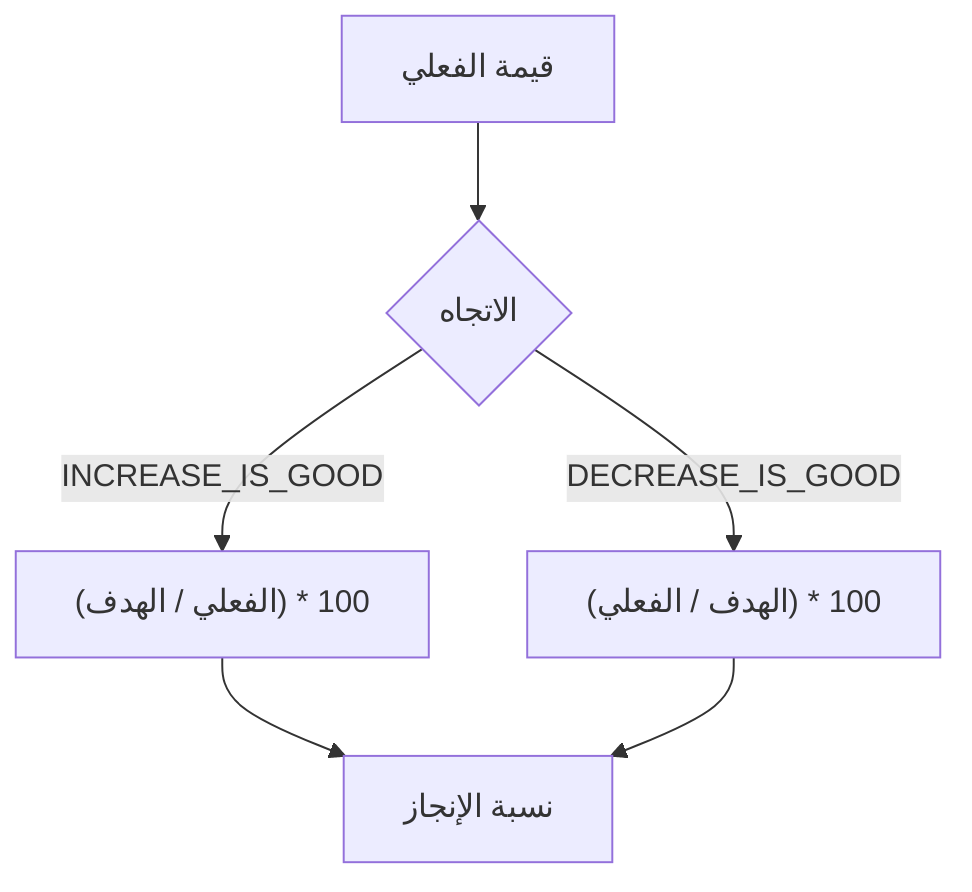

**📊 أمثلة:**
| KPI | الهدف | الفعلي | الاتجاه | الإنجاز |
|-----|-------|--------|---------|---------|
| الإيرادات | 100K | 120K | 📈 | 120% |
| معدل الأخطاء | 5% | 3% | 📉 | 167% |
| رضا العملاء | 90% | 85% | 📈 | 94% |

---

## ك

**الكيان (Entity)**
انظر: *العنصر / الكيان*.

---

## ل

## ل

### لوحة المتابعة (Dashboard)

**التعريف:** عرض تحليلي مرئي يُجمِّع بيانات مؤشرات الأداء والكيانات لإجابة سؤال قيادي محدد.

**📊 أنواع لوحات المتابعة:**

| اللوحة | السؤال الإستراتيجي | الجمهور |
|--------|-------------------|---------|
| التنفيذية | هل نحن على المسار؟ | CEO، الإدارة العليا |
| PMO | ما حالة المشاريع؟ | مديرو المشاريع |
| صحة المبادرات | هل المبادرات تعمل؟ | مديرو المبادرات |
| أداء KPIs | كيف يؤدي فريقي؟ | جميع المستخدمين |
| المخاطر | ما يهددنا؟ | إدارة المخاطر |

**🎨 المكونات:**
- رسوم بيانية
- بطاقات KPIs
- جداول التفاصيل
- مؤشرات RAG
- فلاتر وتحديدات

---

## م

### مؤشر الأداء الرئيسي / KPI (Key Performance Indicator)

**التعريف:** قيمة قابلة للقياس تُظهر مدى فعالية المؤسسة في تحقيق هدف استراتيجي رئيسي.

**🏗️ هيكل KPI:**

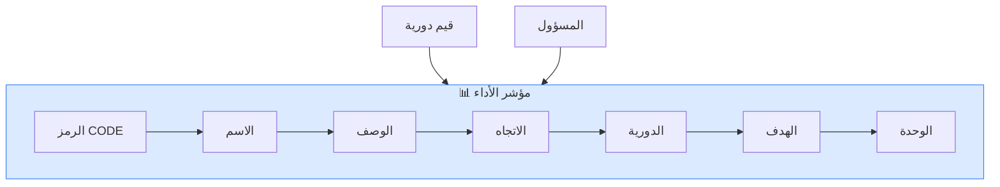

**📋 الخصائص:**
- **رمز فريد:** للإشارة إليه في الصيغ
- **الاتجاه:** هل الزيادة جيدة أم السلبية؟
- **الدورية:** كم مرة يُقاس؟
- **الهدف:** ما القيمة المراد الوصول إليها؟
- **الوحدة:** كيف يُقاس؟ (نسبة، رقم، عملة...)

**💡 نصيحة SMART:**
- **S**pecific — محدد
- **M**easurable — قابل للقياس
- **A**chievable — قابل للتحقيق
- **R**elevant — ذو صلة
- **T**ime-bound — محدد بزمن

### مسؤول المؤسسة (ADMIN)

**التعريف:** دور مستخدم يمنح وصولاً كاملاً لجميع الكيانات والمستخدمين والإعدادات داخل المؤسسة.

**🔑 الصلاحيات:**
- إدارة المستخدمين
- إنشاء وتعديل الكيانات
- ضبط الإعدادات
- عرض جميع التقارير
- الاعتماد على قيم KPIs

---

### مسؤول المنصة (SUPER_ADMIN)

**التعريف:** دور إداري على مستوى المنصة بالكامل.

**🌐 نطاق الصلاحيات:**
- جميع المؤسسات
- إعدادات النظام العامة
- مفاتيح الميزات
- الإدارة العامة للمستخدمين

---

### المبادرة الاستراتيجية (Initiative)

**التعريف:** برنامج أو مشروع كبير مرتبط بركيزة أو هدف استراتيجي.

**📊 مقارنة المفاهيم:**

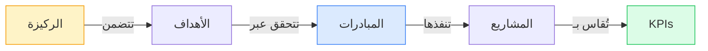

| المفهوم | المدة | النطاق | المخرجات |
|---------|-------|--------|----------|
| **الركيزة** | 3-5 سنوات | استراتيجي | أهداف |
| **المبادرة** | 1-2 سنة | تكتيكي | مشاريع |
| **المشروع** | أشهر | تنفيذي | مخرجات محددة |

### المتغير (Variable)

انظر: *متغير الكيان*.

---

### المدير (MANAGER)

**التعريف:** دور مستخدم يمكّن صاحبه من إدخال وإرسال قيم مؤشرات الأداء للكيانات المكلَّف بها.

**📝 المهام:**
- إدخال قيم KPIs
- إرسال القيم للاعتماد
- متابعة أداء فريقه
- الاعتماد على القيم (إذا مُكّن)

---

### المسودة (DRAFT)

**التعريف:** الحالة الأولية لإدخال قيمة.

**🔒 الخصائص:**
- خاصة بصاحبها
- غير مرئية للمعتمِدين
- قابلة للتعديل
- لم تُرسَل للاعتماد بعد

---

### المُرسَل (SUBMITTED)

**التعريف:** حالة إدخال قيمة تُشير إلى أن البيانات أُرسلت لمراجعة الاعتماد.

**⏳ ما يحدث بعد الإرسال:**
1. إشعار للمعتمِد
2. الانتظار في طابور الاعتمادات
3. مراجعة وقرار
4. إشعار للمُرسِل بالنتيجة

---

### المعتمَد (APPROVED)

**التعريف:** حالة تُشير إلى أن قيمة مؤشر الأداء قُبلت من قِبَل معتمِد مخوَّل.

**✅ بعد الاعتماد:**
- القيمة تصبح رسمية
- تُستخدم في لوحات المتابعة
- تُحسب في الصحة العامة
- تُقفل بعد فترة (حسب الإعدادات)

---

### المقفل (LOCKED)

**التعريف:** الحالة النهائية لقيمة معتمَدة.

**🔒 الخصائص:**
- لا يمكن تغييرها
- تُصبح جزءاً من السجل الرسمي
- تُستخدم في التقارير النهائية
- تُحسب في درجات الصحة

---

### مستوى الاعتماد (KPI Approval Level)

**التعريف:** إعداد على مستوى المؤسسة يُحدد الدور المخوَّل باعتماد قيم مؤشرات الأداء.

**👥 الخيارات:**

| المستوى | من يعتمد | متى يُستخدم |
|---------|----------|-------------|
| **MANAGER** | المدير المباشر | المؤسسات الصغيرة |
| **EXECUTIVE** | الإدارة العليا | المؤسسات المتوسطة |
| **ADMIN** | مسؤول المؤسسة | البيئات الصارمة |

---

### المؤسسة (Organization)

**التعريف:** المستأجر الرئيسي في النظام.

**🏢 ما تحتويه:**
- جميع المستخدمين
- جميع الكيانات
- جميع الإعدادات
- البيانات والتقارير

**🔗 العلاقة:**
- كل مستخدم ينتمي لمؤسسة واحدة
- البيانات معزولة بين المؤسسات
- SUPER_ADMIN فقط يرى كل المؤسسات

---

### المالك (Owner)

**التعريف:** المستخدم المُسنَد إليه مسؤولية كيان معين (`ownerUserId`).

**🎯 المسؤوليات:**
- إدخال قيم الكيان
- متابعة أدائه
- تحديث حالته
- الرد على الاستفسارات

---

## ن

### نظام أحمر/عنبري/أخضر (RAG — Red/Amber/Green)

**التعريف:** نظام تصنيف بالألوان يُستخدم للإشارة إلى صحة الكيانات.

**🎨 الألوان والمعاني:**

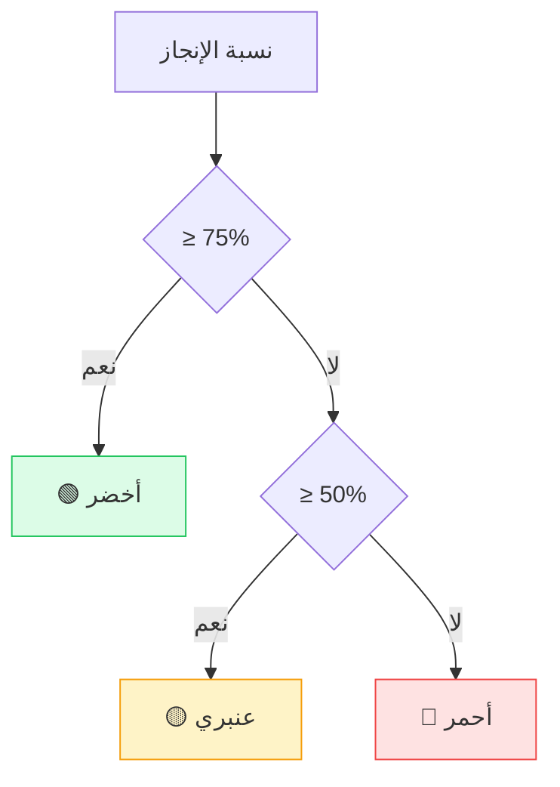

**⚙️ قابلية التخصيص:**
- `ragGreenMin` — حد الأخضر (افتراضي: 75%)
- `ragAmberMin` — حد العنبري (افتراضي: 50%)

---

### حدود RAG (RAG Thresholds)

انظر: *نظام أحمر/عنبري/أخضر*.

---

### نوع الدورية (Period Type)

**التعريف:** تكرار قياس مؤشر الأداء.

**📅 الأنواع:**
- `MONTHLY` — شهري
- `QUARTERLY` — ربع سنوي
- `YEARLY` — سنوي
- `WEEKLY` — أسبوعي
- `DAILY` — يومي

**📊 مثال التطبيق:**
| KPI | نوع الدورية | سبب الاختيار |
|-----|-------------|---------------|
| المبيعات | شهري | يتغير باستمرار |
| الأرباح | ربع سنوي | يتطلب تجميعاً |
| رضا الموظفين | سنوي | استبيان موسع |

---

### نوع المؤشر (Indicator Type)

**التعريف:** تصنيف اختياري يُحدد طبيعة المؤشر الزمنية.

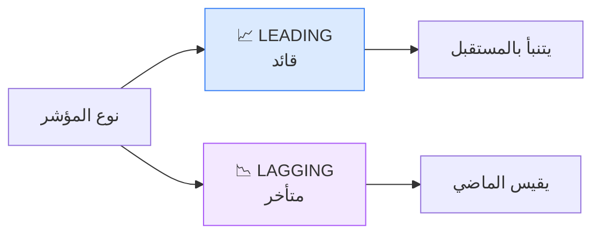

**📋 أمثلة:**

| النوع | أمثلة | الغرض |
|-------|-------|-------|
| **LEADING** | عدد مكالمات المبيعات، ساعات التدريب | التنبؤ والتأثير |
| **LAGGING** | الإيرادات السنوية، معدل العيوب | قياس النتائج |

**💡 نصيحة:** استخدم مزيجاً من المؤشرات القائدة والمتأخرة لصورة شاملة.

---

### نوع الكيان (OrgEntityType)

**التعريف:** تعريف نوع الكيان الخاص بالمؤسسة.

**🏗️ ما يُعرّفه:**
- الرمز (Code)
- الاسم (Name)
- الترتيب (Order)
- الأيقونة (Icon)

**📋 أمثلة:**
- "ركيزة استراتيجية"
- "مبادرة"
- "مؤشر أداء"
- "مشروع مخصص"

---

### نوع المصدر (Source Type)

**التعريف:** يُحدد كيفية إنتاج قيمة الكيان.

**📊 الأنواع:**

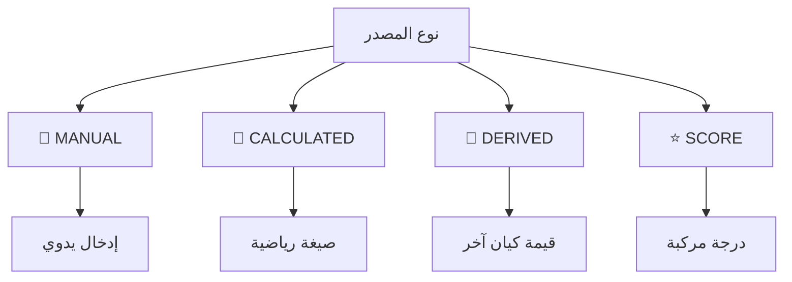

| النوع | الوصف | متى يُستخدم |
|-------|-------|-------------|
| **MANUAL** | إدخال يدوي | البيانات التي لا يمكن حسابها |
| **CALCULATED** | محسوب من صيغة | نسب النمو، الربحية |
| **DERIVED** | مشتق من كيان آخر | استخدام قيمة مشروع في مبادرة |
| **SCORE** | درجة مركبة | مؤشرات مركبة متعددة الأبعاد |

---

## و

### وحدة القياس (Unit)

**التعريف:** وحدة قيمة مؤشر الأداء.

**📋 الوحدات الشائعة:**

| الوحدة | الرمز | مثال |
|--------|-------|------|
| نسبة مئوية | % | نسبة رضا العملاء |
| ريال سعودي | ر.س | الإيرادات، التكاليف |
| دولار أمريكي | $ | الميزانية بالعملة الأجنبية |
| عدد | — | عدد الموظفين، العملاء |
| يوم | يوم | مدة المشروع، وقت الاستجابة |
| ساعة | س | وقت التدريب، العمل |

**💡 نصيحة:** استخدم الوحدات القياسية لتسهيل المقارنة بين الفترات.

---

### الوزن (Weight)

**التعريف:** سمة رقمية تُستخدم عند حساب درجة الكيان الأب.

**🧮 الحساب:**
```
الدرجة المركبة = Σ (درجة الكيان × وزنه) ÷ Σ الأوزان
```

**📊 مثال:**
| KPI | الدرجة | الوزن | المساهمة |
|-----|--------|-------|----------|
| الإيرادات | 90% | 40% | 36% |
| رضا العملاء | 85% | 30% | 25.5% |
| الجودة | 80% | 30% | 24% |
| **المجموع** | — | 100% | **85.5%** |

---

## ي

### يحتاج انتباهاً (Needs Attention)

**التعريف:** قسم في صفحة النظرة العامة يُدرج العناصر التي تتطلب إجراء.

**⚠️ ما يُدرج هنا:**
- مؤشرات الأداء التي لم تُحدَّث (متأخرة)
- الاعتمادات المعلقة
- المخاطر المفتوحة
- المشاريع في خطر

**📊 الترتيب:**
```
الأكثر تأخيراً ← الأقل تأخيراً
```

---

### الإشعار (Notification)

**التعريف:** تنبيه داخلي يُرسَل تلقائياً عند أحداث مهمة.

**🔔 الأنواع:**

| النوع | متى يُرسَل | المستلم |
|-------|-----------|---------|
| **APPROVAL_PENDING** | عند إرسال قيمة | المعتمِدون |
| **VALUE_APPROVED** | عند اعتماد قيمة | المُرسِل |
| **VALUE_REJECTED** | عند رفض قيمة | المُرسِل |
| **ASSIGNMENT_CREATED** | عند تكليف جديد | المُكَّلف |
| **PERIOD_REMINDER** | قبل نهاية الفترة | المالك |

**📍 أين يظهر:**
- عداد على أيقونة الجرس (🔔)
- قائمة منسدلة بالإشعارات
- بريد إلكتروني (إذا مُكّن)

---

## 📋 مصطلحات تقنية في النظام

### رموز وأكواد النظام

| المصطلح التقني | الترجمة | الاستخدام |
|---------------|---------|-----------|
| `Entity` | كيان | الوحدة البيانية الأساسية |
| `EntityValue` | قيمة كيان | إدخال قيمة في فترة معينة |
| `EntityVariable` | متغير كيان | قيمة إضافية للكيان |
| `UserEntityAssignment` | تكليف مستخدم | ربط مستخدم بكيان |
| `OrgEntityType` | نوع كيان | تصنيف الكيانات |

### الأنواع والحالات

| المصطلح التقني | الترجمة | القيم الممكنة |
|---------------|---------|---------------|
| `KpiApprovalLevel` | مستوى الاعتماد | MANAGER, EXECUTIVE, ADMIN |
| `KpiValueStatus` | حالة القيمة | DRAFT, SUBMITTED, APPROVED, REJECTED, LOCKED |
| `KpiDirection` | اتجاه المؤشر | INCREASE_IS_GOOD, DECREASE_IS_GOOD |
| `KpiIndicatorType` | نوع المؤشر | LEADING, LAGGING |
| `KpiAggregationMethod` | طريقة التجميع | LAST_VALUE, SUM, AVERAGE, MIN, MAX |
| `KpiSourceType` | نوع المصدر | MANUAL, CALCULATED, DERIVED, SCORE |
| `KpiPeriodType` | نوع الدورية | DAILY, WEEKLY, MONTHLY, QUARTERLY, YEARLY |

### الإعدادات والقيود

| المصطلح التقني | الترجمة | الوصف |
|---------------|---------|-------|
| `minValue` / `maxValue` | الحد الأدنى/الأقصى | قيود على القيم المُدخَلة |
| `ragGreenMin` | حد الأخضر | أقل قيمة للحالة الخضراء |
| `ragAmberMin` | حد العنبري | أقل قيمة للحالة العنبرية |
| `baselineValue` | قيمة الأساس | نقطة البداية للقياس |
| `targetValue` | القيمة المستهدفة | الهدف المراد الوصول إليه |

### الأمان والحوكمة

| المصطلح التقني | الترجمة | الوظيفة |
|---------------|---------|---------|
| `Soft Delete` | الحذف الناعم | حذف منطقي بدون فقدان البيانات |
| `RBAC` | التحكم بالوصول المبني على الأدوار | Role-Based Access Control |
| `Audit Trail` | سجل التدقيق | تتبع جميع الإجراءات |
| `Notification` | الإشعار | التنبيهات الداخلية |
| `ChangeRequest` | طلب التغيير | تعديل قيمة معتمدة |

---

## 🔍 دليل البحث السريع

ابحث عن المصطلح حسب المجال:

| 🔎 المجال | المصطلحات الرئيسية |
|----------|-------------------|
| **الاستراتيجية** | الركيزة، الهدف، المبادرة، الرؤية |
| **مؤشرات الأداء** | KPI، الاتجاه، نوع المصدر، الدورية، الوحدة |
| **الحوكمة** | اعتماد، تدقيق، حالة، مسودة، مُرسَل، معتمَد، مقفل |
| **المستخدمون** | ADMIN, MANAGER, SUPER_ADMIN, المالك، التكليف |
| **التحليل** | لوحة المتابعة، درجة الصحة، RAG، الاتجاه، التجميع |
| **الصيغ** | CALCULATED, Formula, get(), vars |

---

## 💡 نصائح للاستخدام الفعّال

1. **ابدأ بالمسرد** — اطلع على المصطلحات قبل استخدام النظام
2. **افهم الاتجاه** — اختر `INCREASE_IS_GOOD` أو `DECREASE_IS_GOOD` بحذر
3. **حدد الأهداف بوضوح** — الأهداف SMART تُنتج نتائج أفضل
4. **استخدم RAG** — نظام الألوان يُساعد في التركيز على ما يحتاج انتباهك
5. **تابع التدقيق** — راجع سجل التدقيق لفهم التغييرات

---

**📧 هل تحتاج توضيحاً إضافياً؟** تواصل مع الدعم: support@murtakaz.com

</div>
