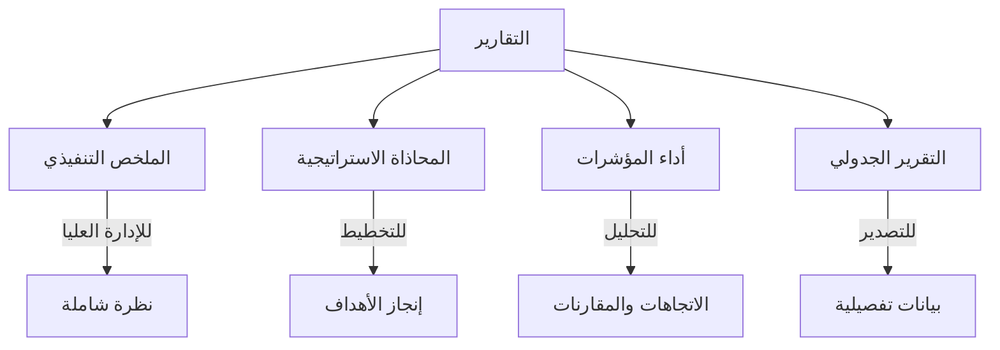
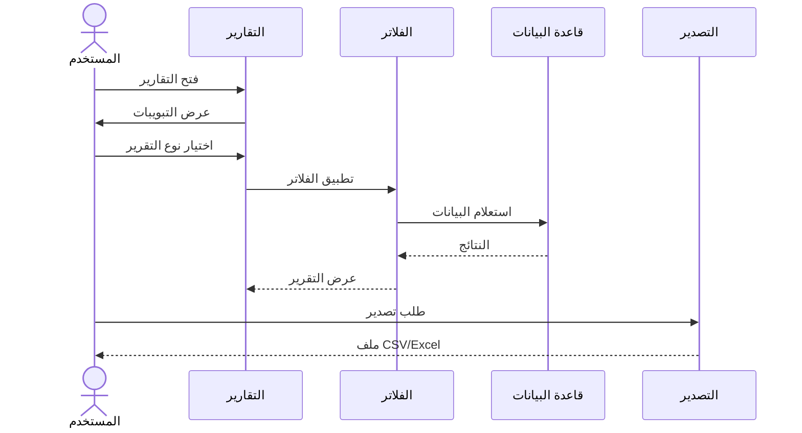
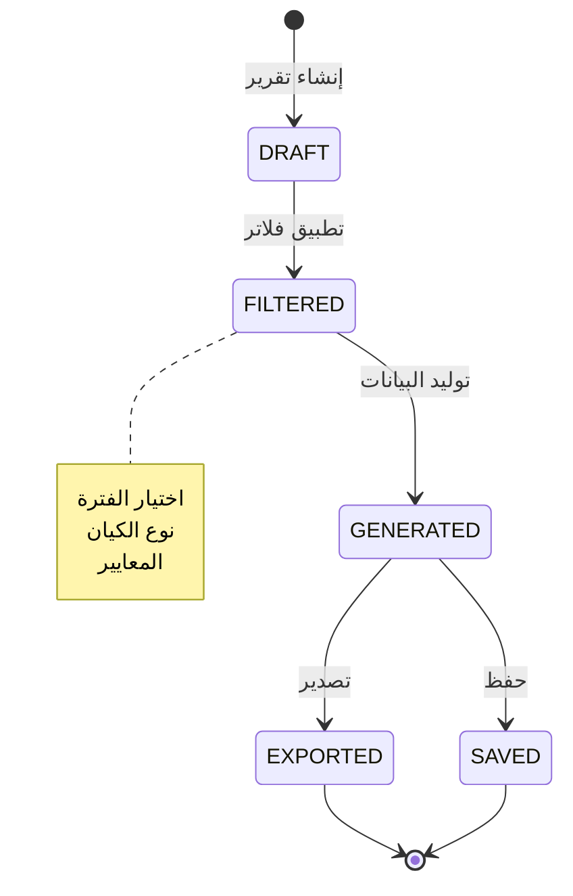
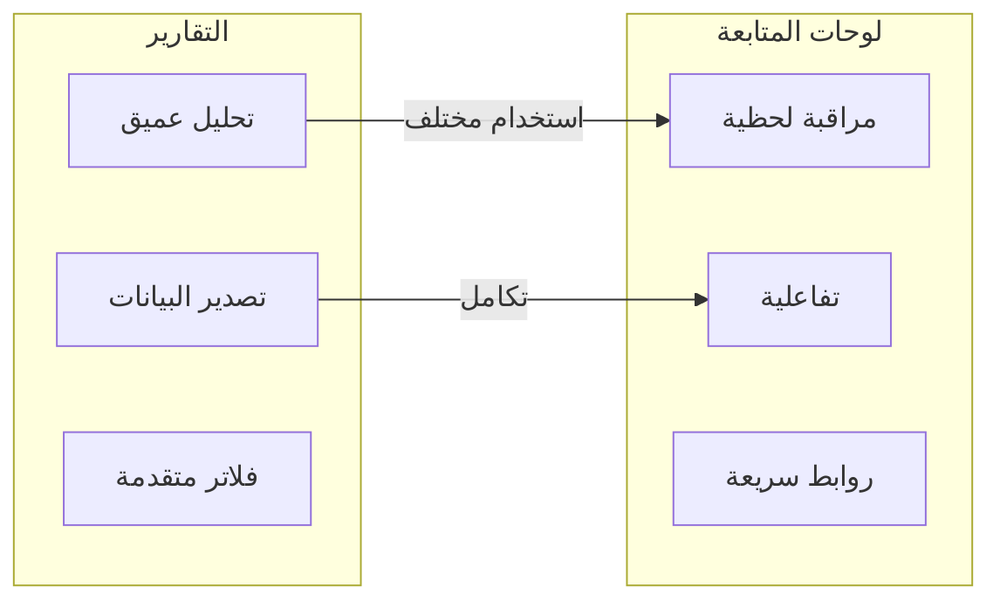

# التقارير والتحليلات

يوفر قسم **التقارير** (`/<locale>/reports`) عروضاً تحليلية شاملة للأداء المؤسسي مع إمكانية التصدير والتصفية المتقدمة.

---

## الوصول إلى التقارير

1. انقر على **التقارير** في الشريط الجانبي.
2. تعرض الصفحة أربعة تبويبات رئيسية للتقارير.
3. يمكن التبديل بين التبويبات للوصول إلى نوع مختلف من التحليلات.

---

## تبويبات التقارير

### مخطط أنواع التقارير

### 1. الملخص التنفيذي (Executive Summary)

**يُجيب على:** *"ما هي نظرة عامة عالية المستوى على أداء المؤسسة؟"*

يوفر ملخصاً تنفيذياً شاملاً للأداء المؤسسي مع التصورات البيانية والرؤى الرئيسية.

**المحتوى الرئيسي:**
- مؤشرات الأداء الرئيسية على مستوى المؤسسة
- ملخص الصحة الإجمالية
- التقدم نحو الأهداف الاستراتيجية
- الرسوم البيانية المرئية للأداء

**يستخدمه:** التنفيذي (EXECUTIVE)، مسؤول المؤسسة (ADMIN)

---

### 2. المحاذاة الاستراتيجية (Strategic Alignment)

**يُجيب على:** *"ما مدى تحقق الركائز والأهداف الاستراتيجية؟"*

يُتبع إنجاز الركائز والأهداف الاستراتيجية ويربطها بمؤشرات الأداء.

**المحتوى الرئيسي:**
- حالة الركائز الاستراتيجية
- تتبع إنجاز الأهداف
- التوافق بين الأهداف ومؤشرات الأداء
- تقييم فجوات الأداء

**يستخدمه:** التنفيذي (EXECUTIVE)، مسؤول المؤسسة (ADMIN)

---

### 3. أداء المؤشرات (KPI Performance)

**يُجيب على:** *"ما تفاصيل أداء مؤشرات الأداء مع الاتجاهات؟"*

يقدم تحليلاً مفصلاً لمؤشرات الأداء مع الاتجاهات التاريخية والمقارنات.

**المحتوى الرئيسي:**
- تحليل تفصيلي لمؤشرات الأداء
- الاتجاهات التاريخية
- المقارنة بين المستهدف والفعلي
- معلومات حداثة البيانات

**يستخدمه:** التنفيذي (EXECUTIVE)، مسؤول المؤسسة (ADMIN)، المدير (MANAGER)

---

### 4. التقرير الجدولي (Tabular Report)

**يُجيب على:** *"كيف يمكنني عرض أداء المؤشرات عبر العناصر بشكل جدولي؟"*

يوفر عرضاً جدولياً لأداء المؤشرات عبر الكيانات المختلفة مع التصفية والتصدير.

**المحتوى الرئيسي:**
- عرض جدولي لأداء المؤشرات عبر الكيانات
- فلاتر متقدمة حسب نوع الكيان والفترة
- إمكانية التصدير إلى CSV/Excel
- مقارنة الأداء بين الكيانات المختلفة

**يستخدمه:** التنفيذي (EXECUTIVE)، مسؤول المؤسسة (ADMIN)، المدير (MANAGER)

---

### تدفق استخدام التقارير

### دورة حياة التقرير

## أدوات التحكم في التقارير

| أداة التحكم | الوصف |
|------------|-------|
| **فلتر الفترة** | تحديد نطاق زمني محدد للتقرير |
| **فلتر نوع الكيان** | اختيار أنواع الكيانات المراد تضمينها |
| **تصدير** | تصدير البيانات إلى CSV أو Excel |
| **تحديث** | إعادة تحميل البيانات للحصول على أحدث المعلومات |

---

## نصائح مفيدة

- ابدأ بالـ **الملخص التنفيذي** للحصول على نظرة شاملة سريعة.
- استخدم **المحاذاة الاستراتيجية** لمراجعة التقدم نحو الأهداف الاستراتيجية.
- **أداء المؤشرات** هو الأنسب للتحليل العميق لاتجاهات مؤشر الأداء.
- **التقرير الجدولي** مثالي لتصدير البيانات وإجراء التحليلات الخارجية.

---

### مقارنة التقارير ولوحات المتابعة

| | التقارير | لوحات المتابعة |
|---|---------|---------------|
| **الهدف** | تحليل عميق وتصدير | مراقبة لحظية وسريعة |
| **التفاعل** | فلاتر وتصدير | تفاعلية مع روابط للتفاصيل |
| **الجمهور** | تحليليون وإداريون | جميع المستخدمين |
| **البيانات** | مفصلة وقابلة للتصدير | ملخصة ومرئية |

