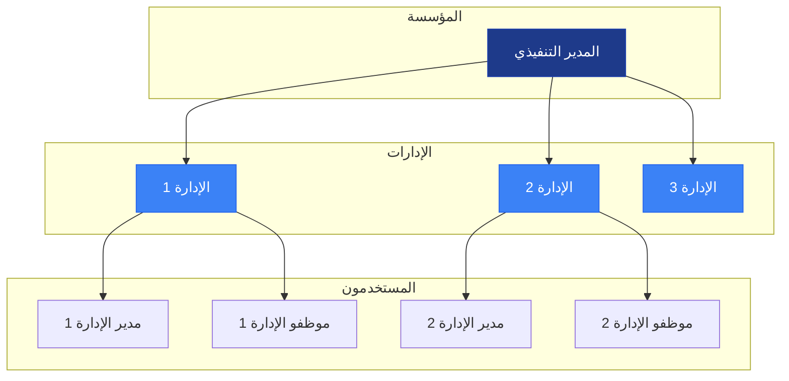
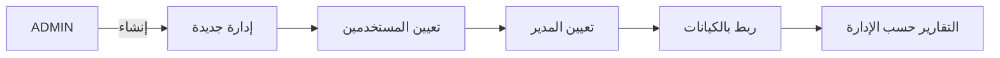
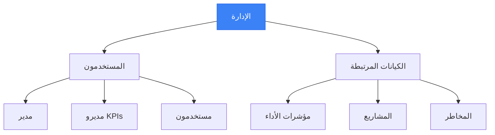

# الإدارات — إدارة الهيكل التنظيمي

<div dir="rtl">

تُستخدم صفحة **الإدارات** (`/<locale>/departments`) لإدارة هيكل الأقسام والإدارات في المؤسسة. تربط الإدارات بين المستخدمين والهيكل التنظيمي.

---

## الوصول إلى الإدارات

1. انقر على **الإدارات** في الشريط الجانبي.
2. أو انتقل مباشرةً إلى:

```
/<locale>/departments
```

> **ملاحظة:** تتطلب إدارة الإدارات (إنشاء/تعديل/حذف) صلاحيات **ADMIN** أو **SUPER_ADMIN**.

---

### هيكل العلاقات التنظيمية



### تدفق إنشاء الإدارة



| العمود | الوصف |
|--------|-------|
| **الاسم** | اسم الإدارة (بالعربية أو الإنجليزية حسب اللغة المختارة) |
| **المدير** | اسم مدير الإدارة (إن وُجد) |
| **المستخدمون** | عدد المستخدمين في الإدارة |
| **تاريخ الإنشاء** | تاريخ إنشاء الإدارة |
| **الإجراءات** | أزرار التعديل والحذف (للمسؤولين فقط) |

---

## إنشاء إدارة جديدة (للمسؤولين فقط)

1. في صفحة الإدارات، انقر على زر **+ إدارة جديدة**.
2. أدخل البيانات المطلوبة:
   - **الاسم** (مطلوب): اسم الإدارة بالإنجليزية
   - **الاسم (عربي)** (اختياري): اسم الإدارة بالعربية
3. انقر على **حفظ**.
4. تظهر الإدارة الجديدة في القائمة.

> **تلميح:** يُفضل إدخال الاسم باللغتين لضمان العرض الصحيح في واجهتي العربية والإنجليزية.

---

## تعديل إدارة (للمسؤولين فقط)

1. في جدول الإدارات، ابحث عن الإدارة المطلوبة.
2. انقر على أيقونة **التعديل** (✏️) في عمود الإجراءات.
3. يفتح حوار التعديل.
4. عدّل الحقول المطلوبة:
   - **الاسم**: تحديث الاسم بالإنجليزية
   - **الاسم (عربي)**: تحديث الاسم بالعربية
5. انقر على **حفظ**.
6. يتم تحديث الإدارة فوراً.

---

## حذف إدارة (للمسؤولين فقط)

> **تحذير:** لا يمكن التراجع عن حذف الإدارة. تأكد من عدم وجود مستخدمين مرتبطين بالإدارة قبل الحذف.

1. في جدول الإدارات، ابحث عن الإدارة المطلوبة.
2. انقر على أيقونة **الحذف** (🗑️) في عمود الإجراءات.
3. يفتح حوار تأكيد الحذف.
4. راجع اسم الإدارة للتأكد.
5. انقر على **حذف** للتأكيد.

### قيود الحذف

- لا يمكن حذف إدارة تحتوي على مستخدمين.
- يجب نقل المستخدمين إلى إدارة أخرى أولاً (عبر إدارة المستخدمين).

---

## ربط المستخدمين بالإدارات

### عند إنشاء مستخدم جديد

1. انتقل إلى **الإدارة ← المستخدمون**.
2. أنشئ مستخدماً جديداً.
3. حدد **الإدارة** من قائمة الإدارات المتاحة.

### تعديل إدارة مستخدم موجود

1. انتقل إلى **الإدارة ← المستخدمون**.
2. افتح صفحة تفاصيل المستخدم.
3. عدّل حقل **الإدارة**.
4. احفظ التغييرات.

---

## تعيين مدير للإدارة

يمكن تعيين مدير للإدارة من صفحة تفاصيل المستخدم:

1. انتقل إلى **الإدارة ← المستخدمون**.
2. افتح المستخدم الذي تريد تعيينه كمدير.
3. في حقل **الدور**، تأكد من اختيار `MANAGER` أو `EXECUTIVE` أو `ADMIN`.
4. احفظ التغييرات.
5. عدّل سجل الإدارة واختر هذا المستخدم كمدير.

---

### العلاقة بين الإدارات والكيانات



- يمكن ربط **الكيانات** بإدارات معينة عند إنشائها.
- تساعد هذه العلاقة في:
  - تصفية الكيانات حسب الإدارة
  - تقارير الأداء حسب الإدارة
  - تحديد المسؤولية التنظيمية

---

## صلاحيات حسب الدور

| الدور | رؤية الإدارات | إنشاء/تعديل/حذف |
|-------|---------------|-----------------|
| **SUPER_ADMIN** | جميع الإدارات في جميع المؤسسات | ✓ كامل |
| **ADMIN** | جميع الإدارات في المؤسسة | ✓ كامل |
| **EXECUTIVE** | جميع الإدارات في المؤسسة | ✗ للقراءة فقط |
| **MANAGER** | إدارته فقط (إن وُجدت) | ✗ للقراءة فقط |

---

## حل المشكلات الشائعة

### لماذا لا يمكن حذف إدارة؟

- تأكد من عدم وجود **مستخدمين** مرتبطين بالإدارة.
- انقل جميع المستخدمين إلى إدارة أخرى أولاً.

### لماذا لا يظهر اسم الإدارة بالعربية؟

- تأكد من إدخال **الاسم (عربي)** عند إنشاء/تعديل الإدارة.
- إذا لم يُدخل الاسم العربي، يُعرض الاسم الإنجليزي في الواجهة العربية.

### كيف أغيّر مدير الإدارة؟

1. انتقل إلى صفحة المستخدمين.
2. عيّن المستخدم الجديد في الإدارة المطلوبة.
3. أو قم بتعديل الإدارة واختيار المستخدم كمدير.

---

## نصائح مفيدة

- حدد إدارة للمستخدم عند إنشائه لتسهيل التنظيم.
- استخدم الأسماء الواضحة والمعروفة في المؤسسة.
- أدخل الأسماء باللغتين لتحسين التجربة في الواجهتين.
- راجع قائمة الإدارات دورياً لضمان تحديثها.

</div>
