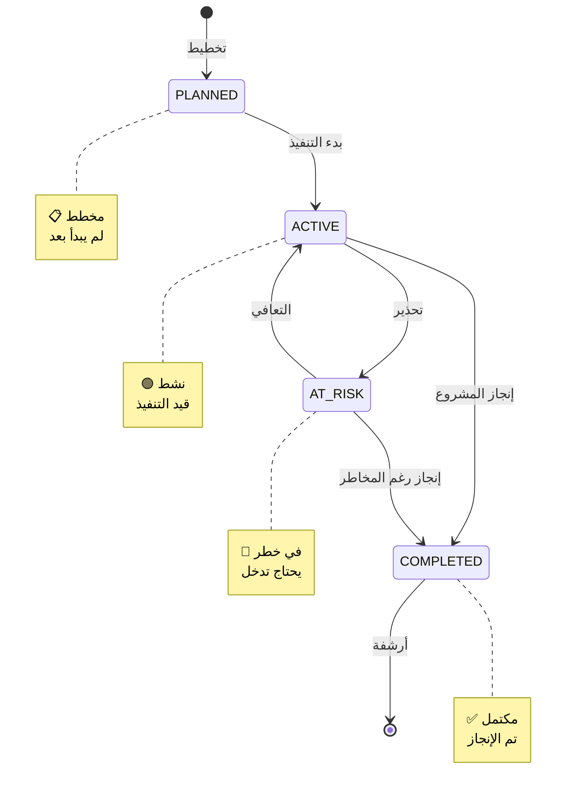
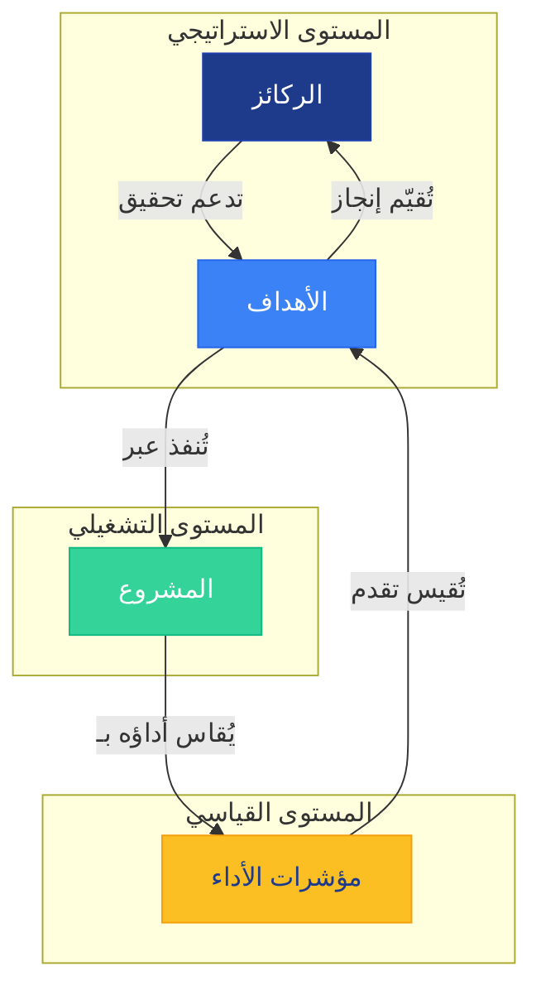

# المشاريع — إدارة محفظة المشاريع

<div dir="rtl">

تُستخدم صفحة **المشاريع** (`/<locale>/projects`) لعرض وإدارة جميع المشاريع في المؤسسة. تُعد المشاريع كيانات استراتيجية تُنفذ لتحقيق الأهداف والركائز.

---

## الوصول إلى المشاريع

1. انقر على **المشاريع** في الشريط الجانبي.
2. أو انتقل مباشرةً إلى:

```
/<locale>/projects
```

---

## قائمة المشاريع

تعرض الصفحة جدولاً بجميع المشاريع في المؤسسة:

| العمود | الوصف |
|--------|-------|
| **المشروع** | اسم المشروع (بالعربية أو الإنجليزية حسب اللغة المختارة) |
| **الحالة** | حالة المشروع (PLANNED، ACTIVE، AT_RISK، COMPLETED) |
| **الرمز** | معرّف فريد للمشروع (Code) |
| **الوصف** | وصف مختصر للمشروع |

---

## البحث والتصفية

- استخدم مربع **البحث** في أعلى الجدول للتصفية حسب اسم المشروع.
- يدعم البحث النصي الفوري مع تحديث النتائج تلقائياً.

---

## صفحة تفاصيل المشروع

انقر على اسم أي مشروع لفتح صفحة التفاصيل:

```
/<locale>/entities/project/<projectId>
```

تعرض صفحة التفاصيل:

### مخطط حالات المشروع



### 2. القيم
- القياسات الدورية للمشروع
- التقدم نحو الأهداف

### 3. المتغيرات
- متغيرات الإدخال المرتبطة بالمشروع

### 4. التكليفات
- المستخدمون المُكلَّفون بالمشروع

### 5. المرفقات
- الملفات والوثائق المرتبطة بالمشروع

---

## إنشاء مشروع جديد (للمسؤولين فقط)

1. انتقل إلى صفحة الكيانات ← المشاريع.
2. انقر على **+ مشروع جديد**.
3. أدخل البيانات المطلوبة:
   - **العنوان** (مطلوب)
   - **العنوان (عربي)** (اختياري)
   - **الوصف** (اختياري)
   - **الحالة** (مطلوب): PLANNED / ACTIVE / AT_RISK / COMPLETED
   - **المالك** (مطلوب)
4. انقر على **حفظ**.

---

### ربط المشروع بالاستراتيجية



يمكن ربط المشاريع بـ:
- **الركائز الاستراتيجية** — لربط المشروع بمحور استراتيجي
- **الأهداف** — لربط المشروع بهدف تنظيمي
- **مؤشرات الأداء** — لقياس أداء المشروع

---

## صلاحيات حسب الدور

| الدور | رؤية المشاريع | إنشاء/تعديل/حذف |
|-------|---------------|-----------------|
| **SUPER_ADMIN** | جميع المشاريع | ✓ كامل |
| **ADMIN** | جميع المشاريع | ✓ كامل |
| **EXECUTIVE** | جميع المشاريع | ✗ للقراءة فقط |
| **MANAGER** | المشاريع المُكلَّف بها | ✗ للقراءة فقط |

---

## نصائح مفيدة

- حدّث حالة المشروع بانتظام لمراجعة التقدم.
- استخدم الحقل "AT_RISK" لتحديد المشاريع التي تحتاج اهتماماً.
- ربط المشروع بمؤشرات الأداء يتيح قياس أدائه بشكل كمي.

</div>
