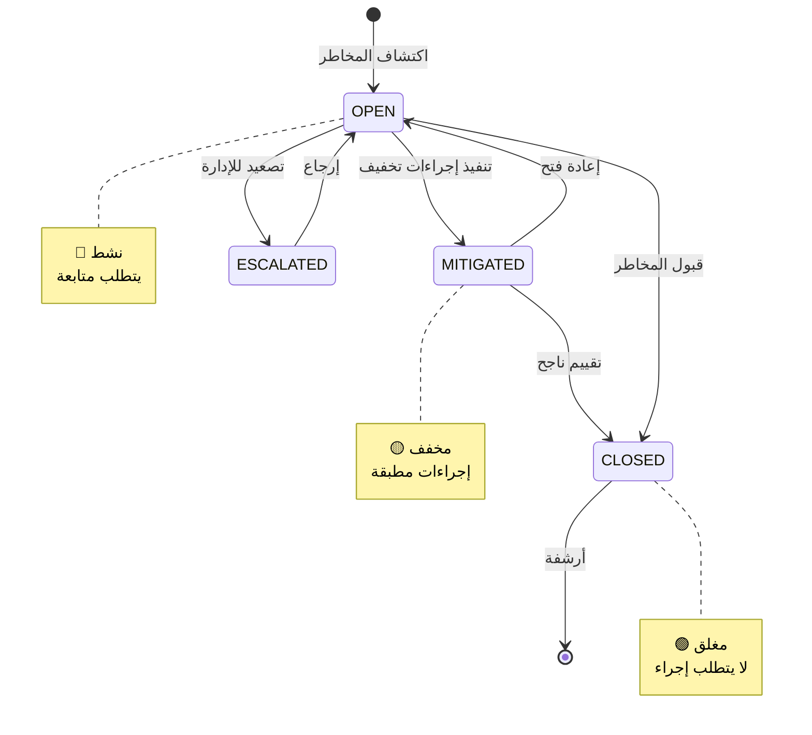
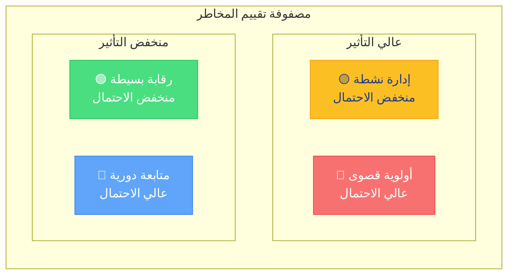
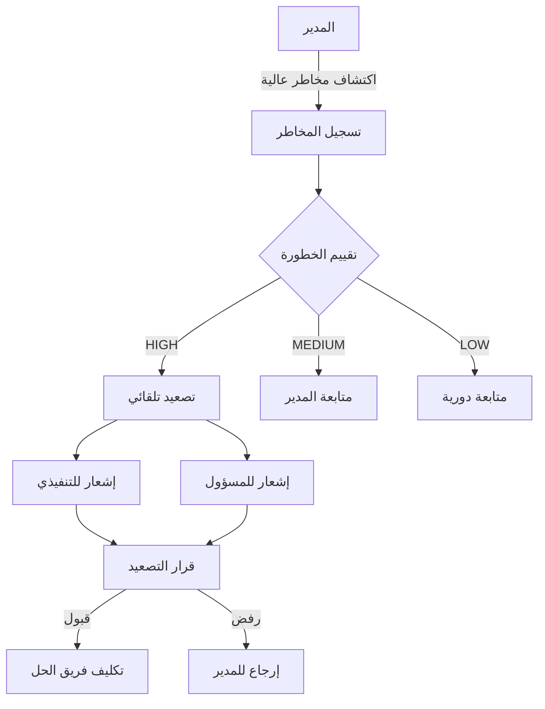
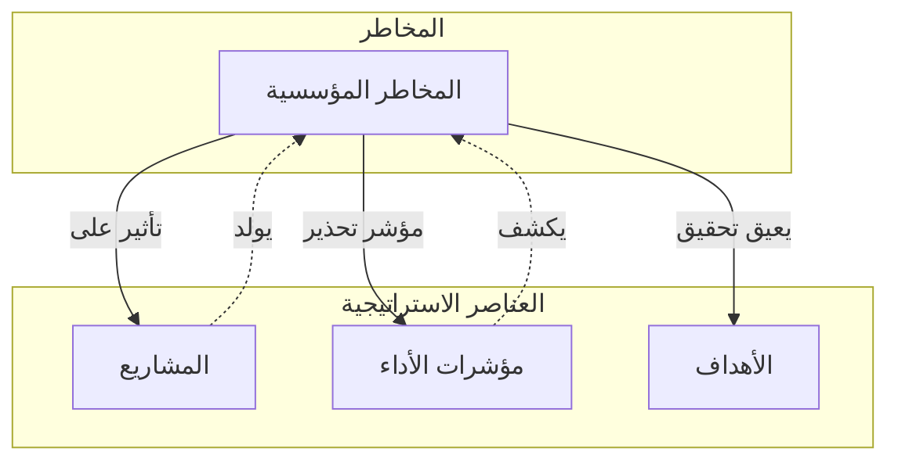

# المخاطر — إدارة سجل المخاطر

<div dir="rtl">

تُستخدم صفحة **المخاطر** (`/<locale>/risks`) لعرض وإدارة المخاطر المؤسسية. تُعد إدارة المخاطر جزءاً أساسياً من الحوكمة الاستراتيجية.

---

## الوصول إلى المخاطر

1. انقر على **المخاطر** في الشريط الجانبي.
2. أو انتقل مباشرةً إلى:

```
/<locale>/risks
```

---

## سجل المخاطر

تعرض الصفحة جدولاً بجميع المخاطر المسجلة في المؤسسة:

| العمود | الوصف |
|--------|-------|
| **المخاطر** | عنوان المخاطر (بالعربية أو الإنجليزية) |
| **الحالة** | حالة المخاطر (OPEN، MITIGATED، CLOSED) |
| **الرمز** | معرّف فريد للمخاطر (Code) |
| **الوصف** | وصف مختصر للمخاطر |

---

## البحث والتصفية

- استخدم مربع **البحث** للتصفية حسب عنوان المخاطر.
- يتم تحديث النتائج تلقائياً أثناء الكتابة.

---

## صفحة تفاصيل المخاطر

انقر على عنوان أي مخاطر لفتح صفحة التفاصيل:

```
/<locale>/entities/risk/<riskId>
```

### المعلومات الرئيسية

| الحقل | الوصف |
|-------|-------|
| **العنوان** | عنوان المخاطر |
| **الوصف** | وصف تفصيلي للمخاطر |
| **الحالة** | OPEN / MITIGATED / CLOSED |
| **مستوى الخطورة** | HIGH / MEDIUM / LOW |
| **المالك** | المسؤول عن إدارة المخاطر |
| **تاريخ الاكتشاف** | تاريخ تسجيل المخاطر |

### التبويبات

#### دورة حياة المخاطر



#### 2. الإجراءات التخفيفية
- قائمة الإجراءات المتخذة للتخفيف من المخاطر
- حالة كل إجراء
- المسؤول عن التنفيذ

#### 3. القيم
- القياسات المرتبطة بالمخاطر
- مؤشرات التحذير المبكر

#### 4. التكليفات
- المستخدمون المُكلَّفون بمتابعة المخاطر

#### 5. المرفقات
- المستندات المرتبطة (خطط الطوارئ، التحليلات)

### مصفوفة الخطورة والاحتمالية



| الربع | الاحتمال | التأثير | الإجراء |
|-------|----------|---------|---------|
| **🔴 أولوية قصوى** | عالي | عالي | تدخل فوري |
| **🟡 إدارة نشطة** | منخفض | عالي | مراقبة مكثفة |
| **🔵 متابعة دورية** | عالي | منخفض | مراجعة دورية |
| **🟢 رقابة بسيطة** | منخفض | منخفض | رقابة عادية |

1. انتقل إلى صفحة الكيانات ← المخاطر.
2. انقر على **+ مخاطر جديدة**.
3. أدخل البيانات:
   - **العنوان** (مطلوب)
   - **الوصف** (مطلوب)
   - **الحالة** (مطلوب): OPEN / MITIGATED / CLOSED
   - **مستوى الخطورة** (مطلوب): HIGH / MEDIUM / LOW
   - **مالك المخاطر** (مطلوب)
4. انقر على **حفظ**.

---

## تحديث حالة المخاطر

### إغلاق مخاطر

1. افتح صفحة تفاصيل المخاطر.
2. انقر على **إغلاق**.
3. أضف ملاحظات الإغلاق.
4. احفظ التغييرات.

### تدفق التصعيد



1. افتح صفحة تفاصيل المخاطر.
2. انقر على **تصعيد**.
3. يتم إرسال إشعار إلى المستوى الإداري الأعلى.

---

### ربط المخاطر بالاستراتيجية



يمكن ربط المخاطر بـ:
- **المشاريع** — مخاطر محددة للمشروع
- **مؤشرات الأداء** — مؤشرات تحذيرية
- **الأهداف** — تأثير على تحقيق الهدف

---

## لوحة متابعة المخاطر

انتقل إلى `/<locale>/dashboards/risk-escalation` لعرض:
- المخاطر الحرجة المفتوحة
- المخاطر المصعَّدة
- متوسط أيام عدم الحل
- توزيع المخاطر حسب الخطورة

---

## صلاحيات حسب الدور

| الدور | رؤية المخاطر | إنشاء/تعديل/حذف | التصعيد |
|-------|---------------|-----------------|---------|
| **SUPER_ADMIN** | جميع المخاطر | ✓ كامل | ✓ |
| **ADMIN** | جميع المخاطر | ✓ كامل | ✓ |
| **EXECUTIVE** | جميع المخاطر | ✗ للقراءة فقط | ✓ |
| **MANAGER** | المخاطر المُكلَّف بها | ✗ للقراءة فقط | ✗ |

---

## نصائح مفيدة
- راجع سجل المخاطر دورياً للتأكد من تحديث الحالات.
- استخدم مستوى الخطورة "HIGH" للمخاطر التي تتطلب اهتماماً فورياً.
- وثّق الإجراءات التخفيفية لتتبع الفعالية.
- ربط المخاطر بالمشاريع ذات الصلة يساعد في فهم السياق.

</div>
