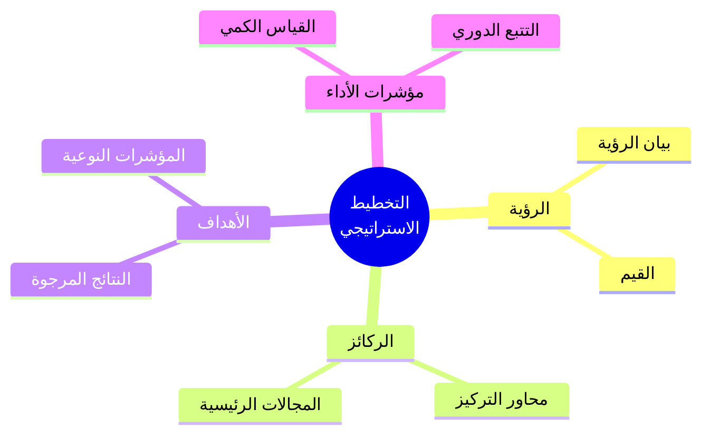
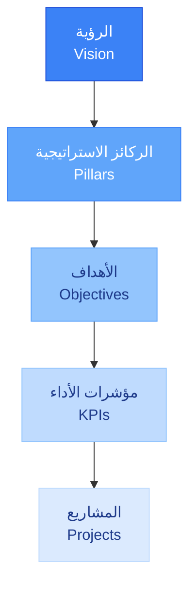
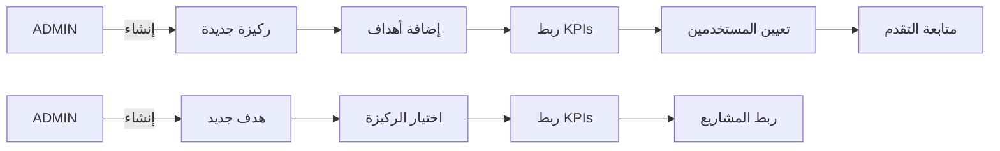
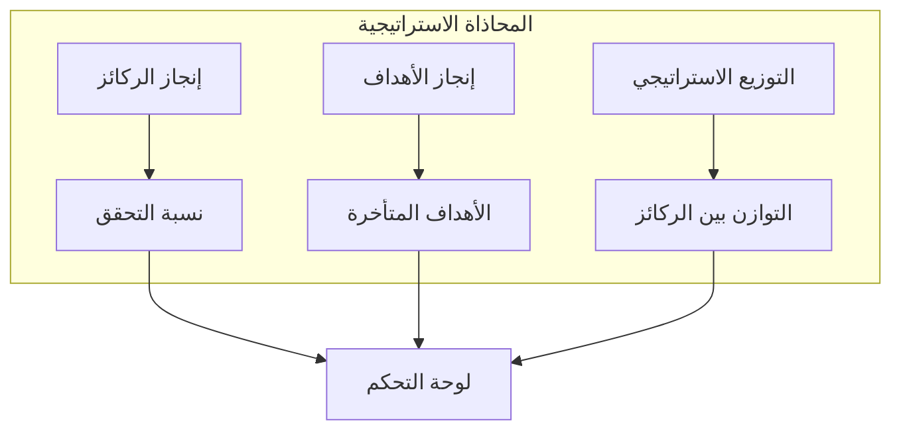
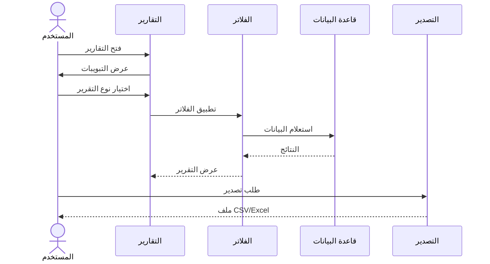

# الركائز والأهداف — التخطيط الاستراتيجي

<div dir="rtl">

تُستخدم صفحتا **الركائز** (`/<locale>/pillars`) و**الأهداف** (`/<locale>/objectives`) لعرض وإدارة إطار الاستراتيجية المؤسسية.

---

## الركائز الاستراتيجية

### الوصول

انتقل إلى `/<locale>/pillars` أو انقر على **الركائز** في الشريط الجانبي.

### مفهوم الركائز

الركائز هي المحاور الرئيسية للاستراتيجية. تُمثل مجالات التركيز الأساسية التي تسعى المؤسسة لتحقيقها.

#### هيكل التخطيط الاستراتيجي



### المحتوى المعروض

تعرض صفحة الركائز:
- قائمة الركائز الاستراتيجية
- شعار كل ركيزة (أيقونة)
- رابط للوصول إلى تفاصيل الركيزة

---

## الأهداف

### الوصول

انتقل إلى `/<locale>/objectives` أو انقر على **الأهداف** في الشريط الجانبي.

### مفهوم الأهداف

الأهداف هي النتائج المراد تحقيقها ضمن كل ركيزة. تُعد الأهداف خطوة بين الرؤية الاستراتيجية ومؤشرات الأداء.

### المحتوى المعروض

تعرض صفحة الأهداف:
- قائمة الأهداف التنظيمية
- الركيزة المرتبطة بكل هدف
- رابط للوصول إلى تفاصيل الهدف

---

## العلاقة بين الركائز والأهداف



> **الهيكل الهرمي:** الرؤية ← الركائز ← الأهداف ← مؤشرات الأداء ← المشاريع

---

## صفحة تفاصيل الركيزة

```
/<locale>/entities/pillar/<pillarId>
```

### المحتوى
- **النظرة العامة**: العنوان، الوصف، الحالة
- **الأهداف المرتبطة**: قائمة الأهداف ضمن الركيزة
- **مؤشرات الأداء**: KPIs المرتبطة بالركيزة
- **المشاريع**: المشاريع المرتبطة بالركيزة
- **التكليفات**: المستخدمون المُكلَّفون

---

## صفحة تفاصيل الهدف

```
/<locale>/entities/objective/<objectiveId>
```

### المحتوى
- **النظرة العامة**: العنوان، الوصف، الحالة، الركيزة الأم
- **مؤشرات الأداء**: KPIs المرتبطة بالهدف
- **المشاريع**: المشاريع المساهمة في تحقيق الهدف
- **التقدم**: شريط تقدم نحو تحقيق الهدف
- **التكليفات**: المستخدمون المُكلَّفون

---

## إنشاء ركيزة/هدف جديد (للمسؤولين فقط)

### تدفق إنشاء ركيزة/هدف



1. انتقل إلى صفحة الكيانات ← الركائز / الأهداف.
2. انقر على **+ ركيزة جديدة** أو **+ هدف جديد**.
3. أدخل البيانات:
   - **العنوان** (مطلوب)
   - **العنوان (عربي)** (اختياري)
   - **الوصف** (مطلوب)
   - **الحالة**: PLANNED / ACTIVE / COMPLETED
   - **الركيزة الأم** (للأهداف فقط — اختياري)
4. انقر على **حفظ**.

---

## لوحة متابعة المحاذاة الاستراتيجية

#### هيكل المحاذاة الاستراتيجية



#### تدفق استخدام التقارير



انتقل إلى `/<locale>/dashboards/pillar` أو `/<locale>/reports` ← **المحاذاة الاستراتيجية** لعرض:
- إنجاز الركائز والأهداف
- نسبة التحقق لكل ركيزة
- الأهداف المتأخرة
- التوزيع الاستراتيجي

---

## صلاحيات حسب الدور

| الدور | رؤية الركائز/الأهداف | إنشاء/تعديل/حذف |
|-------|---------------------|-----------------|
| **SUPER_ADMIN** | الكل | ✓ كامل |
| **ADMIN** | الكل | ✓ كامل |
| **EXECUTIVE** | الكل | ✗ للقراءة فقط |
| **MANAGER** | المُكلَّف بها | ✗ للقراءة فقط |

---

## نصائح مفيدة

- ابدأ بإعداد الركائز ثم الأهداف ثم مؤشرات الأداء.
- تأكد من ارتباط كل هدف بركيزة واضحة.
- راجع حالة الركائز والأهداف دورياً.
- استخدم لوحة المحاذاة الاستراتيجية لفهم التقدم العام.

</div>
