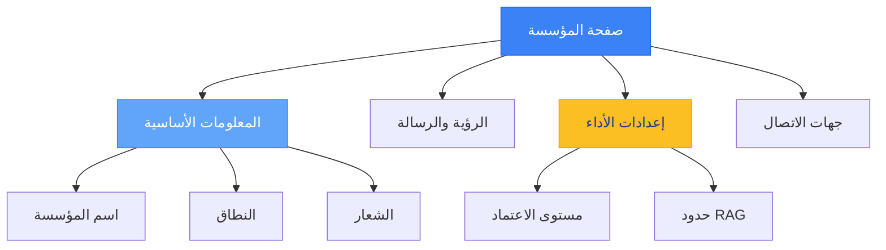
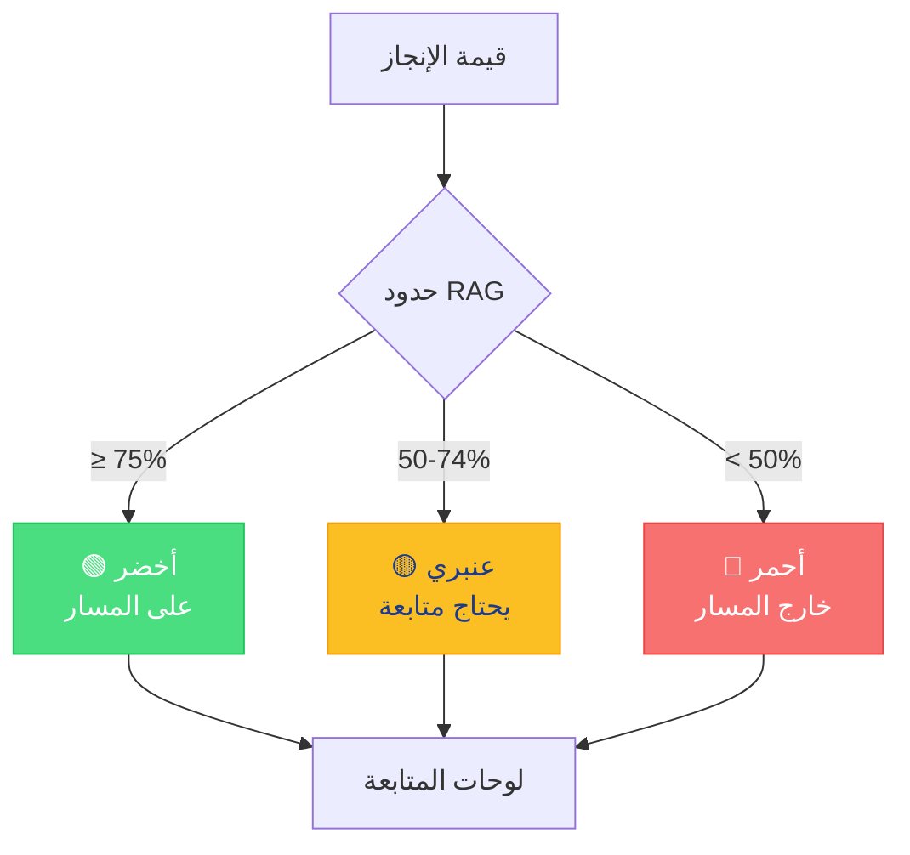
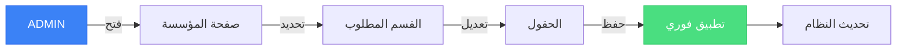
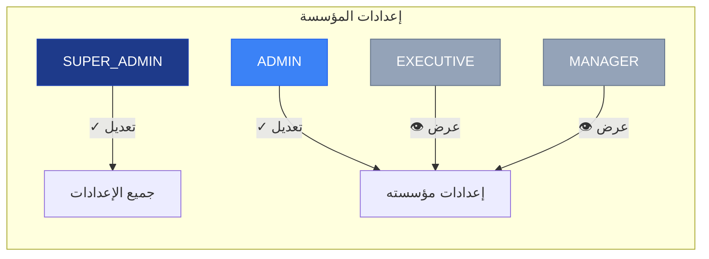

# المؤسسة — إعدادات وإدارة المؤسسة

<div dir="rtl">

تُستخدم صفحة **المؤسسة** (`/<locale>/organization`) لعرض وتعديل معلومات المؤسسة وإعداداتها.

---

## الوصول إلى صفحة المؤسسة

1. انقر على **المؤسسة** في الشريط الجانبي.
2. أو انتقل مباشرةً إلى:

```
/<locale>/organization
```

> **ملاحظة:** تتطلب بعض الإعدادات صلاحيات **ADMIN** أو **SUPER_ADMIN**.

---

## أقسام صفحة المؤسسة

### هيكل صفحة المؤسسة



| الحقل | الوصف | قابل للتعديل |
|-------|-------|--------------|
| **اسم المؤسسة** | الاسم الرسمي للمؤسسة | ✓ ADMIN |
| **اسم المؤسسة (عربي)** | الاسم باللغة العربية | ✓ ADMIN |
| **النطاق (Domain)** | نطاق البريد الإلكتروني | ✓ ADMIN |
| **الشعار** | صورة شعار المؤسسة | ✓ ADMIN |

### 2. الرؤية والرسالة

| الحقل | الوصف |
|-------|-------|
| **الرسالة** | رسالة المؤسسة (Mission) |
| **الرسالة (عربي)** | الرسالة بالعربية |
| **الرؤية** | رؤية المؤسسة (Vision) |
| **الرؤية (عربي)** | الرؤية بالعربية |

### 3. إعدادات الأداء

### تأثير إعدادات RAG



| الإعداد | الوصف | الافتراضي |
|---------|-------|-----------|
| **مستوى اعتماد مؤشرات الأداء** | الجهة المخولة بالاعتماد | MANAGER |
| **حد الأخضر (RAG)** | نسبة إنجاز الخضراء | 75% |
| **حد الأصفر (RAG)** | نسبة إنجاز الصفراء | 50% |

> **تأثير مستوى الاعتماد:**
> - `MANAGER` — المدير يعتمد قيم مؤشرات الأداء
> - `EXECUTIVE` — التنفيذي يعتمد القيم
> - `ADMIN` — المسؤول يعتمد القيم

> **تأثير حدود RAG:**
> - ≥ 75% — أخضر (على المسار)
> - 50–74% — أصفر (يحتاج متابعة)
> - < 50% — أحمر (خارج المسار)

### 4. جهات الاتصال

معلومات التواصل للمؤسسة:
- العنوان
- رقم الهاتف
- البريد الإلكتروني
- الموقع الإلكتروني

---

## تعديل إعدادات المؤسسة (للمسؤولين فقط)

### تدفق تعديل الإعدادات



1. انتقل إلى صفحة **المؤسسة**.
2. انقر على **تعديل** في القسم المطلوب.
3. عدّل الحقول.
4. انقر على **حفظ**.
5. يتم تطبيق التغييرات فوراً.

---

## إعدادات المظهر

### تغيير الشعار

1. في قسم **المعلومات الأساسية**.
2. انقر على **تغيير الشعار**.
3. ارفع صورة جديدة (يفضل PNG أو SVG).
4. يتم تحديث الشعار في جميع الصفحات.

---

## صلاحيات حسب الدور

### مخطط صلاحيات الوصول



| الدور | رؤية الإعدادات | تعديل الإعدادات |
|-------|---------------|-----------------|
| **SUPER_ADMIN** | جميع الإعدادات | ✓ كامل |
| **ADMIN** | إعدادات مؤسسته | ✓ كامل |
| **EXECUTIVE** | إعدادات مؤسسته | ✗ للقراءة فقط |
| **MANAGER** | إعدادات مؤسسته | ✗ للقراءة فقط |

---

## نصائح مفيدة

- حدد **مستوى الاعتماد** بناءً على هيكل الحوكمة في مؤسستك.
- اضبط **حدود RAG** لتتوافق مع معايير الأداء المؤسسية.
- أدخل **الرؤية والرسالة** باللغتين لتحسين التواصل.
- تأكد من صحة **النطاق** لتسهيل إدارة المستخدمين.

</div>
