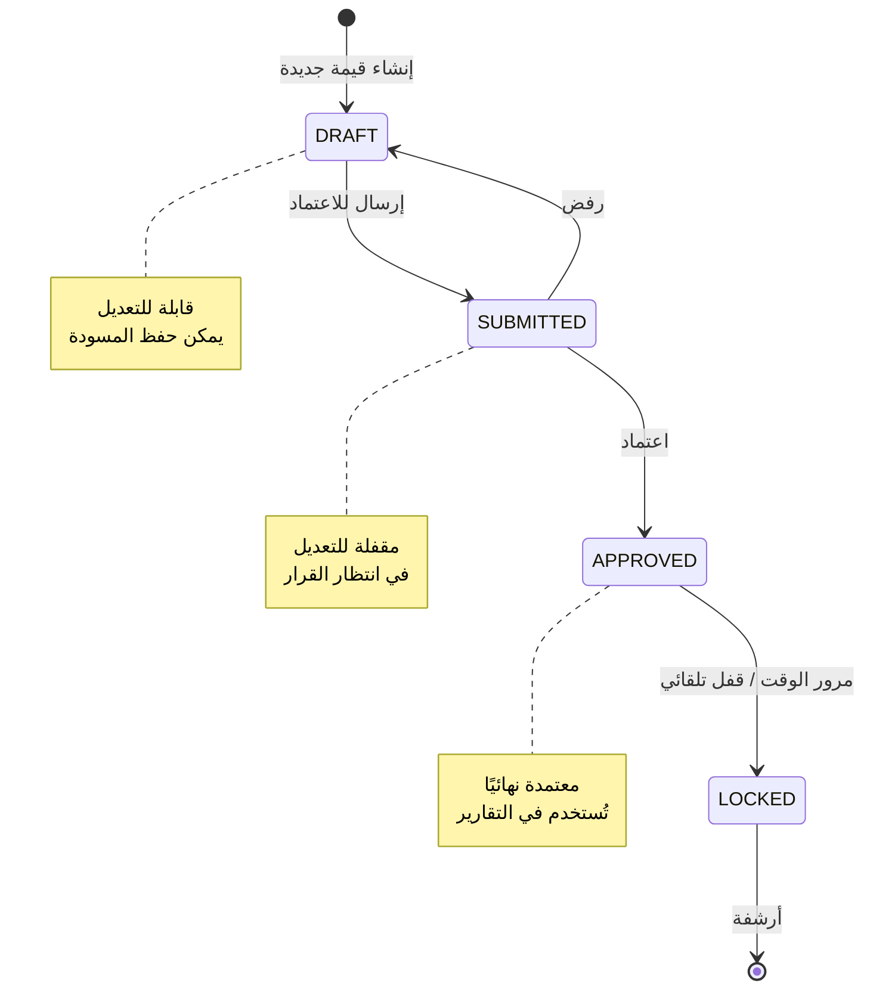
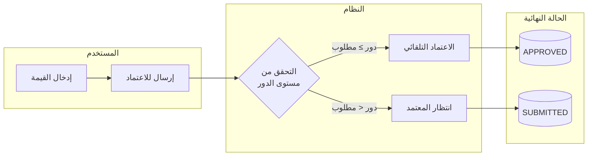
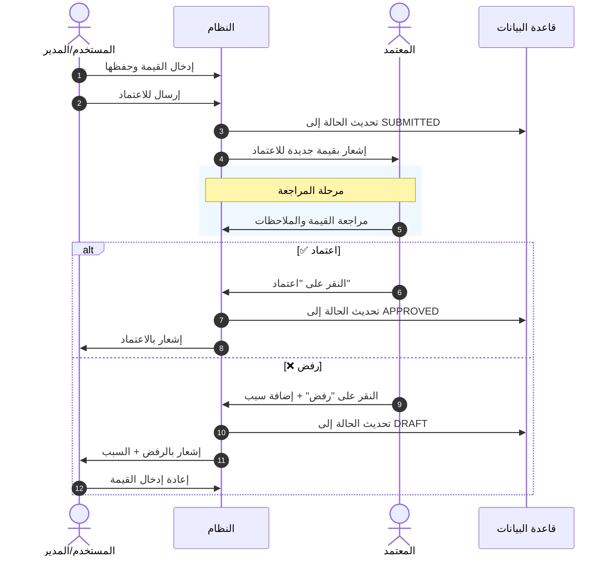
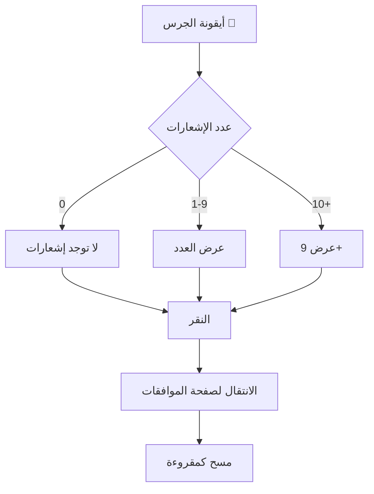
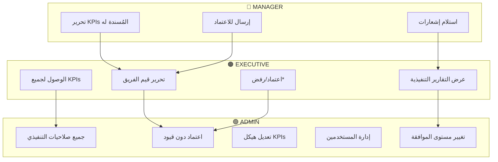
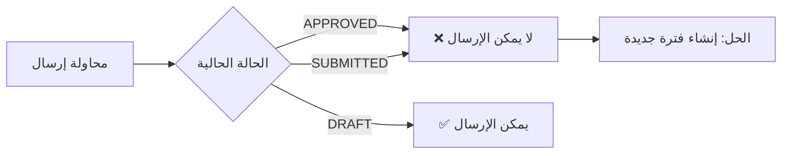
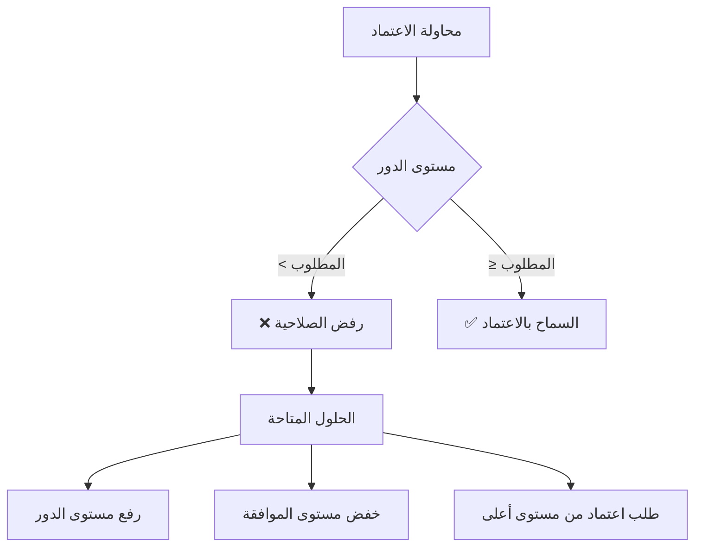
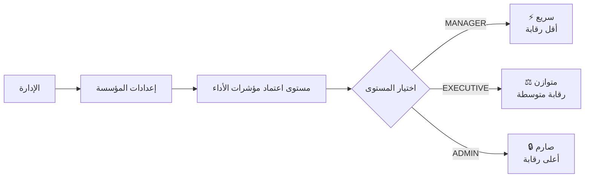
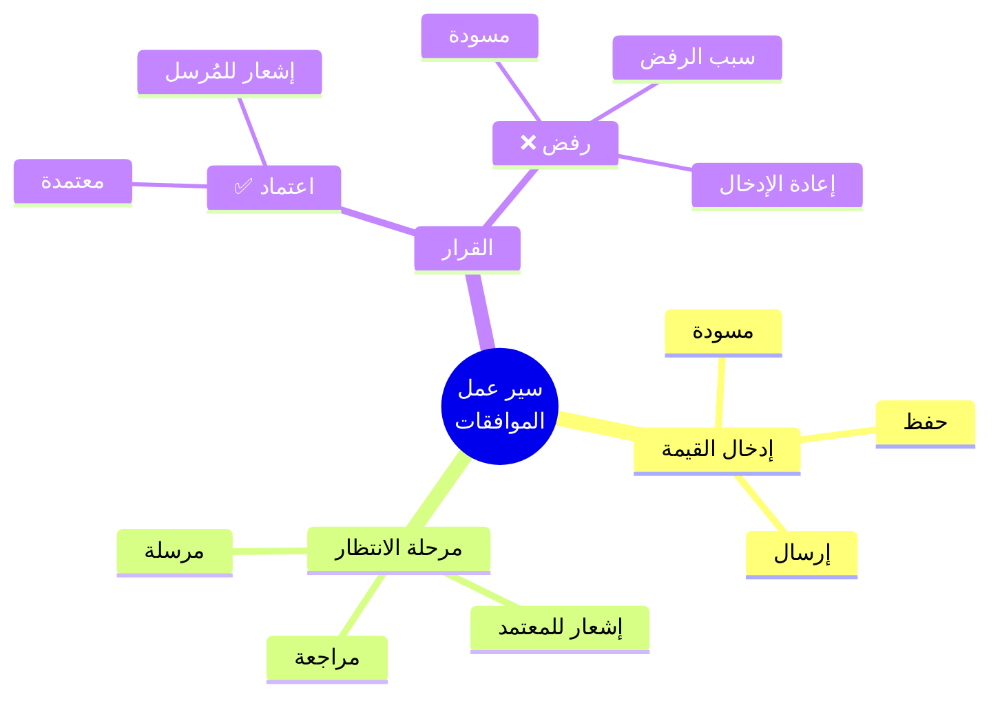

# دليل سير عمل الموافقات

## نظرة عامة

يتيح نظام ** المؤشرات** سير عمل موافقات مرن لقيم مؤشرات الأداء الرئيسية (KPIs)، مما يضمن الحوكمة والرقابة على البيانات قبل اعتمادها نهائيًا.

---

## مستويات الموافقة

| المستوى | الدور | الصلاحيات |
|---------|-------|----------|
| 1 | MANAGER (مدير) | اعتماد قيم KPIs للفريق |
| 2 | EXECUTIVE (تنفيذي) | اعتماد قيم KPIs على مستوى القسم/الإدارة |
| 3 | ADMIN (مسؤول) | اعتماد جميع القيم + إدارة النظام |

> **ملاحظة:** يمكن تخصيص الحد الأدنى لمستوى الموافقة لكل جهة في إعدادات النظام.

---

## حالات قيمة KPI

### مخطط حالات القيمة

### جدول الحالات

| الحالة | الوصف | قابلية التعديل | اللون |
|--------|-------|---------------|-------|
| **مسودة** (DRAFT) | القيمة قيد الإعداد | ✅ نعم — يمكن تعديلها وحفظها | رمادي |
| **مرسلة للاعتماد** (SUBMITTED) | بانتظار موافقة المعتمد | ❌ لا — مقفلة للتعديل | برتقالي |
| **معتمدة** (APPROVED) | تم اعتماد القيمة نهائيًا | ❌ لا — نهائية | أخضر |
| **مغلقة** (LOCKED) | مغلقة تلقائيًا لفترة سابقة | ❌ لا — للقراءة فقط | أزرق |

---

## سير العمل الكامل

### 1. إدخال القيمة (المستخدم/المدير المسؤول)

> **الدور المطلوب:** MANAGER أو من لديه صلاحية تحرير

#### الخطوات:

1. الانتقال إلى صفحة KPI
2. إدخال القيم في قسم **المدخلات**
3. النقر على **حفظ** (Save)
4. عند الانتهاء، النقر على **إرسال للاعتماد** (Submit for Approval)

#### ⚠️ ملاحظات مهمة:

- يجب أن تكون جميع المتغيرات المطلوبة مملوءة
- يمكن إضافة ملاحظة توضيحية مع القيمة
- يُنصح بمراجعة القيم قبل الإرسال

---

### 2. الاعتماد التلقائي (Auto-Approval)

إذا كان مستخدم الإرسال **يعتمد ذاتيًا** (مستوى دوره ≥ مستوى الموافقة المطلوب):

#### أمثلة على الاعتماد التلقائي:

| المُرسل | مستوى الموافقة المطلوب | النتيجة |
|---------|------------------------|---------|
| MANAGER | MANAGER | ✅ اعتماد تلقائي |
| EXECUTIVE | MANAGER | ✅ اعتماد تلقائي |
| EXECUTIVE | EXECUTIVE | ✅ اعتماد تلقائي |
| MANAGER | EXECUTIVE | ⏳ ينتظر اعتماد تنفيذي |

في حالة الاعتماد التلقائي، تنتقل القيمة مباشرة من **مسودة** إلى **معتمدة**.

---

### 3. الاعتماد اليدوي (Manual Approval)

إذا كان مستخدم الإرسال **لا يملك صلاحية الاعتماد**:

---

## صفحة الموافقات

**الرابط:** `/ar/approvals`

### الفلاتر المتاحة

| الفلتر | الوصف | اللون |
|--------|-------|-------|
| **قيد الانتظار** (Pending) | القيم المرسلة بانتظار القرار | 🔴 |
| **المعتمدة** (Approved) | القيم التي تم اعتمادها | 🟢 |
| **الكل** (All) | جميع القيم بصرف النظر عن حالتها | ⚪ |

### معلومات العرض في الجدول

| العمود | الوصف |
|--------|-------|
| **عنوان KPI** | اسم مؤشر الأداء |
| **القيمة المُرسلة** | الرقم المطلوب اعتماده |
| **تاريخ الإرسال** | متى تم الإرسال |
| **المُرسل** | من قام بإرسال القيمة |
| **الإجراء** | أزرار الموافقة/الرفض |

---

## الإشعارات

### جدول الإشعارات

| الحدث | المستلم | نوع الإشعار | الأولوية |
|-------|---------|------------|----------|
| إرسال KPI للاعتماد | المعتمدين في الجهة | بريد + داخل النظام | 🔴 عالية |
| اعتماد KPI | المُرسل الأصلي | بريد + داخل النظام | 🟢 عادية |
| رفض KPI | المُرسل الأصلي | بريد + داخل النظام (مع سبب الرفض) | 🟠 متوسطة |

### أيقونة الجرس

---

## أدوار المستخدمين والصلاحيات

### رسم بياني للصلاحيات

> *الاعتماد/الرفض يعتمد على إعداد `kpiApprovalLevel`

---

## المشكلات الشائعة وحلولها

### ❌ "periodNotDraft" — الفترة ليست مسودة

**السبب:** محاولة إرسال قيمة KPI تم اعتمادها بالفعل.

**الحل:**
- إذا كانت القيمة معتمدة، لا يمكن إعادة إرسالها
- للتعديل، يجب إنشاء نسخة جديدة (فترة جديدة)

---

### ❌ "periodNotSubmitted" — الفترة غير مرسلة

**السبب:** محاولة اعتماد قيمة KPI لم يتم إرسالها بعد.

**الحل:**
- تأكد من أن القيمة في حالة "مرسلة للاعتماد"
- يمكن للمستخدم المسؤول إرسالها أولاً

---

### ❌ "insufficientApprovalAuthority" — صلاحيات غير كافية

**السبب:** محاولة اعتماد قيمة من مستخدم لا يملك المستوى المطلوب.

**الحل:**
- التواصل مع مسؤول الجهة لرفع مستوى الدور
- أو إعداد مستوى موافقة أقل في إعدادات الجهة

---

### ❌ "غير موجود" أو "لا يمكن الوصول"

**السبب:** المستخدم لا يملك صلاحية الوصول لهذا KPI.

**الحل:**
- للمدراء: يجب أن يكون KPI مُسندًا لهم أو لفريقهم
- للتنفيذيين/المسؤولين: يجب أن يكونوا في نفس الجهة

---

## إعداد مستوى الموافقة للجهة

### صلاحية الوصول

> **ADMIN فقط**

### الخطوات

### مستويات الموافقة المقارنة

| المستوى | السرعة | الرقابة | المناسب لـ |
|---------|--------|---------|-----------|
| **MANAGER** | ⚡ سريع | 🔴 أقل | الشركات الصغيرة |
| **EXECUTIVE** | ⚖️ متوسط | 🟠 متوسط | الشركات المتوسطة |
| **ADMIN** | 🐌 أبطأ | 🟢 أعلى | الشركات الكبيرة/المنظمية |

### التأثير

- ✅ يطبق على جميع KPIs في الجهة
- ✅ لا يؤثر على القيم المعتمدة سابقًا
- ✅ يمكن تغييره في أي وقت

---

## ملخص سريع

---

## الخاتمة

يضمن سير عمل الموافقات:

| الجانب | الوصف |
|--------|-------|
| ✅ **دقة البيانات** | مراجعة قبل الاعتماد |
| ✅ **المساءلة** | معرفة من أدخل ومن اعتمد |
| ✅ **الشفافية** | سجل كامل لجميع التغييرات |
| ✅ **الحوكمة** | فصل بين الإدخال والاعتماد |

> 💡 **للدعم الفني:** يرجى التواصل مع مسؤول النظام.

