# دليل استخدام المساعد الذكي (AI)

## نظرة عامة

يوفر نظام **مرتكز** مساعداً ذكياً (AI Assistant) متكاملاً لمساعدة المستخدمين في إدارة الأداء الاستراتيجي. يتميز المساعد الذكي بقدرته على:

- 🎯 تحليل البيانات وإنشاء تقارير فورية
- 💬 الإجابة على الأسئلة بلغة طبيعية (العربية/الإنجليزية)
- 🔄 إنشاء مؤشرات أداء مقترحة بناءً على الأهداف
- 📝 كتابة الملاحظات والشروحات تلقائياً
- 📊 مقارنة الأداء عبر الفترات

---

## هيكل المساعد الذكي

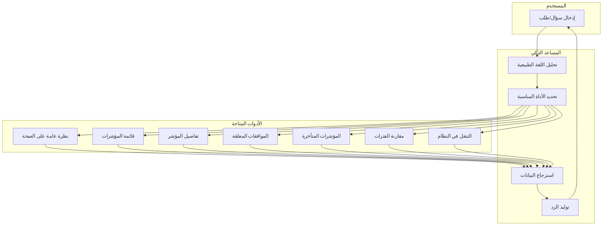

---

## الوصول إلى المساعد الذكي

### طريقة الفتح

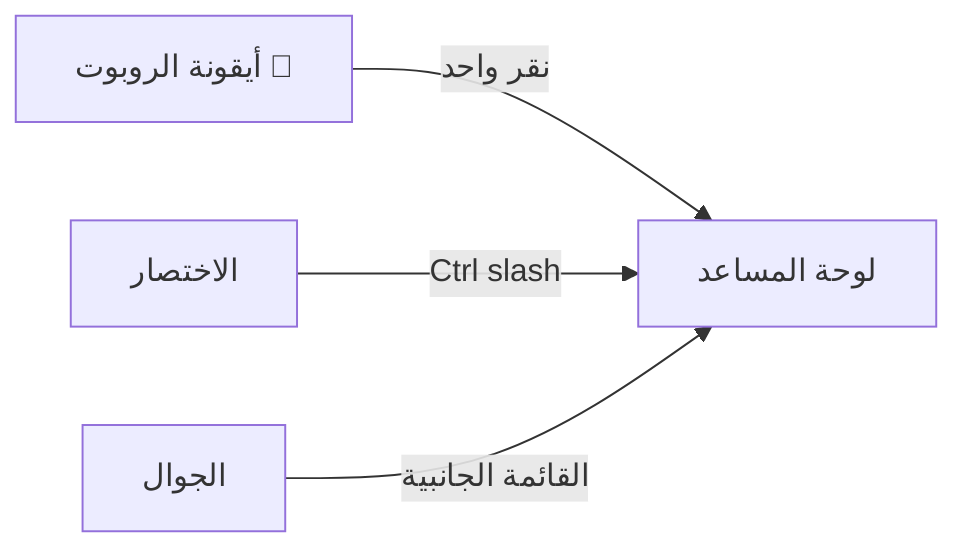

1. **أيقونة العائمة**: انقر على أيقونة الروبوت الزرقاء في الزاوية السفلية اليمينية
2. **اختصار لوحة المفاتيح**: `Ctrl + /` (أو `Cmd + /` على Mac)
3. **الجوال**: من القائمة الجانبية → "المساعد الذكي"

### حالات استخدام سريعة

| الاقتراح الجاهز | الوصف | الأيقونة |
|----------------|--------|----------|
| **نظرة عامة على الصحة** | ملخص شامل لصحة المؤسسة | 📊 |
| **مؤشرات متأخرة** | KPIs خلف الهدف (حمراء) | 🔴 |
| **الموافقات المعلقة** | قائمة الاعتمادات المنتظرة | ⏳ |
| **مؤشرات متأخرة التحديث** | KPIs لم يتم تحديثها | ⚠️ |
| **اتجاه الأداء** | مقارنة 6 أشهر vs 3 أشهر | 📈 |
| **الفريق والملكية** | توزيع المؤشرات والمسؤولين | 👥 |

---

## قدرات المساعد الذكي

### 1. الرد على الأسئلة

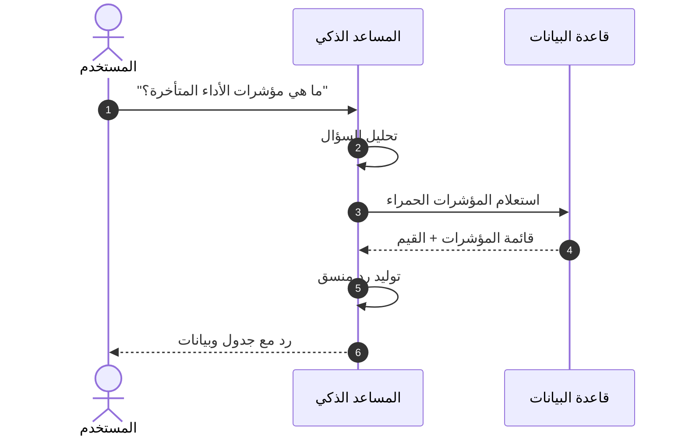

**أمثلة على الأسئلة:**
- "أعطني نظرة عامة على صحة المؤسسة"
- "ما هي الموافقات المعلقة؟"
- "قارن أداء الربع الحالي بالربع السابق"
- "أي مؤشرات لم يتم تحديثها منذ أكثر من 30 يوماً؟"

### 2. التنقل الذكي

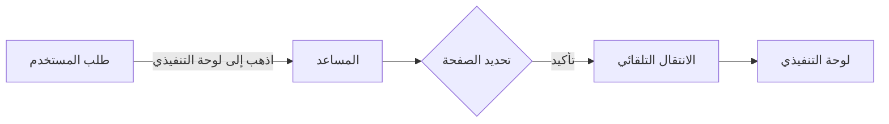

**أوامر التنقل:**
- "اذهب إلى لوحة التنفيذي"
- "افتح صفحة الموافقات"
- "أرني تفاصيل مؤشر الأداء X"
- "انتقل إلى إعدادات المؤسسة"

### 3. تحليل البيانات

| التحليل | الوصف | المثال |
|---------|-------|--------|
| **المقارنة** | مقارنة فترتين زمنيتين | "قارن يونيو بمايو" |
| **الترتيب** | ترتيب المؤشرات حسب الأداء | "أظهر أفضل 5 مؤشرات" |
| **التصفية** | تصفية حسب الحالة | "المؤشرات الحمراء فقط" |
| **الإحصائيات** | حساب المتوسطات والنسب | "متوسط تحقيق الأهداف" |

---

## معالج مؤشرات الأداء (KPI Wizard)

### تدفق العمل

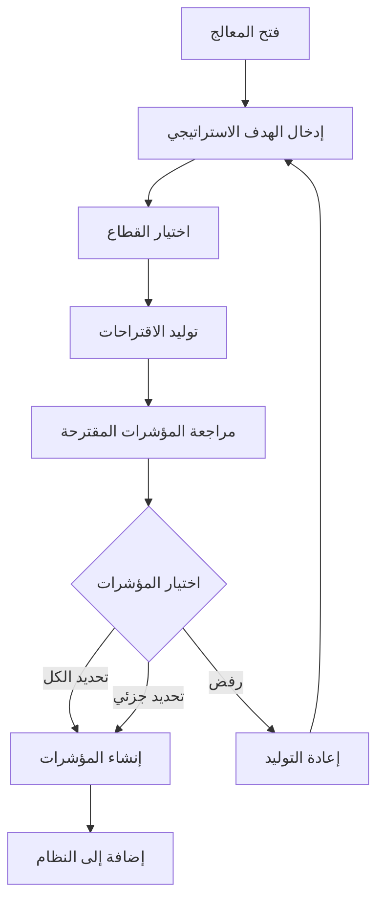

### خطوات الاستخدام

1. **الوصول**: من صفحة الكيانات → زر "✨ استخدم المعالج"
2. **إدخال الهدف**: اكتب الهدف الاستراتيجي (مثال: "زيادة رضا العملاء")
3. **اختيار القطاع**: حدد القطاع المناسب:
   - عام
   - حكومة / قطاع عام
   - رعاية صحية
   - تعليم
   - خدمات مالية
   - عقارات
   - تجزئة
   - تكنولوجيا
4. **التوليد**: انتظر اقتراحات المؤشرات (3-6 مؤشرات)
5. **المراجعة**: راجع كل مؤشر:
   - الاسم (عربي/إنجليزي)
   - الوحدة
   - الدورية
   - الاتجاه (أعلى أفضل / أقل أفضل)
   - التبرير (لماذا هذا المؤشر مناسب)
6. **القبول**: حدد المؤشرات المراد إنشاؤها → "قبول المحدد"

> ⚠️ **ملاحظة**: المؤشرات المُولَّدة بالذكاء الاصطناعي تحتاج مراجعة قبل الإنشاء النهائي.

---

## السرد الذكي للتقارير (AI Narrative)

### متى تستخدمه؟

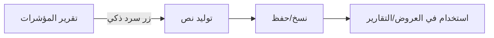

### الخطوات

1. افتح أي تقرير مؤشرات
2. انقر على زر "✨ سرد ذكي"
3. اختر اللغة (العربية/الإنجليزية)
4. انتظر توليد النص
5. انسخ النص أو أعد التوليد

**محتوى السرد:**
- ملخص تنفيذي
- تحليل المؤشرات الخضراء/الصفراء/الحمراء
- الاتجاهات الرئيسية
- توصيات عملية

---

## الميزات المساعدة

### 1. منشئ الصيغ (Formula Builder)

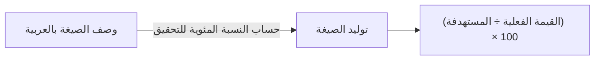

**الاستخدام**: عند إنشاء مؤشر محسوب (CALCULATED)، اكتب الصيغة المطلوبة بلغة طبيعية والمساعد سيحولها لصيغة JavaScript.

### 2. الترجمة الذكية

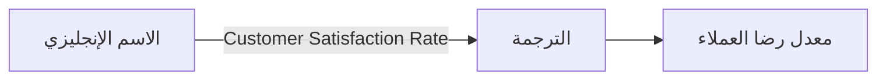

**الاستخدام**: زر "ترجمة" بجانب حقول النص يترجم تلقائياً بين العربية والإنجليزية.

### 3. كاتب الملاحظات

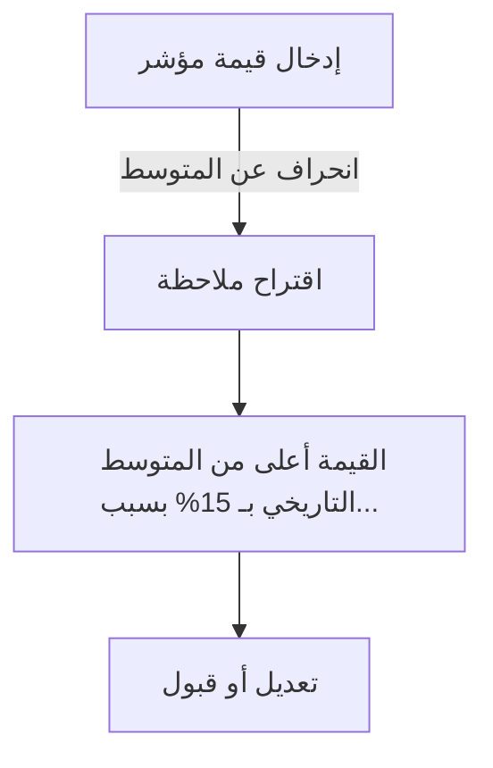

**الاستخدام**: عند إدخال قيمة استثنائية، يقترح المساذ ملاحظة تفسيرية.

### 4. الوصف التلقائي

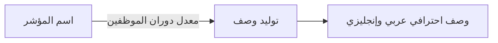

**الاستخدام**: زر "وصف تلقائي" يولد وصفاً احترافياً للمؤشر.

---

## صلاحيات الوصول

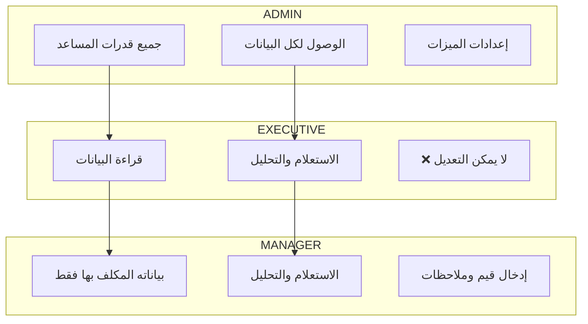

| الدور | الصلاحيات |
|-------|----------|
| **ADMIN** | جميع قدرات المساعد + تفعيل/تعطيل الميزات |
| **EXECUTIVE** | قراءة وتحليل جميع البيانات (للقراءة فقط) |
| **MANAGER** | الوصول للبيانات المكلف بها + إدخال القيم |

---

## تفعيل/تعطيل الميزات

### صلاحية التحكم
> **SUPER_ADMIN فقط**

### الميزات القابلة للتفعيل

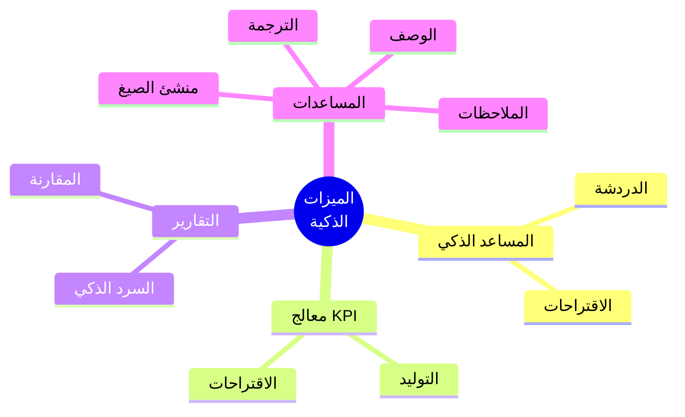

| الميزة | الوصف | مفتاح التفعيل |
|--------|-------|--------------|
| **المساعد الذكي** | الدردشة والأسئلة | `aiEnabled` |
| **المعالج الذكي** | توليد KPIs | `advancedFeatures` |
| **الرسوم البيانية الذكية** | التصورات التفاعلية | `diagramsEnabled` |
| **السرد الذكي** | تقارير نصية | `aiEnabled` |
| **المرفقات** | رفع الملفات | `fileAttachments` |

### خطوات التفعيل

1. انتقل إلى **الإدارة** ← **إعدادات المنصة** (كـ SUPER_ADMIN)
2. اختر **مؤشرات الميزات**
3. فعّل/عطّل الميزات المطلوبة
4. احفظ التغييرات

---

## نصائح للاستخدام الأمثل

### ✅ افعل

- استخدم الأسئلة الواضحة والمحددة
- اطلب بيانات مدعومة بالأرقام
- استخدم الاقتراحات الجاهزة للاستعلامات الشائعة
- راجع المؤشرات المُولَّدة قبل القبول
- تحقق من صحة الصيغ قبل الحفظ

### ❌ لا تفعل

- لا تطلب تعديل بيانات (المساعد للقراءة فقط)
- لا تعتمد على البيانات دون التحقق
- لا تشارك بيانات حساسة في المحادثات
- لا تستخدم وصف/ملاحظة مُولدة دون مراجعة

---

## استكشاف الأخطاء

| المشكلة | الحل |
|---------|------|
| المساعد لا يستجيب | تحقق من تفعيل الميزة في الإعدادات |
| لا توجد بيانات | تأكد من وجود KPIs معتمدة في النظام |
| الرد بطيء | قد يكون الاتصال ضعيفاً — حاول مرة أخرى |
| اقتراحات غير مناسبة | صفّح الهدف الاستراتيجي بشكل أوضح |
| خطأ في الترجمة | راجع النص يدوياً — الذكاء الاصطناعي قد يخطئ |

---

## الخصوصية والأمان

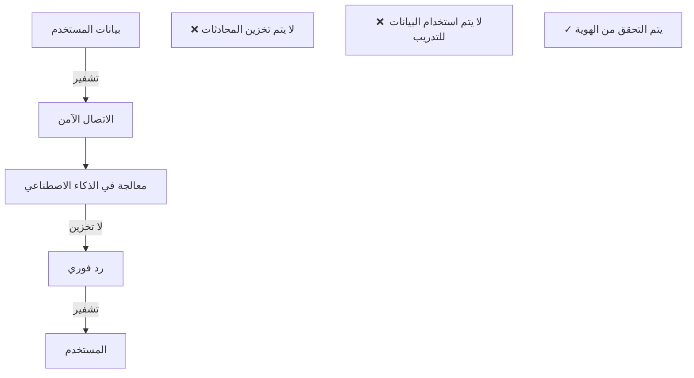

- 🔒 **التشفير**: جميع الاتصالات مشفرة (HTTPS/TLS)
- 🚫 **عدم التخزين**: المحادثات لا تُخزن في قاعدة البيانات
- 🚫 **عدم التدريب**: البيانات لا تُستخدم لتحسين نماذج الذكاء الاصطناعي
- ✅ **التحقق**: يتم التحقق من صلاحيات المستخدم قبل كل استعلام

---

## ملخص سريع

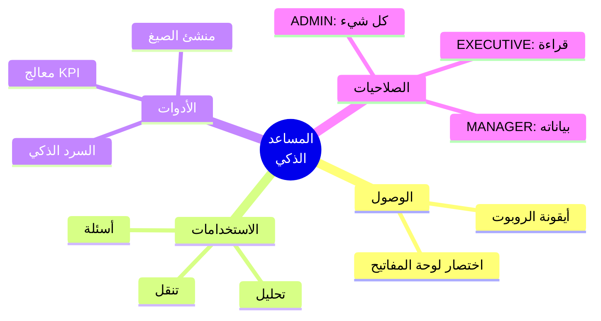

> 💡 **للدعم:** إذا واجهت مشكلة مع المساعد الذكي، تواصل مع مسؤول النظام للتحقق من إعدادات الميزات.

