# 📍 دليل صفحات التطبيق

<div dir="rtl">

دليلك الشامل للتنقل في منصة ** المؤشرات KPI**. هنا ستجد كل الصفحات مصنفة حسب الغرض مع روابط الوصول السريع.

---

## 🗺️ خريطة التطبيق

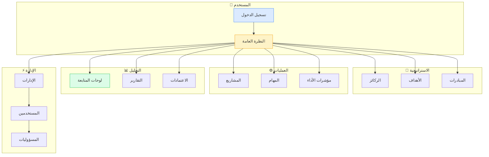

## 🌐 الصفحات العامة

صفحات يمكن الوصول إليها بدون تسجيل دخول:

| 📄 الصفحة | 🔗 الرابط | 📝 الوصف |
|-----------|-----------|----------|
| 🏠 الصفحة الرئيسية | `/<locale>` | صفحة الهبوط مع تعريف بالمنتج |
| 💰 الأسعار | `/<locale>/pricing` | جداول الأسعار والباقات |
| ❓ الأسئلة الشائعة | `/<locale>/faq` | إجابات على الأسئلة المتكررة |
| ℹ️ من نحن | `/<locale>/about` | معلومات عن الشركة |
| 📧 التواصل | `/<locale>/contact` | نموذج التواصل معنا |
| 💼 الوظائف | `/<locale>/careers` | فرص العمل المتاحة |
| 🔒 الخصوصية | `/<locale>/privacy` | سياسة الخصوصية |
| 📋 الشروط | `/<locale>/terms` | شروط استخدام المنصة |

---

## 🔐 المصادقة

صفحات تسجيل الدخول والخروج:

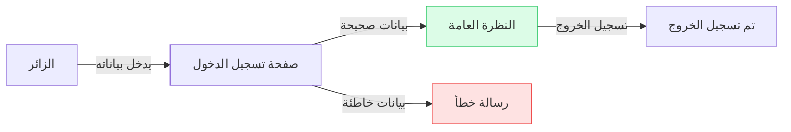

| 🔑 الصفحة | 🔗 الرابط | 👤 لمن |
|-----------|-----------|--------|
| تسجيل الدخول الرئيسية | `/<locale>/auth/login` | جميع المستخدمين |
| نقطة دخول بديلة | `/<locale>/login` | جميع المستخدمين |

**💡 نصيحة:** احفظ رابط `/<locale>/auth/login` في المفضلة للوصول السريع.

---

## 📊 لوحة القيادة — النظرة العامة

صفحتك الرئيسية بعد تسجيل الدخول:

### 🎯 ما ستجدها هنا:

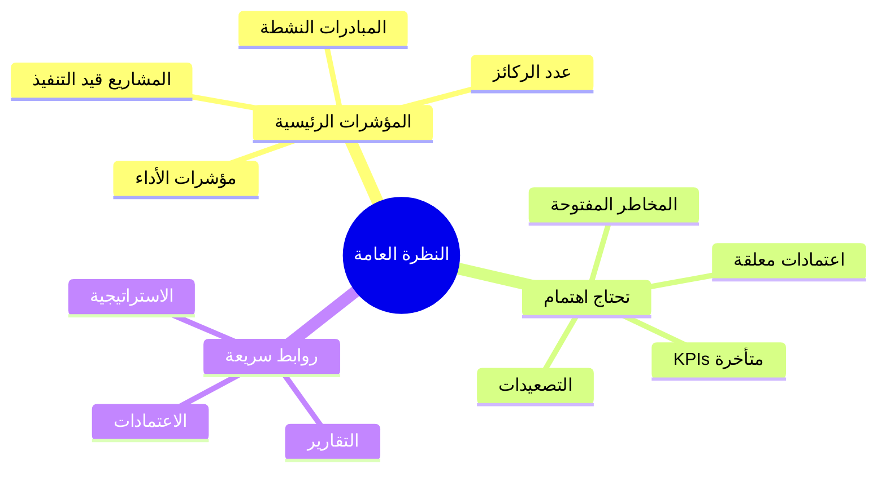

### 🔗 الوصول:
- **الرابط:** `/<locale>/overview`
- **الاختصار:** انقر على الشعار أو "النظرة العامة" في القائمة

---
---

## 🎯 الاستراتيجية

### الركائز الاستراتيجية

| 📍 الصفحة | 🔗 الرابط | 🎯 الغرض |
|-----------|-----------|----------|
| قائمة الركائز | `/<locale>/pillars` | عرض جميع الركائز الاستراتيجية |
| تفاصيل الركيزة | `/<locale>/pillars/<id>` | تفاصيل ركيزة محددة |

**💡 متى تستخدمها:**
- لمعرفة أهداف المؤسسة على المستوى العالي
- لرؤية العلاقة بين الركائز والمبادرات

---

### الأهداف الاستراتيجية

| 📍 الصفحة | 🔗 الرابط | 🎯 الغرض |
|-----------|-----------|----------|
| قائمة الأهداف | `/<locale>/objectives` | جميع أهداف المؤسسة |
| تفاصيل الهدف | `/<locale>/objectives/<id>` | تفاصيل هدف محدد |

---

### الإدارات والهيكل التنظيمي

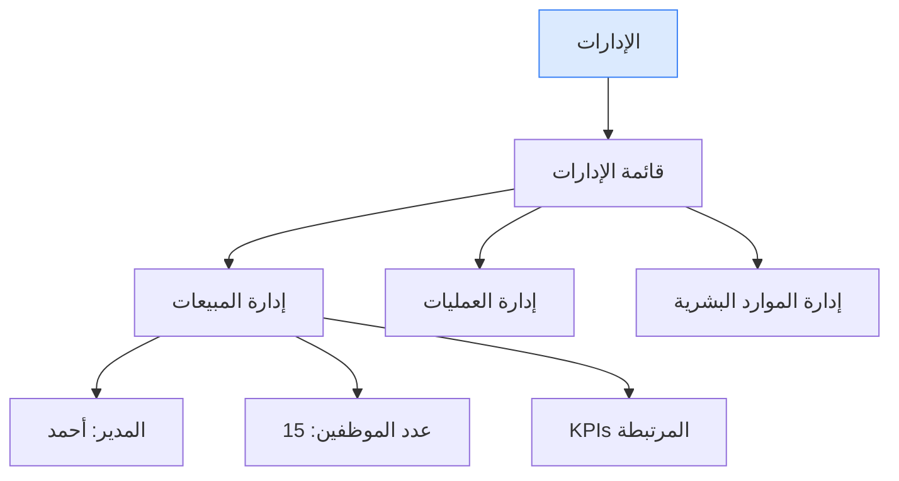

| 📍 الصفحة | 🔗 الرابط | 👤 الصلاحية |
|-----------|-----------|-------------|
| دليل الإدارات | `/<locale>/departments` | جميع الأدوار |
| إنشاء إدارة | `/<locale>/departments/new` | ADMIN فقط |
| تفاصيل الإدارة | `/<locale>/departments/<id>` | حسب الصلاحية |

---

---

## 📦 الكيانات والمؤشرات

### أنواع الكيانات المتاحة

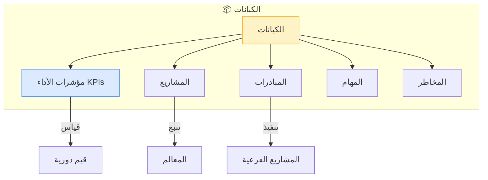

### صفحات الكيانات

| 📍 الصفحة | 🔗 نمط الرابط | 📋 الوصف |
|-----------|---------------|----------|
| قائمة الكيانات | `/<locale>/entities/<نوع>` | عرض جميع الكيانات من نوع معين |
| تفاصيل الكيان | `/<locale>/entities/<نوع>/<id>` | عرض تفاصيل كيان محدد |
| تعديل الكيان | `/<locale>/entities/<نوع>/<id>/edit` | تعديل بيانات الكيان (ADMIN) |

**أمثلة على أنواع الكيانات:**
- `kpi` — مؤشرات الأداء
- `project` — المشاريع
- `initiative` — المبادرات
- `task` — المهام
- `risk` — المخاطر

---

## 📊 لوحات المتابعة (Dashboards)

### رحلة استخدام لوحات المتابعة

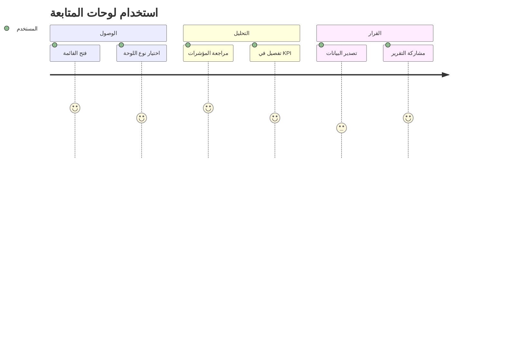

### أنواع لوحات المتابعة

| 📊 اللوحة | 🔗 الرابط | 👤 للمستخدمين |
|-----------|-----------|---------------|
| 🎯 دليل اللوحات | `/<locale>/dashboards` | الجميع |
| 👔 التنفيذية | `/<locale>/dashboards/executive` | EXECUTIVE, ADMIN |
| 📋 PMO | `/<locale>/dashboards/pmo` | مديرو المشاريع |
| 🏛️ الركائز | `/<locale>/dashboards/pillar` | الجميع |
| 💚 صحة المبادرات | `/<locale>/dashboards/initiative-health` | مديرو المبادرات |
| ⚡ تنفيذ المشاريع | `/<locale>/dashboards/project-execution` | مديرو المشاريع |
| 📈 أداء KPIs | `/<locale>/dashboards/kpi-performance` | الجميع |
| 🚨 المخاطر والتصعيد | `/<locale>/dashboards/risk-escalation` | الجميع |
| ⚖️ الحوكمة | `/<locale>/dashboards/governance` | الإدارة العليا |
| 👥 المدير | `/<locale>/dashboards/manager` | MANAGER |
| 🏅 مساهمة الموظف | `/<locale>/dashboards/employee-contribution` | جميع الموظفين |

---

## 📑 التقارير

### مركز التقارير

**الرابط:** `/<locale>/reports`

### أنواع التقارير المتاحة

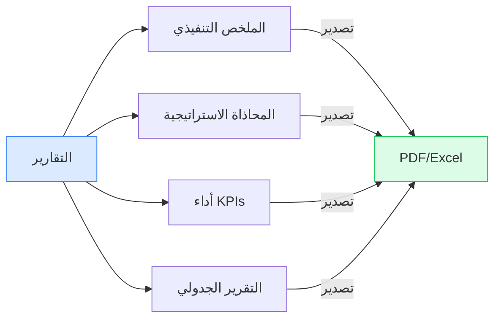

| 📄 التقرير | 📋 المحتوى | 💡 متى تستخدمه |
|------------|-----------|----------------|
| **الملخص التنفيذي** | أداء المؤسسة العالي | اجتماعات الإدارة العليا |
| **المحاذاة الاستراتيجية** | تحقيق الركائز والأهداف | مراجعات الاستراتيجية |
| **أداء KPIs** | تحليل مفصل مع الاتجاهات | تحليل الأداء الشهري |
| **التقرير الجدولي** | بيانات عبر الكيانات مع فلاتر | التحليل العميق والتصدير |

---

## ✅ الاعتمادات والحوكمة

### سير عمل الاعتماد

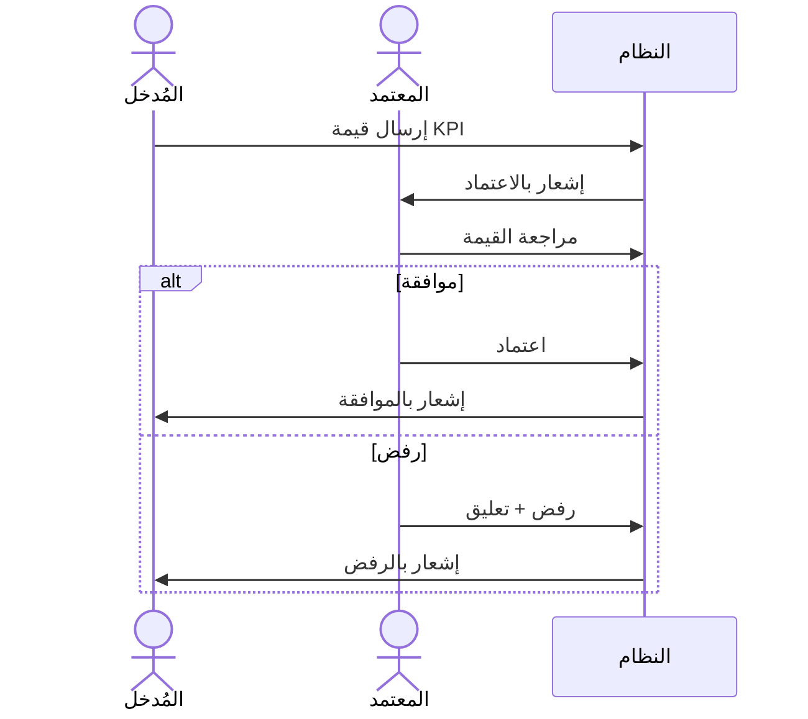

### صفحات الاعتماد

| 📍 الصفحة | 🔗 الرابط | 👤 الصلاحية |
|-----------|-----------|-------------|
| قائمة الاعتمادات | `/<locale>/approvals` | حسب مستوى الاعتماد |
| تفاصيل الطلب | `/<locale>/approvals/<requestId>` | المعتمِد فقط |

---

## 👥 إدارة المستخدمين والتكليفات

### المسؤوليات

**الرابط:** `/<locale>/responsibilities`

### طرق العرض

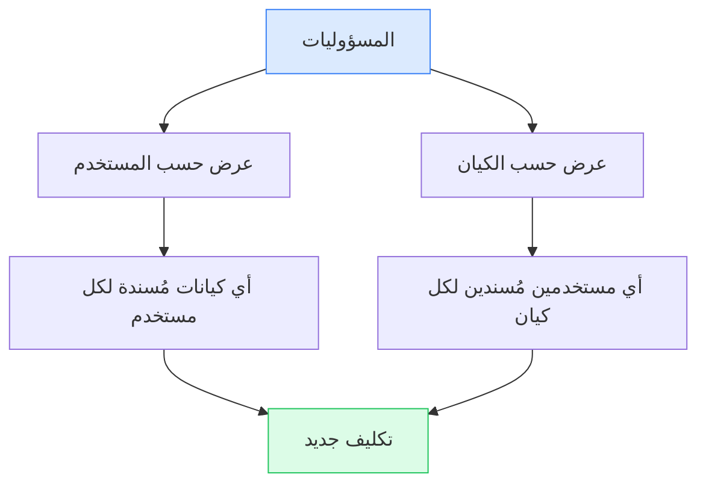

### المستخدمون

| 📍 الصفحة | 🔗 الرابط | 👤 الصلاحية |
|-----------|-----------|-------------|
| دليل المستخدمين | `/<locale>/users` | ADMIN |
| تفاصيل المستخدم | `/<locale>/users/<userId>` | ADMIN |
| الملف الشخصي | `/<locale>/profile` | المستخدم نفسه |

---

## ⚙️ الإدارة

### صفحات الإدارة للمسؤولين

| 📍 الصفحة | 🔗 الرابط | 👤 للمسؤول |
|-----------|-----------|------------|
| لوحة الإدارة | `/<locale>/admin` | ADMIN |
| إعدادات المؤسسة | `/<locale>/organization` | ADMIN |

### الإدارة العامة (SUPER_ADMIN)

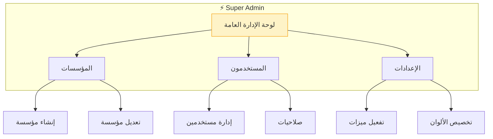

| 📍 الصفحة | 🔗 الرابط | 💡 الوظيفة |
|-----------|-----------|------------|
| نظرة عامة | `/<locale>/super-admin` | إحصائيات النظام |
| المؤسسات | `/<locale>/super-admin/organizations` | إدارة المؤسسات |
| إنشاء مؤسسة | `/<locale>/super-admin/organizations/create` | مؤسسة جديدة |
| تفاصيل المؤسسة | `/<locale>/super-admin/organizations/<orgId>` | إعدادات مؤسسة |
| المستخدمون | `/<locale>/super-admin/users` | إدارة المستخدمين |
| تفاصيل المستخدم | `/<locale>/super-admin/users/<userId>` | إعدادات مستخدم |
| الإعدادات | `/<locale>/super-admin/settings` | إعدادات النظام |
| الملف الشخصي | `/<locale>/super-admin/profile` | الملف الشخصي |

**الإعدادات المتاحة:**
- ✅ تفعيل/تعطيل الذكاء الاصطناعي
- ✅ تفعيل/تعطيل لوحات المتابعة
- ✅ تفعيل/تعطيل الاعتمادات
- ✅ تخصيص ألوان السمة

---

---

## 🗂️ أنماط الروابط المفيدة

### صيغ الروابط الشائعة

```
📦 الكيانات:
─────────────────────────────
/<locale>/entities/<نوع>              ← قائمة
/<locale>/entities/<نوع>/<id>         ← تفاصيل  
/<locale>/entities/<نوع>/<id>/edit    ← تعديل

📊 لوحات المتابعة:
─────────────────────────────
/<locale>/dashboards                    ← الدليل
/<locale>/dashboards/<نوع>            ← لوحة محددة

📑 التقارير:
─────────────────────────────
/<locale>/reports                     ← مركز التقارير

⚙️ الإدارة:
─────────────────────────────
/<locale>/admin                      ← إدارة المؤسسة
/<locale>/super-admin                ← إدارة النظام
```

---

## 👤 صلاحيات الوصول حسب الدور

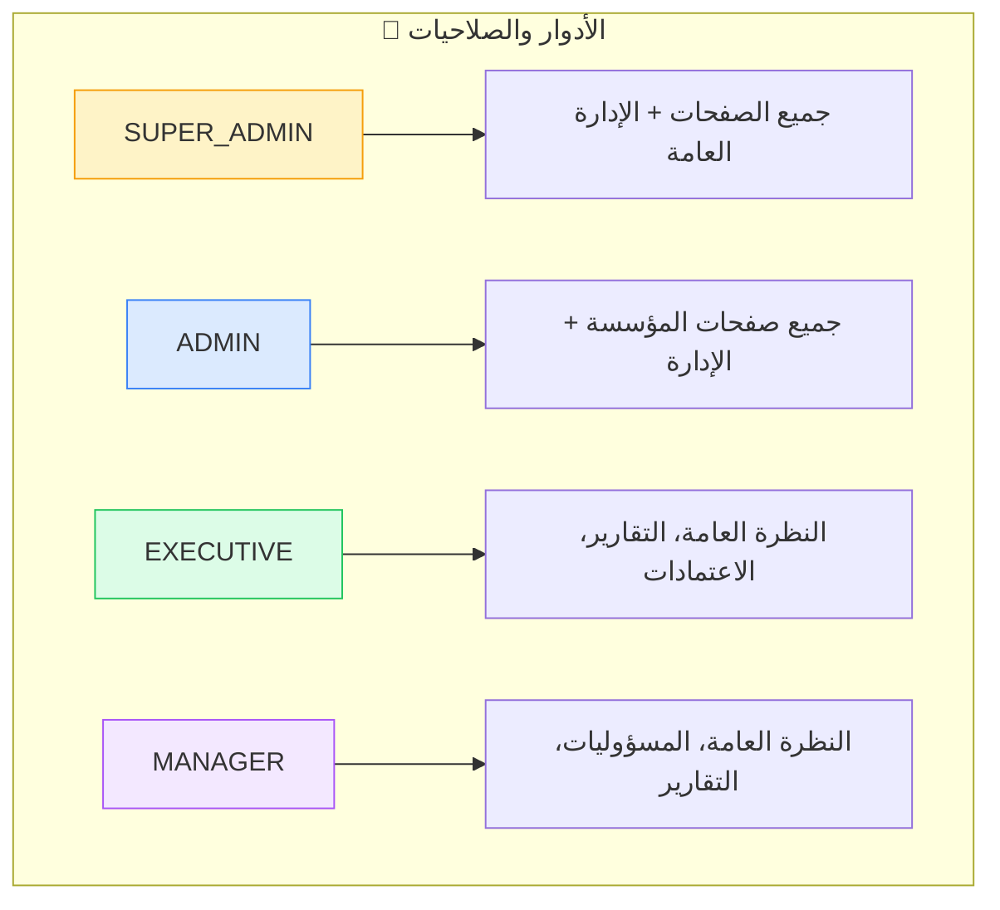

### جدول الصلاحيات التفصيلي

| الدور | الصفحات المتاحة | الصفحات المقيدة |
|-------|-----------------|-----------------|
| **SUPER_ADMIN** | جميع الصفحات | لا شيء |
| **ADMIN** | جميع صفحات المؤسسة + إدارة المستخدمين | الإدارة العامة |
| **EXECUTIVE** | النظرة العامة، التقارير، لوحات المتابعة، الاعتمادات | إدارة المستخدمين، الإعدادات |
| **MANAGER** | النظرة العامة، المسؤوليات، التقارير، الكيانات المُسندة | الاعتمادات (إلا إذا كان معتمداً) |

---

## 💡 نصائح سريعة للتنقل

### ⌨️ اختصارات لوحة المفاتيح

| الاختصار | الوظيفة |
|----------|---------|
| `Ctrl + K` | فتح البحث السريع |
| `Ctrl + /` | عرض اختصارات المفاتيح |
| `?` | فتح المساعدة السياقية |
| `Esc` | إغلاق النوافذ المنبثقة |

### 📱 روابط سريعة للحفظ في المفضلة

| الصفحة | الرابط | السبب |
|--------|--------|-------|
| النظرة العامة | `/ar/overview` | نقطة البداية اليومية |
| التقارير | `/ar/reports` | الوصول السريع للتحليل |
| لوحة المدير | `/ar/dashboards/manager` | متابعة الفريق |

---

## 🔍 استكشاف الأخطاء

### مشاكل الوصول الشائعة

| المشكلة | الحل |
|---------|------|
| "404 — الصفحة غير موجودة" | تحقق من صحة الرابط |
| "403 — غير مصرح" | تحقق من صلاحيات دورك |
| "500 — خطأ في الخادم" | أعد تحميل الصفحة أو اتصل بالدعم |
| بطء في التحميل | استخدم الفلاتر لتقليل البيانات |

### التواصل

- **📧 الدعم الفني**: support@murtakaz.com
- **❓ المساعدة التفاعلية**: اضغط على `?` في أي صفحة

</div>
