# رحلات المستخدم

<div dir="rtl">

دليل شامل لمسارات المستخدم في منصة  المؤشرات KPI، يوضح كيف يتنقل كل دور من الأدوار في النظام لتحقيق أهدافه.

---

## نظرة عامة على الأدوار

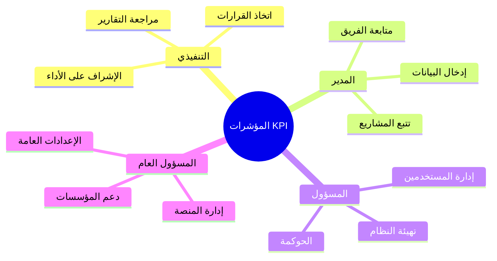

---

## الرحلة أ — التنفيذي (Executive)

### 👤 ملف الشخصية

| | |
|:---|:---|
| **الدور** | EXECUTIVE |
| **الهدف** | الإشراف الاستراتيجي واتخاذ القرارات المبنية على البيانات |
| **الوقت في النظام** | 30-60 دقيقة يومياً |
| **الأولويات** | النظرة العامة → التقارير → الاعتمادات |

### مسار الرحلة

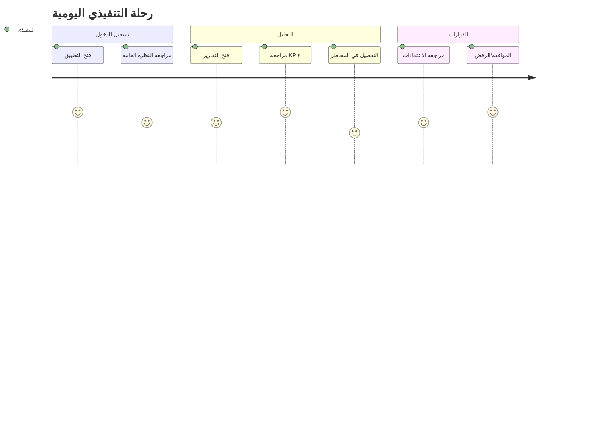

### تدفق العمل

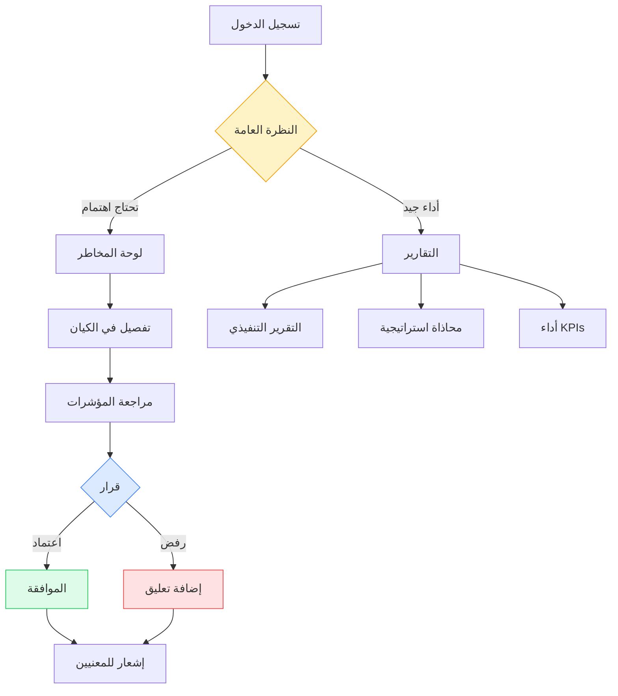

---

## الرحلة ب — المدير (Manager)

### 👤 ملف الشخصية

| | |
|:---|:---|
| **الدور** | MANAGER |
| **الهدف** | تنفيذ الاستراتيجية عبر فريقي وضمان تحديث البيانات |
| **الوقت في النظام** | 1-2 ساعة يومياً |
| **الأولويات** | إدخال القيم → متابعة الفريق → الاعتمادات |

### مسار الرحلة

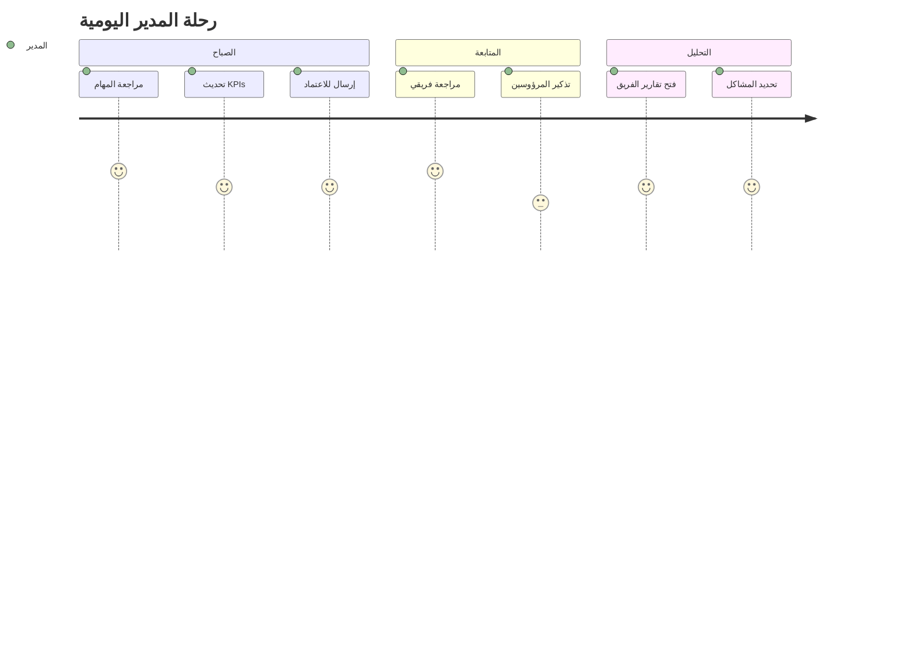

### تدفق العمل

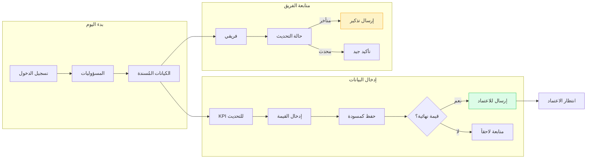

### دورة حياة قيمة KPI

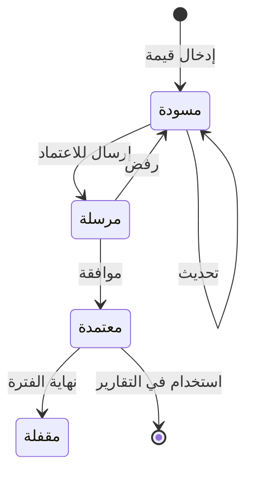

### الخطوات التفصيلية

| الخطوة | الصفحة | الإجراء | النتيجة |
|--------|--------|---------|---------|
| 1 | `/ar/responsibilities` | مراجعة تكليفاتي | معرفة ما يجب تحديثه |
| 2 | `/ar/entities/kpi` | اختيار KPI | فتح صفحة KPI |
| 3 | تبويب "القيم" | إدخال قيمة جديدة | حفظ كمسودة |
| 4 | نفس الصفحة | إرسال للاعتماد | انتظار الاعتماد |
| 5 | `/ar/dashboards/manager` | مراجعة أداء الفريق | متابعة التقدم |

### نصائح للمدير

> 💡 **تذكير:** ضع موعداً ثابتاً يومياً (مثلاً 9 صباحاً) لتحديث KPIs
> 
> 💡 **تنظيم:** صفح الأهمية - ابدأ بـ KPIs ذات الأولوية العالية

---

## الرحلة ج — المسؤول (Admin)

### 👤 ملف الشخصية

| | |
|:---|:---|
| **الدور** | ADMIN |
| **الهدف** | إدارة المؤسسة وضمان سير العمل بفعالية |
| **الوقت في النظام** | 2-4 ساعات أسبوعياً |
| **الأولويات** | إدارة المستخدمين → الهيكل التنظيمي → الحوكمة |

### خريطة الإدارة

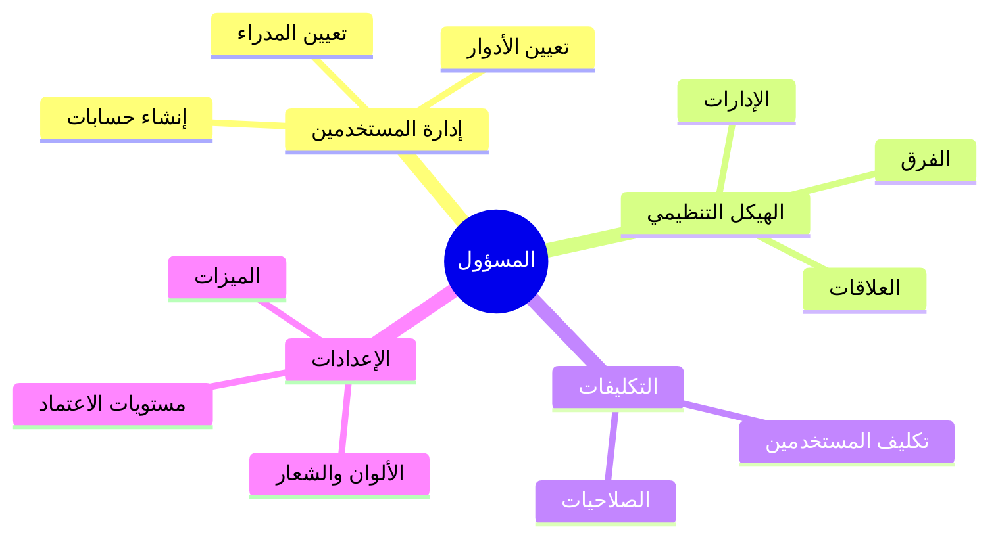

### تدفق إعداد مؤسسة جديدة

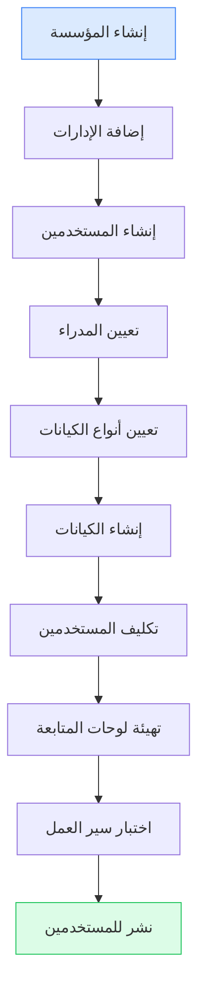

### الخطوات التفصيلية

| المهمة | الصفحة | الإجراء | النتيجة |
|--------|--------|---------|---------|
| إنشاء مستخدم | `/ar/admin/users` | جديد → إدخال البيانات → حفظ | مستخدم جاهز |
| إنشاء إدارة | `/ar/departments` | جديد → اسم → مدير | إدارة في الهيكل |
| تكليف مستخدم | `/ar/responsibilities` | اختر الكيان → اختر المستخدم | صلاحية محددة |
| تغيير إعداد | `/ar/organization` | تعديل → حفظ | تطبيق على النظام |

---

## الرحلة د — المسؤول العام (Super Admin)

### 👤 ملف الشخصية

| | |
|:---|:---|
| **الدور** | SUPER_ADMIN |
| **الهدف** | إدارة المنصة كاملة ودعم جميع المؤسسات |
| **الوقت في النظام** | حسب الحاجة |
| **الأولويات** | المراقبة → الدعم → التحسين |

### لوحة القيادة

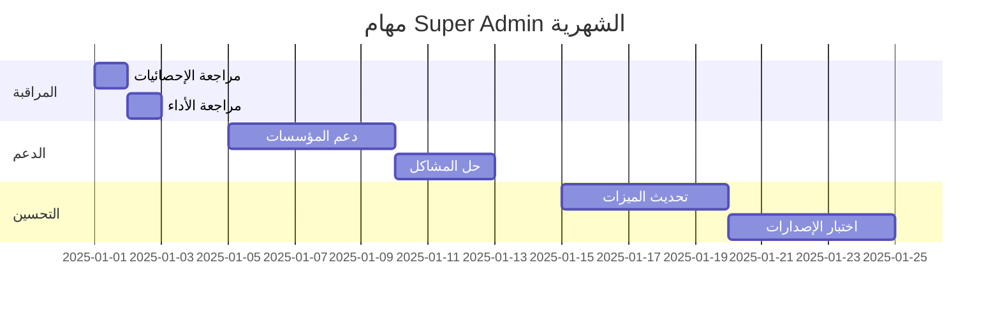

### الخطوات التفصيلية

| المهمة | الصفحة | الإجراء |
|--------|--------|---------|
| مراجعة النظام | `/ar/super-admin` | نظرة عامة على الإحصائيات |
| إنشاء مؤسسة | `/ar/super-admin/organizations` | جديد → إدخال البيانات |
| إدارة المستخدمين | `/ar/super-admin/users` | بحث → تعديل/حذف |
| تفعيل ميزة | `/ar/super-admin/settings` | تبديل المفتاح → حفظ |

---

## الرحلة هـ — الاعتمادات (Approval Workflow)

### تدفق الموافقة

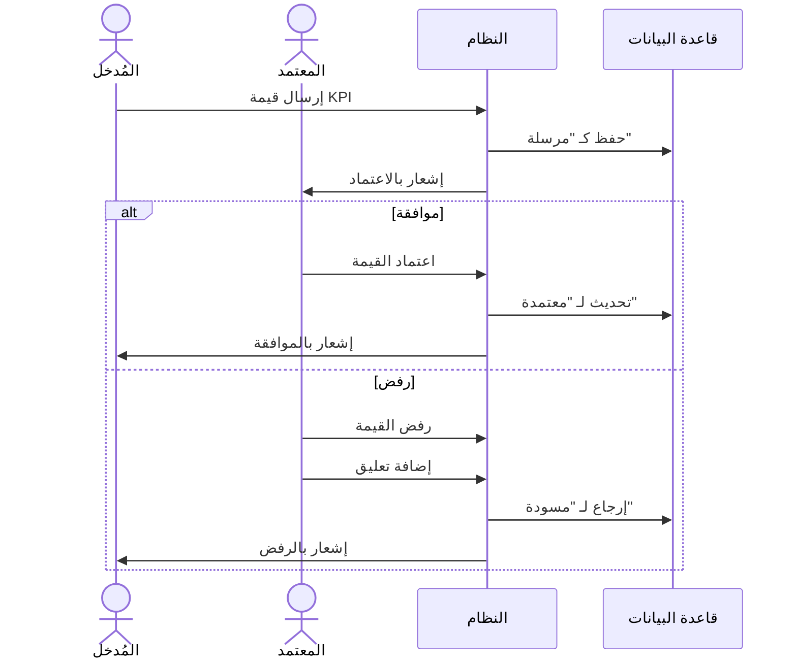

### حالات الاعتماد

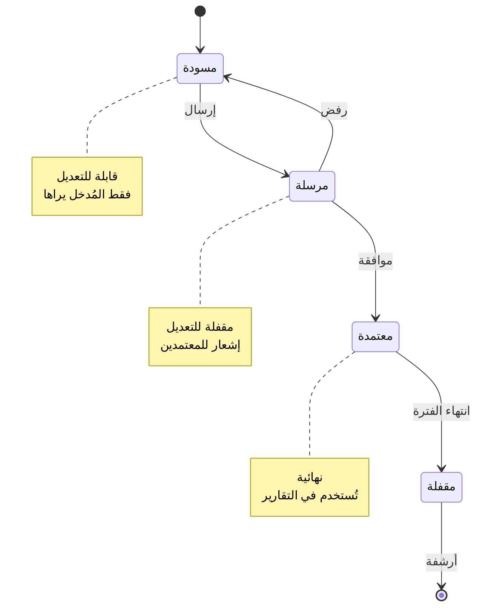

---

## الرحلة و — المسؤوليات (Responsibilities)

### طرق العرض

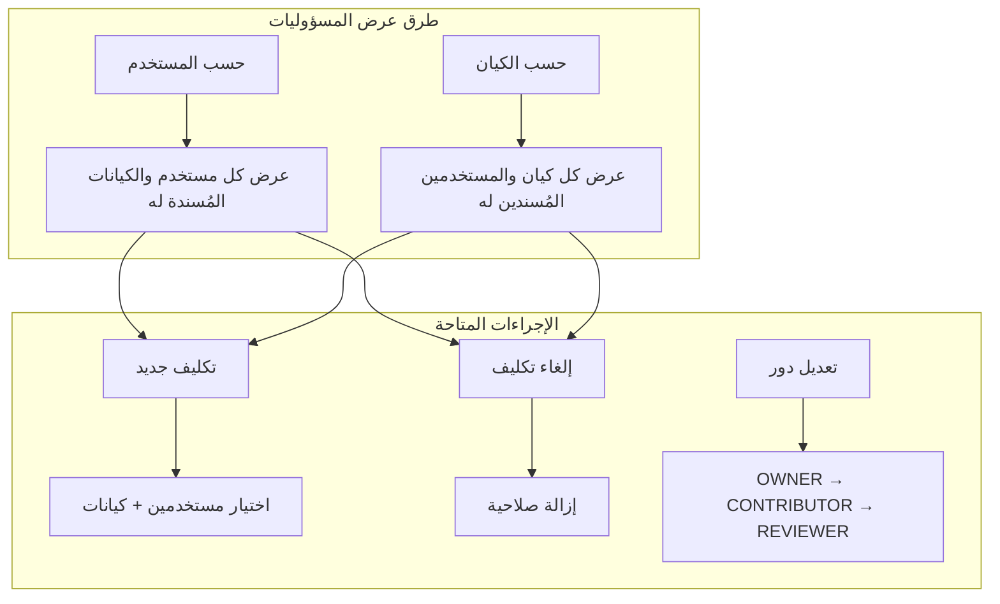

### صلاحيات الأدوار

| الدور | إنشاء | قراءة | تحديث | حذف | اعتماد |
|-------|:-----:|:-----:|:-----:|:---:|:------:|
| OWNER | ✅ | ✅ | ✅ | ✅ | ✅ |
| CONTRIBUTOR | ✅ | ✅ | ✅ | ❌ | ❌ |
| REVIEWER | ❌ | ✅ | ❌ | ❌ | ✅ |

---

## مقارنة الرحلات

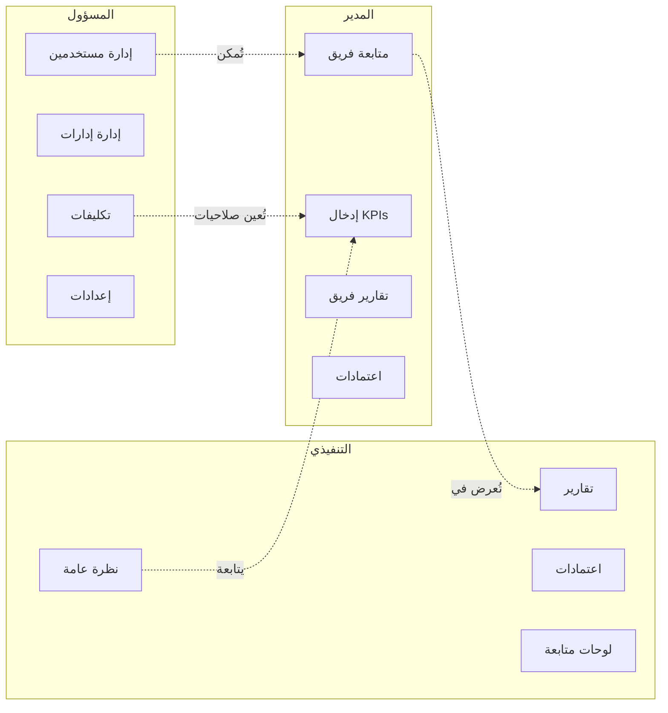

---

## نقاط الدخول السريعة

| الدور | الصفحة الرئيسية | الاختصار |
|-------|-----------------|----------|
| جميع الأدوار | `/ar/overview` | لوحة الملخص |
| التنفيذي | `/ar/dashboards/executive` | الملخص التنفيذي |
| المدير | `/ar/responsibilities` | مسؤولياتي |
| المسؤول | `/ar/admin` | لوحة الإدارة |
| المسؤول العام | `/ar/super-admin` | نظام كامل |

---

## نصائح عامة لجميع المستخدمين

### 🚀 اختصارات سريعة

```
Ctrl+K    → فتح البحث
Ctrl+/    → عرض اختصارات لوحة المفاتيح
?         → المساعدة السياقية
```

### 📱 التنقل بين الأقسام

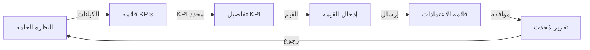

### ⚡ تحسين الإنتاجية

1. **استخدم الفلاتر** لتضييق نطاق البحث
2. **فعّل الإشعارات** للحصول على التنبيهات فوراً
3. **احفظ المفضلة** في المتصفح للوصول السريع
4. **استخدم التطبيق** على الجوال للمتابعة من أي مكان

---

## دعم المستخدم

### حل مشاكل شائعة

| المشكلة | الحل |
|---------|------|
| لا أجد KPI | تحقق من التكليفات في `/ar/responsibilities` |
| لا أستطيع الإرسال | تأكد من ملء جميع الحقول المطلوبة |
| لا أرى زر الموافقة | تحقق من أن لديك صلاحية الاعتماد |

### التواصل

- **الدعم الفني**: support@murtakaz.com
- **الدليل التفاعلي**: اضغط على `?` في أي صفحة

</div>
