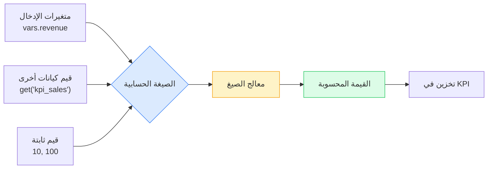
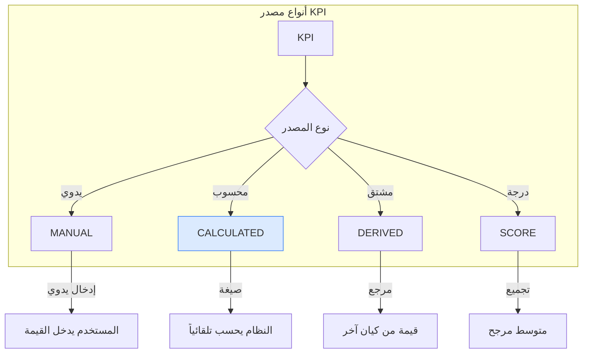
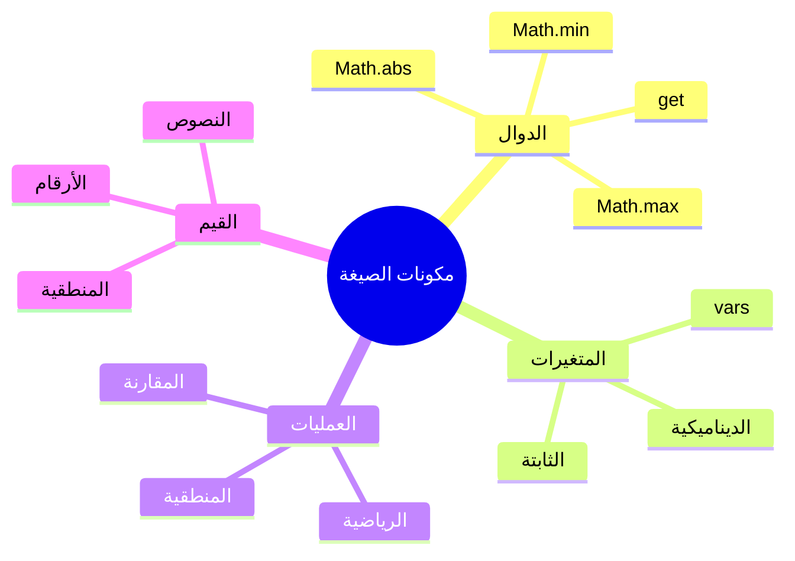
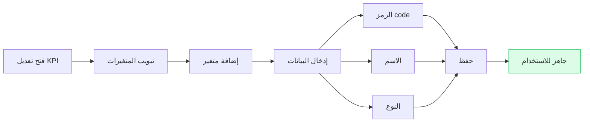
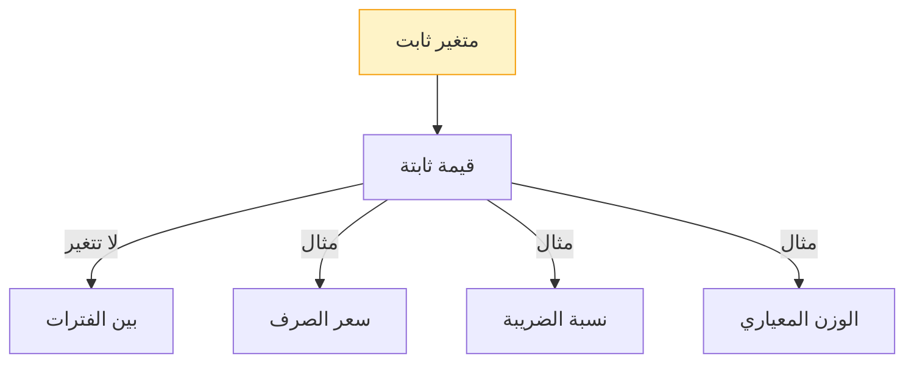
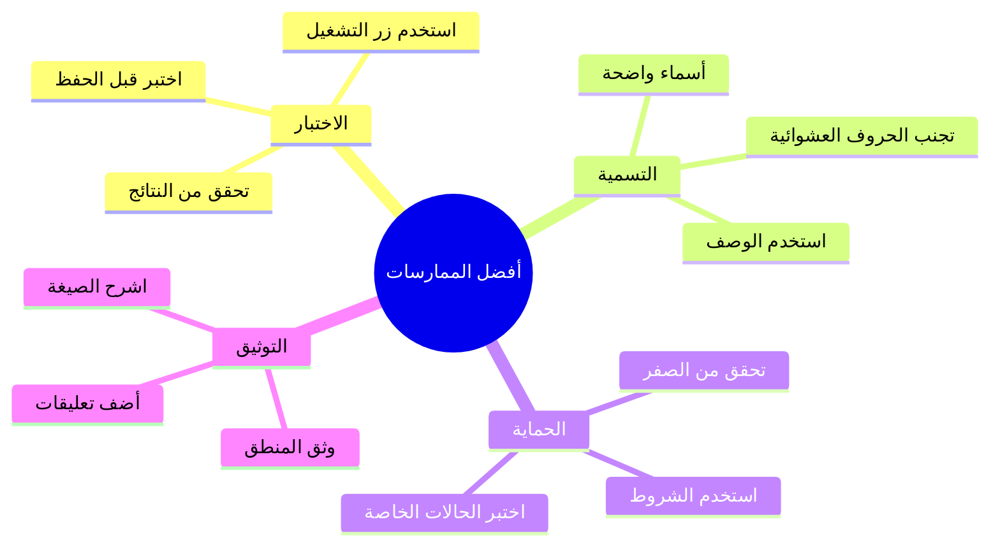
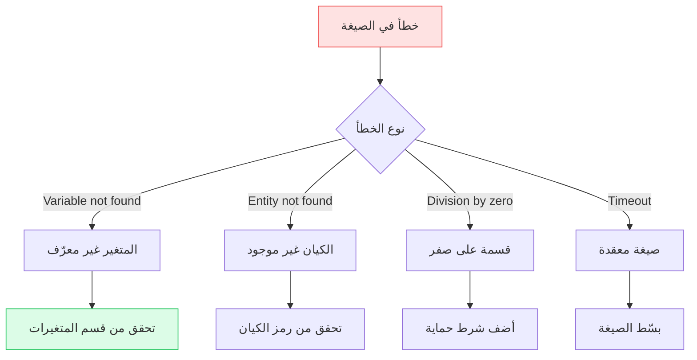

# دليل الصيغ الحسابية

<div dir="rtl">

دليل شامل ومُفصل لكتابة واستخدام الصيغ الحسابية في مؤشرات الأداء (KPIs) المحسوبة.

---

## نظرة عامة

الصيغ الحسابية تُستخدم في الكيانات ذات **نوع المصدر = CALCULATED** لحساب قيمة مؤشر الأداء تلقائياً بناءً على متغيرات وقيم أخرى.

### كيف تعمل الصيغة؟



### أنواع المصدر (Source Types)



---

## بناء الصيغة

### اللغة المستخدمة

الصيغ مكتوبة بلغة **JavaScript** وتُنفذ في بيئة آمنة.

### مكونات الصيغة



---

## الدوال المتاحة

### 1. دالة `get()` — جلب قيمة كيان

تجلب القيمة الحالية لكيان آخر باستخدام رمزه (Code).

#### الصيغة العامة

```javascript
get("رمز_الكيان")
```

#### أمثلة الاستخدام

```javascript
// جلب قيمة مؤشر أداء آخر
get("kpi_sales_q1")

// جلب قيمة إدارة
get("dept_quality_score")

// جلب إجمالي الإيرادات
get("revenue_total")

// جلب قيمة مشروع
get("project_completion_rate")
```

#### مثال عملي: نسبة الإنجاز

```javascript
// حساب نسبة إنجاز المبيعات
(get("actual_sales") / get("target_sales")) * 100
```

**التفسير:**
- `get("actual_sales")` → تجلب القيمة الفعلية للمبيعات
- `get("target_sales")` → تجلب الهدف المستهدف
- القسمة تعطي النسبة
- الضرب في 100 يحولها لنسبة مئوية

#### ⚠️ ملاحظات مهمة

- الرمز حساس لحالة الأحرف (Case-sensitive)
- يجب أن يكون الكيان موجوداً ومعرفاً
- إذا كان الكيان محسوباً، يتم حسابه أولاً

تجلب القيمة الحالية لكيان آخر باستخدام رمزه (Code).

**الاستخدام:**
```javascript
get("kpi_sales_q1")           // جلب قيمة مؤشر أداء آخر
get("dept_quality")          // جلب قيمة إدارة
get("revenue_total")         // جلب إجمالي الإيرادات
```

**مثال عملي:**
```javascript
// حساب نسبة الإنجاز
(get("actual_sales") / get("target_sales")) * 100
```

---

## أمثلة عملية حسب المجال

### 💰 المالية والمحاسبة

#### 1. نسبة النمو

```javascript
// حساب نسبة النمو بين فترتين
((get("current_revenue") - get("previous_revenue")) / get("previous_revenue")) * 100
```

**حالة الاستخدام:** مقارنة أداء الشهر الحالي بالشهر السابق

#### 2. العائد على الاستثمار (ROI)

```javascript
// حساب ROI للمشاريع
((vars.gain - vars.investment_cost) / vars.investment_cost) * 100
```

**حالة الاستخدام:** تقييم جدوى المشاريع الاستثمارية

#### 3. معدل دوران الأصول

```javascript
// حساب كفاءة استخدام الأصول
get("total_revenue") / get("total_assets")
```

#### 4. نسبة السيولة

```javascript
// النقدية ÷ الخصوم المتداولة
get("current_assets") / get("current_liabilities")
```

---

### 👥 الموارد البشرية

#### 5. معدل الدوران الوظيفي

```javascript
// عدد المغادرين ÷ متوسط عدد الموظفين
(vars.employees_left / vars.avg_employees) * 100
```

#### 6. معدل الحضور

```javascript
// (أيام العمل - أيام الغياب) ÷ أيام العمل
((vars.work_days - vars.absence_days) / vars.work_days) * 100
```

#### 7. متوسط الرواتب

```javascript
// إجمالي الرواتب ÷ عدد الموظفين
get("total_salaries") / vars.employee_count
```

---

### 🏭 العمليات والإنتاج

#### 8. معدل الجودة

```javascript
// (الإنتاج الكلي - المعيب) ÷ الإنتاج الكلي
((vars.total_produced - vars.defective) / vars.total_produced) * 100
```

#### 9. استغلال الطاقة الإنتاجية

```javascript
// الإنتاج الفعلي ÷ الطاقة القصوى
(vars.actual_output / vars.max_capacity) * 100
```

#### 10. متوسط وقت الإنتاج

```javascript
// إجمالي وقت الإنتاج ÷ عدد الوحدات
vars.total_production_time / vars.units_produced
```

---

### 📊 مؤشرات الأداء المركبة

#### 11. مؤشر الأداء المتوازن (BSC)

```javascript
// متوسط مرجح لأربعة أبعاد
(
  get("financial_kpi") * 0.30 +
  get("customer_kpi") * 0.25 +
  get("internal_kpi") * 0.25 +
  get("learning_kpi") * 0.20
)
```

#### 12. مؤشر رضا العملاء المركب

```javascript
// دمج عدة مؤشرات للرضا
(
  get("satisfaction_service") * 0.40 +
  get("satisfaction_product") * 0.35 +
  get("satisfaction_price") * 0.25
)
```

#### 13. درجة الأداء الإجمالية

```javascript
// حساب الدرجة مع معايير مختلفة
var financial = get("financial_score") * 0.40;
var operational = get("operational_score") * 0.35;
var strategic = get("strategic_score") * 0.25;

financial + operational + strategic
```

---

## العمليات المنطقية والشرطية

### الشروط البسيطة (Ternary Operator)

```javascript
// الصيغة العامة
condition ? value_if_true : value_if_false
```

#### أمثلة:

```javascript
// 1. تجنب القسمة على صفر
get("denominator") === 0 ? 0 : (get("numerator") / get("denominator"))

// 2. قيمة مختلفة حسب الشرط
get("actual") >= get("target") ? 100 : (get("actual") / get("target")) * 100

// 3. مكافأة الأداء
get("achievement") >= 100 ? vars.bonus_full : (vars.bonus_full * get("achievement") / 100)
```

### العمليات المنطقية

```javascript
// AND (&&)
get("condition_a") > 50 && get("condition_b") > 50 ? 100 : 50

// OR (||)
get("kpi_a") > 80 || get("kpi_b") > 80 ? "ممتاز" : "يحتاج تحسين"

// NOT (!)
!get("is_completed") ? 0 : 100
```

---

## المتغيرات (Variables)

### إنشاء متغير — خطوة بخطوة



### أنواع المتغيرات

| النوع | الوصف | حالات الاستخدام | مثال |
|-------|-------|-----------------|------|
| `NUMBER` | رقم عادي | الإيرادات، التكلفة | 1000، 50.5 |
| `PERCENTAGE` | نسبة مئوية | معدلات النمو | 75، 100 |
| `CURRENCY` | عملة | المبالغ المالية | 1000 SAR |
| `INTEGER` | عدد صحيح | عدد الموظفين | 50 |

### المتغيرات الثابتة (Static)



**الاستخدام:**
1. افتح صفحة تعديل الكيان
2. انتقل إلى قسم **المتغيرات**
3. أنشئ متغيراً
4. فعّل **ثابت (Is Static)**
5. أدخل **القيمة الثابتة**

---

## نصائح وأفضل الممارسات

### ✅ ما يجب فعله



#### 1. اختبر الصيغة دائماً

```javascript
// استخدم زر "تشغيل الاختبار" قبل الحفظ
// تأكد من النتيجة المتوقعة
```

#### 2. استخدم أسماء واضحة

```javascript
// ✅ جيد
vars.customer_satisfaction
vars.monthly_revenue
vars.employee_count

// ❌ غير جيد
vars.x
vars.a
vars.temp
```

#### 3. أضف تعليقات في الصيغ المعقدة

```javascript
// حساب نسبة الإنجاز مع عقوبة التأخير
var achievement = (get("actual") / get("target")) * 100;  // النسبة الأساسية
var delay = get("delay_days");                           // أيام التأخير
var penalty = delay > 0 ? delay * 2 : 0;              // عقوبة 2% لكل يوم

achievement - penalty  // النتيجة النهائية
```

#### 4. تحقق من القيم الصفرية

```javascript
// ✅ حماية من القسمة على صفر
get("denominator") === 0 ? 0 : (get("numerator") / get("denominator"))

// ✅ استخدام Math.max
Math.max(0, get("value"))

// ✅ تحديد حد أقصى
Math.min(100, get("percentage"))
```

### ❌ ما لا يجب فعله

| لا تفعل | السبب |
|---------|-------|
| استخدام `fetch` أو `console.log` | غير مدعوم في بيئة الصيغ |
| الوصول لمتغيرات غير معرّفة | سيسبب خطأ |
| رموز كيانات غير موجودة | سيسبب "Entity not found" |
| صيغ معقدة جداً | قد تسبب timeout |
| حلقات تكرار لا نهائية | ستتوقف عن العمل |

---

## استكشاف الأخطاء وإصلاحها

### دليل الأخطاء الشائعة



### ❌ "Variable not found"

**الأعراض:**
- رسالة خطأ عند حفظ الصيغة
- الصيغة لا تعمل

**الأسباب:**
- المتغير غير معرّف في قسم المتغيرات
- خطأ في إملاء اسم المتغير
- حالة الأحرف غير متطابقة

**الحل:**
1. انتقل إلى تبويب "المتغيرات"
2. تأكد من وجود المتغير
3. تحقق من إملاء الرمز (case-sensitive)
4. أعد حفظ الصيغة

---

### ❌ "Entity not found"

**الأسباب:**
- استخدام `get()` مع رمز غير موجود
- الكيان تم حذفه
- خطأ في إملاء الرمز

**الحل:**
```javascript
// ✅ تحقق من وجود الكيان أولاً
var value = get("entity_code");
if (value === undefined || value === null) {
  0  // قيمة افتراضية
} else {
  value
}
```

---

### ❌ "Division by zero"

**الحل:**
```javascript
// ✅ استخدم شرط حماية
var denominator = get("target");
var numerator = get("actual");

denominator === 0 ? 0 : (numerator / denominator) * 100

// ✅ أو استخدم Math.max
get("denominator") === 0 ? 0 : (get("numerator") / get("denominator"))
```

---

### ❌ "Formula timeout"

**الأسباب:**
- صيغة معقدة جداً
- استدعاءات متداخلة كثيرة
- حلقة من استدعاءات `get()`

**الحل:**
1. بسّط الصيغة
2. قسّمها إلى KPIs فرعية
3. تجنب الاستدعاء المتداخل

---

## أمثلة متقدمة وحالات خاصة

### 1. مؤشر متعدد الأبعاد مع عقوبة

```javascript
// حساب مؤشر مركب مع عقوبة للانحراف
var achievement = (get("actual") / get("target")) * 100;
var variance = Math.abs(get("actual") - get("target"));
var penalty = variance > 10 ? (variance - 10) * 0.5 : 0;

Math.max(0, achievement - penalty)
```

**التفسير:**
- إذا كان الانحراف أكبر من 10، يُطبق عقوبة
- العقوبة: 0.5% لكل نقطة انحراف إضافية
- النتيجة لا تقل عن صفر

---

### 2. متوسط متحرك ديناميكي

```javascript
// متوسط متحرك لآخر 3 فترات
(
  get("period_current") * 0.50 +
  get("period_prev1") * 0.30 +
  get("period_prev2") * 0.20
)
```

**الأوزان:**
- الفترة الحالية: 50%
- الفترة السابقة: 30%
- فترة ما قبلها: 20%

---

### 3. مؤشر يعتمد على شروط متعددة

```javascript
// تقييم الأداء مع معايير متعددة
var completion = get("completion_rate");
var quality = get("quality_score");
var onTime = get("is_on_time");

// يجب إكمال 80% على الأقل
// الجودة يجب أن تكون أكثر من 70%
// يجب التسليم في الموعد

(completion >= 80 && quality >= 70 && onTime) ?
  (completion * 0.4 + quality * 0.6) :
  (completion * 0.4 + quality * 0.6) * 0.8  // خصم 20% إذا لم يكن في الموعد
```

---

### 4. حساب معدل التغير التراكمي

```javascript
// معدل النمو التراكمي السنوي (CAGR)
var endValue = get("end_value");
var startValue = get("start_value");
var years = get("number_of_years");

(Math.pow(endValue / startValue, 1 / years) - 1) * 100
```

---

## دوال Math المتقدمة

### دوال Math

| الدالة | الاستخدام | مثال |
|--------|-----------|------|
| `Math.abs(x)` | القيمة المطلقة | `Math.abs(-10)` → 10 |
| `Math.min(a, b)` | الحد الأدنى | `Math.min(50, 100)` → 50 |
| `Math.max(a, b)` | الحد الأقصى | `Math.max(50, 100)` → 100 |
| `Math.round(x)` | التقريب | `Math.round(3.7)` → 4 |
| `Math.ceil(x)` | التقريب لأعلى | `Math.ceil(3.2)` → 4 |
| `Math.floor(x)` | التقريب لأسفل | `Math.floor(3.9)` → 3 |
| `Math.pow(x, y)` | الأس | `Math.pow(2, 3)` → 8 |
| `Math.sqrt(x)` | الجذر التربيعي | `Math.sqrt(16)` → 4 |

### أمثلة متقدمة

```javascript
// 1. حساب الانحراف المعياري
var avg = (get("val1") + get("val2") + get("val3")) / 3;
var variance = (
  Math.pow(get("val1") - avg, 2) +
  Math.pow(get("val2") - avg, 2) +
  Math.pow(get("val3") - avg, 2)
) / 3;
Math.sqrt(variance)

// 2. تقييم مع مكافآت وعقوبات
var base_score = get("completion_rate");
var bonus = get("quality_score") > 90 ? 10 : 0;
var penalty = get("delay_days") > 0 ? get("delay_days") * 2 : 0;

Math.max(0, Math.min(100, base_score + bonus - penalty))

// 3. متوسط متحرك مرجح
(
  get("month1") * 0.50 +
  get("month2") * 0.30 +
  get("month3") * 0.20
)
```

---

## مرجع سريع للصيغ

### العمليات الأساسية

| العملية | الصيغة | مثال | النتيجة |
|---------|--------|------|---------|
| جلب قيمة | `get("CODE")` | `get("sales")` | 1000 |
| متغير | `vars.CODE` | `vars.cost` | 500 |
| جمع | `a + b` | `10 + 20` | 30 |
| طرح | `a - b` | `20 - 10` | 10 |
| ضرب | `a * b` | `10 * 20` | 200 |
| قسمة | `a / b` | `20 / 10` | 2 |
| باقي | `a % b` | `17 % 5` | 2 |
| أس | `Math.pow(a, b)` | `Math.pow(2, 3)` | 8 |

### المقارنات والشروط

| العملية | الصيغة | مثال |
|---------|--------|------|
| يساوي | `a === b` | `get("a") === 100` |
| لا يساوي | `a !== b` | `get("a") !== 0` |
| أكبر | `a > b` | `get("actual") > get("target")` |
| أصغر | `a < b` | `get("value") < 50` |
| AND | `a && b` | `condition1 && condition2` |
| OR | `a \|\| b` | `condition1 \|\| condition2` |
| شرط | `a ? b : c` | `x > 0 ? x : 0` |

### دوال Math

| الدالة | الاستخدام | مثال |
|--------|-----------|------|
| `Math.abs(x)` | قيمة مطلقة | `Math.abs(-5)` → 5 |
| `Math.min(...args)` | أصغر قيمة | `Math.min(10, 20, 5)` → 5 |
| `Math.max(...args)` | أكبر قيمة | `Math.max(10, 20, 5)` → 20 |
| `Math.round(x)` | تقريب | `Math.round(3.7)` → 4 |
| `Math.ceil(x)` | تقريب لأعلى | `Math.ceil(3.2)` → 4 |
| `Math.floor(x)` | تقريب لأسفل | `Math.floor(3.9)` → 3 |
| `Math.pow(x, y)` | أس | `Math.pow(2, 3)` → 8 |
| `Math.sqrt(x)` | جذر تربيعي | `Math.sqrt(16)` → 4 |

---

## قوالب جاهزة للاستخدام

### قالب 1: نسبة إنجاز بسيطة

```javascript
// استبدل ACTUAL و TARGET برموزك
(get("ACTUAL") / get("TARGET")) * 100
```

### قالب 2: متوسط مرجح

```javascript
// استبدل الأوزان حسب احتياجك
(
  get("kpi1") * 0.40 +
  get("kpi2") * 0.35 +
  get("kpi3") * 0.25
)
```

### قالب 3: نسبة نمو

```javascript
// مقارنة الفترة الحالية بالسابقة
((get("current") - get("previous")) / get("previous")) * 100
```

### قالب 4: هامش ربح

```javascript
// استخدم متغيرات
((vars.revenue - vars.cost) / vars.revenue) * 100
```

### قالب 5: درجة مركبة مع شروط

```javascript
// مع مكافأة للأداء الممتاز
var score = get("base_score");
var bonus = score >= 90 ? 10 : 0;
Math.min(100, score + bonus)
```

---

## دعم ومساعدة

### حل مشاكل شائعة

| المشكلة | الحل السريع |
|---------|-------------|
| الصيغة لا تحفظ | تحقق من الأقواس المتطابقة |
| نتيجة غير متوقعة | اختبر كل جزء من الصيغة منفرداً |
| خطأ Variable not found | تأكد من تعريف المتغير |
| خطأ Entity not found | تحقق من رمز الكيان |

### التواصل

- **الدعم الفني**: support@murtakaz.com
- **الأمثلة**: راجع قسم "الأمثلة العملية" أعلاه

</div>
