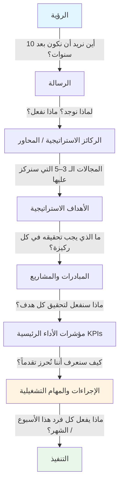
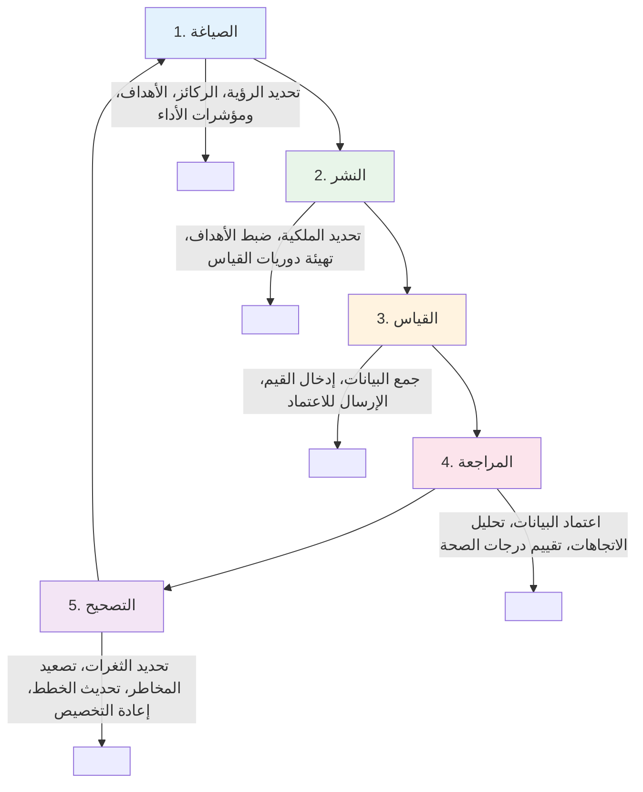

# أسس تنفيذ الاستراتيجية

## ما هو تنفيذ الاستراتيجية؟

**الاستراتيجية** هي خطة المؤسسة لتحقيق أهدافها بعيدة المدى. أما **تنفيذ الاستراتيجية** فهو منهجية ترجمة تلك الخطة إلى إجراءات قابلة للقياس، وتحديد الملكية، وتتبع التقدم، وإجراء التصحيحات في الوقت الفعلي.

تفشل معظم المؤسسات ليس بسبب استراتيجية سيئة، بل بسبب ضعف التنفيذ. تُظهر الأبحاث باستمرار أن **60–90% من الخطط الاستراتيجية لا تُكتَمل** بسبب الفجوة بين التخطيط والتطبيق.

---

## فجوة تنفيذ الاستراتيجية

تنشأ الفجوة بين الاستراتيجية المُصاغة جيداً والنتائج الفعلية من أسباب متكررة:

| السبب الجذري | الأعراض الظاهرة |
|-------------|----------------|
| **غياب الملكية الواضحة** | الجميع "يمتلك" الاستراتيجية؛ لا أحد يُحاسَب |
| **غياب القياس** | يُناقَش التقدم في الاجتماعات دون أن يُقاس أبداً |
| **غياب الرؤية** | القيادة لا ترى ما يجري على أرض الواقع |
| **غياب حلقة التغذية الراجعة** | تظهر المشكلات متأخرة جداً للتصحيح |
| **حوافز غير متوافقة** | العمل اليومي منفصل عن الأهداف الاستراتيجية |
| **التعقيد الزائد** | وثائق الاستراتيجية طويلة أو مجردة جداً للتطبيق |

تعالج منصة رافد KPI كل سبب من هذه الأسباب مباشرةً من خلال بناء **نظام تنفيذ منظَّم وقابل للقياس ومُهيمَن عليه**.

---

## التسلسل الهرمي للاستراتيجية

يتطلب تنفيذ الاستراتيجية الفعّال تسلسلاً هرمياً واضحاً يربط الرؤية بالعمل اليومي:

يجب ربط كل مستوى صراحةً بالمستوى الذي فوقه. بدون هذه الروابط، تتحول الخطط الاستراتيجية إلى قوائم أمنيات بدلاً من خرائط طريق للتنفيذ.

---

## دورة حياة تنفيذ الاستراتيجية

tنفيذ الاستراتيجية ليس حدثاً لمرة واحدة — بل هو دورة مستمرة:

تدعم منصة رافد KPI مراحل **القياس ← المراجعة ← التصحيح** من هذه الدورة من خلال إدخال البيانات والاعتماد ولوحات المتابعة.

---

## التتالي مقابل التوافق

مفهومان أساسيان في تنفيذ الاستراتيجية:

### التتالي الرأسي (Vertical Cascade)
تحليل الأهداف رفيعة المستوى إلى أهداف فرعية ومبادرات ومؤشرات أداء عبر التسلسل الهرمي المؤسسي. يتتالى الهدف على مستوى الرئيس التنفيذي (مثل: "نمو الإيرادات 20%") نزولاً إلى أهداف الأقسام ومعالم المشاريع ومؤشرات الأداء الفردية.

### التوافق الأفقي (Horizontal Alignment)
ضمان أن أقسام وفرق مختلفة تعمل في اتجاه تكاملي — لا متناقض. يُعدّ سوء التوافق أحد أكثر التكاليف الخفية شيوعاً في المؤسسات الكبيرة.

---

## دور البيانات في تنفيذ الاستراتيجية

تنفيذ الاستراتيجية بلا بيانات قائم على الآراء. البيانات:

- **تُؤكد** ما إذا كانت الاستراتيجية تعمل كما هو مقصود
- **تُشير** إلى المشكلات مبكراً قبل أن تتحول إلى أزمات
- **تُزيل** التحيز السياسي من محادثات الأداء
- **تُمكّن** من اتخاذ القرارات القائمة على الحقائق على جميع المستويات
- **تُنشئ المساءلة** — ما يُقاس يُدار

لهذا السبب، لا تُعدّ دورة إدخال البيانات ← الاعتماد ← لوحات المتابعة في رافد KPI مجرد ميزة برمجية — بل هي العمود الفقري التشغيلي لحوكمة الاستراتيجية الحديثة.

---

## المبادئ الرئيسية للتنفيذ الناجح

1. **الوضوح** — كل شخص يعرف دوره وما هو مسؤول عن قياسه.
2. **الإيقاع المنتظم** — تُجمع البيانات وتُراجع في فترات منتظمة ومتوقعة.
3. **المساءلة** — لكل مؤشر أداء مالك محدد الاسم يُحاسَب على أدائه.
4. **الشفافية** — القيادة لديها رؤية آنية للأداء على جميع المستويات.
5. **السرعة** — تُكتشف المشكلات وتُتخذ القرارات بسرعة، لا في المراجعات السنوية.
6. **الثقة في البيانات** — تمر جميع البيانات المُبلَّغ عنها بعملية اعتماد مُهيمَن عليها قبل احتسابها.

---

## ملخص المفاهيم الرئيسية

> **النقاط الأساسية:**
> - **60–90%** من الخطط الاستراتيجية لا تُكتَمل بسبب الفجوة بين التخطيط والتنفيذ
> - **التسلسل الهرمي** يربط الرؤية بالعمل اليومي عبر 7 مستويات
> - **دورة الحياة** تشمل: الصياغة → النشر → القياس → المراجعة → التصحيح
> - **التتالي الرأسي** و**التوافق الأفقي** يضمان تنفيذاً متكاملاً
> - **البيانات** تُزيل التحيز السياسي وتُنشئ المساءلة

---

## للاستزادة

- كابلان ونورتون، *بطاقة الأداء المتوازن* (1996)
- هريبينياك، *جعل الاستراتيجية تعمل* (2005)
- نيفن، *بطاقة الأداء المتوازن خطوةً بخطوة* (2002)
- مانكينز وستيل، *تحويل الاستراتيجية العظيمة إلى أداء عظيم*، مجلة هارفارد بزنس ريفيو (2005)

