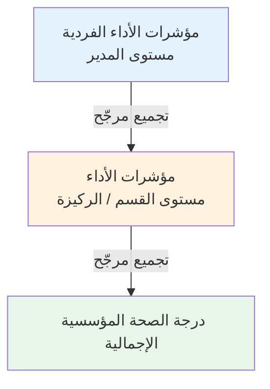

# تصميم مؤشرات الأداء الرئيسية وقياسها

## ما هو مؤشر الأداء الرئيسي (KPI)؟

**مؤشر الأداء الرئيسي (Key Performance Indicator - KPI)** هو مقياس كمي يُستخدم لتقييم مدى فعالية فرد أو فريق أو مؤسسة في تحقيق هدف استراتيجي رئيسي. كلمة *رئيسي* بالغة الأهمية — فليس كل مقياس مؤشر أداء. يجب أن يرتبط مؤشر الأداء مباشرةً بهدف استراتيجي يمثّل أهمية حقيقية.

> "ما يُقاس يُدار." — بيتر دراكر

---

## مؤشر الأداء مقابل المقياس مقابل الهدف

كثيراً ما تختلط هذه المصطلحات:

| المصطلح | التعريف | المثال |
|---------|---------|--------|
| **الهدف** | النتيجة المنشودة | "تحسين رضا العملاء" |
| **المقياس** | أي نقطة بيانات كمية | "عدد طلبات الدعم" |
| **مؤشر الأداء الرئيسي** | مقياس مرتبط مباشرةً بهدف استراتيجي | "درجة رضا العملاء ≥ 85%" |

ليس كل مقياس يستحق أن يكون مؤشر أداء رئيسي. كثرة مؤشرات الأداء تُشتّت التركيز. أفضل الممارسات توصي بـ **5–10 مؤشرات أداء كحدٍّ أقصى لكل مستوى تنظيمي**.

---

## إطار مؤشرات الأداء الذكية (SMART)

يجب أن يكون مؤشر الأداء المُصمَّم جيداً:

| الحرف | الصفة | السؤال المطروح |
|-------|-------|--------------|
| **S** | محدد (Specific) | هل واضح تماماً ما الذي يُقاس؟ |
| **M** | قابل للقياس (Measurable) | هل يمكن التعبير عنه بالأرقام؟ |
| **A** | قابل للتحقيق (Achievable) | هل الهدف واقعي بالنظر إلى مواردنا؟ |
| **R** | ذو صلة (Relevant) | هل يعكس مباشرةً أولوية استراتيجية؟ |
| **T** | محدد بوقت (Time-bound) | هل ثمة فترة قياس محددة؟ |

---

## مكونات مؤشر الأداء المُعرَّف جيداً

يجب توثيق هذه السمات لكل مؤشر أداء قبل تتبّعه:

| السمة | الوصف | المثال |
|-------|-------|--------|
| **العنوان** | اسم واضح ووصفي | "معدل الاحتفاظ بالموظفين" |
| **المالك** | الشخص المسؤول عن الأداء | مدير الموارد البشرية |
| **الخط الأساسي** | قيمة المرجع الابتدائية | 72% (العام الماضي) |
| **الهدف** | النتيجة المراد تحقيقها | 85% بحلول الربع الرابع |
| **الوحدة** | طريقة التعبير عن القيمة | % |
| **الاتجاه** | الاتجاه الإيجابي | الزيادة مؤشر إيجابي |
| **الدورية** | مدى تكرار القياس | ربع سنوي |
| **مصدر البيانات** | مصدر القيمة | نظام الموارد البشرية |
| **الصيغة الحسابية** | طريقة الحساب (إن وُجدت) | (الموظفون الباقون ÷ إجمالي الموظفين) × 100 |

---

## أنواع مؤشرات الأداء حسب المصدر

تختلف مؤشرات الأداء في طريقة إنتاج قيمها:

### 1. المؤشرات اليدوية (Manual)
يُدخل الشخص المسؤول القيمة مباشرةً في كل فترة.
- **الأنسب لـ**: البيانات المجمّعة خارج الأنظمة الآلية (الاستطلاعات، العدادات اليدوية، التقييمات)
- **المخاطر**: الخطأ البشري، التأخر، عدم الاتساق
- **المثال**: "درجة رضا العملاء" تُدخَل شهرياً من نتائج الاستطلاع

### 2. المؤشرات المحسوبة (Calculated)
تُحسَب القيمة تلقائياً من صيغة حسابية باستخدام متغيرات مُدخَلة.
- **الأنسب لـ**: النسب المشتقة، مقاييس الكفاءة، الدرجات المركّبة
- **المخاطر**: أخطاء الصيغة؛ يجب إدخال جميع المتغيرات
- **المثال**: `هامش الربح % = (الإيرادات - التكاليف) ÷ الإيرادات × 100`

### 3. المؤشرات المشتقة (Derived)
تُسحَب القيمة تلقائياً من مؤشر أداء أو كيان آخر.
- **الأنسب لـ**: تجميع مؤشرات أداء فرعية في درجة أم؛ تجنب ازدواجية إدخال البيانات
- **المثال**: "إيرادات المجموعة" مشتقة من مجموع مؤشرات الإيرادات لجميع الأقسام

### 4. مؤشرات الدرجة (Score)
درجة صحة مركّبة مُجمَّعة من قيم الكيانات الفرعية باستخدام الأوزان.
- **الأنسب لـ**: ملخصات صحة على مستوى الركيزة أو الهدف
- **المثال**: "درجة التميز التشغيلي" = متوسط مرجّح لـ 5 مؤشرات فرعية

---

## اتجاه مؤشر الأداء

الاتجاه يُخبر النظام ما إذا كانت الزيادة أو الانخفاض يُشير إلى أداء إيجابي:

| الاتجاه | المعنى | مثال مؤشر الأداء |
|---------|--------|-----------------|
| **الزيادة إيجابية** | القيم المرتفعة أفضل | الإيرادات، رضا العملاء |
| **الانخفاض إيجابي** | القيم المنخفضة أفضل | معدل الأخطاء، دوران الموظفين، التكاليف |

يؤثر هذا الإعداد على كيفية حساب نسب الإنجاز ودرجات الصحة.

---

## دوريات القياس

يجب قياس مؤشرات الأداء بالتكرار الصحيح:

| نوع الدورية | التكرار | الأنسب لـ |
|------------|---------|----------|
| **شهري** | كل شهر | مؤشرات الأداء التشغيلي، المقاييس المالية |
| **ربع سنوي** | كل 3 أشهر | مؤشرات الأداء الاستراتيجي، معالم المشاريع |
| **سنوي** | مرة في السنة | الأهداف الاستراتيجية طويلة المدى |

يتطلب دمج الدوريات المختلفة في لوحة متابعة واحدة قواعد تجميع دقيقة — ولهذا تمتلك كل مؤشر أداء **طريقة تجميع** مُهيَّأة (آخر قيمة، مجموع، متوسط، أدنى، أعلى).

---

## مؤشرات الأداء القيادية مقابل المتأخرة

تمييز بالغ الأهمية كثيراً ما يُغفَل:

| النوع | التعريف | متى يُخبرك | المثال |
|-------|---------|-----------|--------|
| **متأخر (Lagging)** | يقيس النتائج بعد حدوثها | متأخر جداً للتغيير | الإيرادات، معدل تراجع العملاء |
| **قيادي (Leading)** | يقيس الأنشطة التي تتنبأ بالنتائج المستقبلية | إنذار مبكر | المكالمات البيعية، ساعات التدريب |

**أفضل الممارسات**: استخدام مزيج متوازن. مؤشرات الأداء المتأخرة تُخبرك *بما حدث*؛ أما القيادية فتُخبرك *بما سيحدث*.

---

## أخطاء شائعة في تصميم مؤشرات الأداء

| الخطأ | المشكلة | الحل |
|-------|---------|------|
| **كثرة مؤشرات الأداء** | إرهاق وضياع التركيز | الحد بـ 5–10 مؤشرات لكل مستوى |
| **غياب المالك** | لا أحد مسؤول | تخصيص مالك محدد الاسم لكل مؤشر |
| **مقاييس الظهور** | تبدو جيدة لكنها لا تعكس قيمة حقيقية | ربط كل مؤشر بهدف استراتيجي |
| **غياب الخط الأساسي** | لا يمكن قياس التقدم | تسجيل قيمة البداية دائماً |
| **صيغة حسابية غامضة** | أشخاص مختلفون يحسبون بطرق مختلفة | توثيق الصيغة ومصدر البيانات بدقة |
| **دورية غير مناسبة** | القياس النادر يُفوّت المشكلات | مطابقة الدورية مع الإيقاع الطبيعي للمقياس |
| **هدف مرتفع جداً** | يُحبط الفريق | وضع أهداف طموحة لكن قابلة للتحقيق |
| **هدف منخفض جداً** | يُعطي ثقة زائفة | مراجعة الأهداف دورياً مقارنةً بالمعايير القياسية |

---

## دورة حياة مؤشر الأداء في الممارسة

مؤشر الأداء لا يوجد فحسب — بل يمر بدورة حياة:

في مرتكز KPI، تُترجَم هذه الدورة مباشرةً إلى إنشاء الكيانات وإدخال القيم والاعتماد ومراجعة لوحات المتابعة.

---

## التجميع: من الفردي إلى المؤسسي

مؤشرات الأداء على مستوى الفرد أو الفريق تتصاعد إلى الأداء المؤسسي:

الأوزان المُخصَّصة لكل مؤشر أداء تُحدد مقدار تأثيره في الدرجة الأم — مما يُتيح للقيادة إبراز المقاييس الأكثر أهمية استراتيجياً.

---

## ملخص المفاهيم الرئيسية

> **النقاط الأساسية:**
> - **SMART**: محدد، قابل للقياس، قابل للتحقيق، ذو صلة، محدد بوقت
> - **5–10 مؤشرات** كحد أقصى لكل مستوى تنظيمي
> - **قيادية vs متأخرة**: مزيج متوازن للتنبؤ والمراقبة
> - **الاتجاه** (الزيادة/الانخفاض إيجابي) يؤثر على حساب الإنجاز
> - **الفصل بين المهام**: المدير يُدخل ≠ التنفيذي يعتمد

---

## للاستزادة

- بارمنتر، *مؤشرات الأداء الرئيسية* (2015)
- مار، *مؤشرات الأداء الرئيسية* (2012)
- كابلان ونورتون، *خرائط الاستراتيجية* (2004)
- هوبارد، *كيف تقيس أي شيء* (2010)

