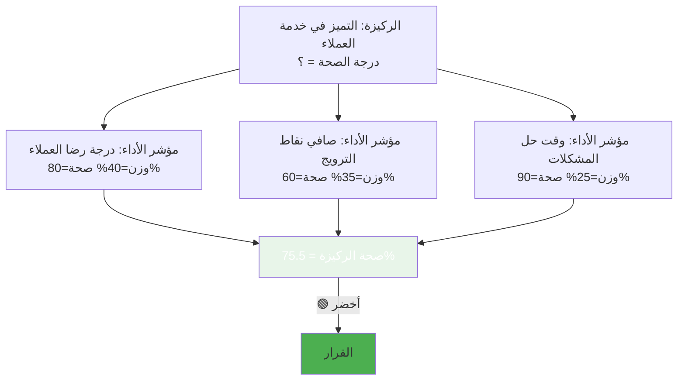
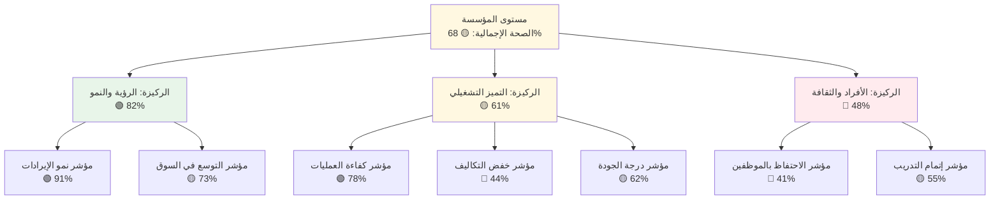
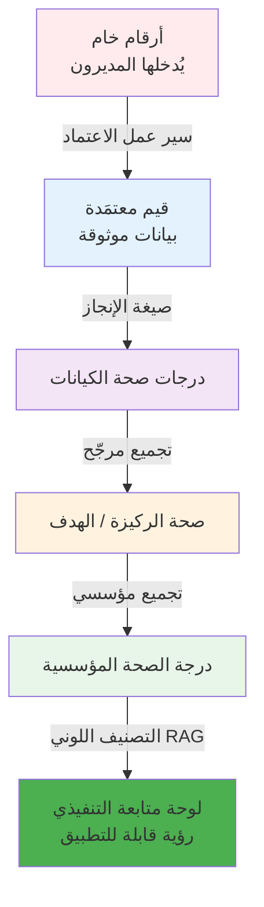

# الصحة المؤسسية ونظام التصنيف اللوني (أحمر/عنبري/أخضر)

<div dir="rtl">

## ما هي الصحة المؤسسية؟

**الصحة المؤسسية** تشير إلى قدرة المؤسسة على التوافق حول أهدافها، وتنفيذ استراتيجيتها بفعالية، وتجديد نفسها عبر الزمن. على عكس الأداء المالي — الذي يُخبرك *بما حدث* — تُخبرك الصحة المؤسسية *بما إذا كانت المؤسسة قادرة على استدامة أدائها*.

في سياق أنظمة إدارة الأداء، تُشغَّل "الصحة" على شكل **درجة مركّبة** تعكس:
- مدى تحقق مستهدفات مؤشرات الأداء
- مدى حداثة بيانات الأداء واكتمالها
- مدى اتساق اتباع عمليات الاعتماد والحوكمة

---

## نظام التصنيف اللوني: أحمر / عنبري / أخضر (RAG)

الاختصار الأكثر انتشاراً للصحة هو **نظام RAG** (المعروف أيضاً بنظام إشارة المرور):

| اللون | المعنى | الحد المعتاد |
|-------|--------|-------------|
| 🟢 **أخضر** | على المسار — الأداء كما هو متوقع | ≥ 75% |
| 🟡 **عنبري** | في خطر — يحتاج متابعة واهتماماً | 50–74% |
| 🔴 **أحمر** | خارج المسار — يستلزم تدخلاً عاجلاً | < 50% |

لا يقتصر نظام RAG على مؤشرات الأداء — يمكن تطبيقه على المشاريع والأقسام والمبادرات والركائز المؤسسية بأكملها.

### لماذا ينجح نظام RAG؟
- **الفهم الفوري**: تستطيع القيادة مسح عشرات المؤشرات في ثوانٍ
- **التوجه نحو العمل**: كل لون يتضمن مستوى مختلفاً من الاستجابة المطلوبة
- **غير تقني**: لا يتطلب معرفة إحصائية للتفسير
- **القابلية للمقارنة**: يتيح مقارنة أنواع مختلفة من مؤشرات الأداء بنفس المقياس

---

## كيف تُحسَب درجات الصحة؟

درجة الصحة هي **مقياس مرجّح مركّب** يجمع إشارات متعددة. في مرتكز KPI، تشمل درجة الصحة المؤسسية:

### 1. درجة الإنجاز
ما مدى قرب القيمة الفعلية من الهدف؟

```
للاتجاه (الزيادة إيجابية):
  نسبة الإنجاز % = (القيمة الفعلية ÷ القيمة المستهدفة) × 100

للاتجاه (الانخفاض إيجابي):
  نسبة الإنجاز % = (القيمة المستهدفة ÷ القيمة الفعلية) × 100

(محدودة بـ 100% — الأداء الزائد لا يرفع الدرجة فوق 100%)
```

### 2. درجة الحداثة
ما مدى حداثة آخر قيمة مؤشر أداء مُرسَلة ومعتمَدة؟

| الأيام منذ آخر قيمة معتمَدة | تصنيف الحداثة | الدرجة |
|---------------------------|--------------|--------|
| 0–30 يوماً | ممتاز | 100% |
| 31–60 يوماً | جيد | 75% |
| 61–90 يوماً | مقبول | 50% |
| أكثر من 90 يوماً | يحتاج انتباهاً | 25% |
| لا توجد بيانات أبداً | لا بيانات | 0% |

### 3. درجة الامتثال
هل أُرسلت البيانات واعتُمدت ضمن الفترة المتوقعة؟

| الحالة | مؤشر الامتثال |
|--------|--------------|
| قيمة مقفلة/معتمَدة موجودة للفترة الحالية | ✅ ملتزم |
| مُرسَل لكن لم يُعتمَد بعد | ⏳ معلّق |
| مسودة فقط | ⚠️ لم يُرسَل |
| لا يوجد إدخال أصلاً | ❌ مفقود |

### الصيغة المركّبة (مفاهيمياً)
```
صحة الكيان = و1 × نسبة الإنجاز + و2 × نسبة الحداثة + و3 × نسبة الامتثال

الصحة المؤسسية = المتوسط المرجّح لدرجات صحة جميع الكيانات
```

حيث `و1`، `و2`، `و3` أوزان قابلة للتهيئة تعكس الأولويات المؤسسية.

---

## التجميع المرجّح

ليست جميع مؤشرات الأداء بنفس الأهمية. تُتيح **الأوزان** للقيادة التعبير عن الأهمية الاستراتيجية النسبية لكل مؤشر:



بدون الأوزان، تُسهم جميع مؤشرات الأداء بالتساوي — وهذا نادراً ما يعكس الأولوية الاستراتيجية الحقيقية.

---

## مبادئ درجات الصحة

### مشكلة "القمامة تُنتج قمامة"
درجة الصحة لا تتجاوز جودة البيانات التي تُغذّيها. مؤسسة تُدخل قيماً مبالغاً فيها ستجد لوحة متابعة خضراء بشكل زائف. ولهذا تُعدّ **حوكمة البيانات** (الفصل الرابع) وسير عمل الاعتماد أساساً لا غنى عنه لأي درجات صحة ذات معنى.

### الحداثة كمؤشر جودة
مؤشر الأداء بقيمة قديمة يُعدّ في نظر كثيرين أسوأ من عدم وجود مؤشر أداء أصلاً — فهو يُنشئ ثقة زائفة. تتبّع حداثة البيانات إلى جانب الإنجاز ممارسة أفضل تُطبَّق في أنظمة إدارة الأداء الناضجة.

### احذر من "اللعب مع الأرقام"
عندما ترتبط درجات الصحة بالمكافآت أو العواقب، قد تميل الفرق إلى التلاعب بها (إدخال القيم قبيل الموعد النهائي مباشرةً، وضع أهداف منخفضة، أو تقريب الأرقام). الحلول الوقائية تشمل:
- التحقق المستقل من البيانات
- ملاحظات/مرفقات إلزامية للقيم المُرسَلة
- تحليل الاتجاهات الذي يجعل التحسينات المفاجئة مرئية
- حوكمة اعتماد قوية

---

## نمط لوحة متابعة الصحة

تستخدم لوحة المتابعة المُصمَّمة جيداً درجات الصحة على مستويات متعددة في آنٍ واحد:



هذا الهيكل يُتيح للرئيس التنفيذي رؤية فورية أن "الأفراد والثقافة" هي أكبر مصدر قلق، والتعمق لمعرفة أن الاحتفاظ بالموظفين هو المحرك الجذري.

---

## تحليل الاتجاهات: الصحة عبر الزمن

درجة الصحة الواحدة هي لقطة لحظية. **الاتجاهات** تكشف ما إذا كانت المؤسسة تتحسن أم تركد أم تتراجع:

| نمط الاتجاه | التفسير |
|------------|---------|
| 🟢🟢🟢🟢 أخضر مستقر | أداء متواصل ومستدام |
| 🔴🟡🟢🟢 تحسّن | تعافٍ قيد التقدم |
| 🟢🟢🟡🔴 تراجع | تدخل مطلوب الآن |
| 🟡🔴🟡🔴 متذبذب | تنفيذ غير متسق؛ السبب الجذري غير واضح |

مخططات التقدم الفصلي (مثل الموجودة في صفحة النظرة العامة لمرتكز KPI) تكشف هذه الأنماط بوضوح.

---

## درجات الصحة في السياق السعودي

في سياق رؤية 2030 للمملكة العربية السعودية، باتت درجات الصحة محورية لحوكمة الأداء الوطني:

- **الجهات الحكومية** تُبلّغ بيانات الأداء الفصلي مع حالة RAG لجهات الرقابة
- **برامج تحقيق الرؤية** حدّدت عتبات صحية تُؤدي إلى تصعيد المراجعات عند تجاوزها
- **تقارير مجالس الإدارة والقيادة** تعتمد بشكل متزايد على لوحات RAG كصيغتها الرئيسية
- **المقارنة المعيارية** عبر الوزارات والجهات تتم عبر درجات صحة موحّدة

هذا السياق يجعل درجات الصحة المُهيمَن عليها والموثوقة متطلباً غير قابل للتفاوض لأي منصة إدارة أداء جادة تعمل في السوق السعودية.

---

## ملخص: من البيانات الخام إلى الصحة المؤسسية



كل طبقة تُضيف ثقةً وسياقاً وسهولةً في الاستخدام — محوِّلةً الأرقام الخام إلى استخبارات استراتيجية.

---

## ملخص المفاهيم الرئيسية

> **النقاط الأساسية:**
> - **نظام RAG**: 🟢 أخضر (≥75%)، 🟡 عنبري (50–74%)، 🔴 أحمر (<50%)
> - **3 مكونات للصحة**: الإنجاز، الحداثة، الامتثال
> - **التجميع المرجّح**: الأوزان تعكس الأولوية الاستراتيجية
> - **التحليل عبر الزمن**: الاتجاهات أكثر أهمية من اللقطات الفردية
> - **السياق السعودي**: درجات الصحة متطلب غير قابل للتفاوض

---

## للاستزادة

- ماكنزي، *عناصر التغيير الأربعة* (2015)
- كابلان ونورتون، *قسط التنفيذ* (2008)
- مار، *25 مؤشر أداء رئيسي يجب معرفته* (2012)
- رؤية المملكة العربية السعودية 2030 — إطار إدارة الأداء الوطني

</div>
